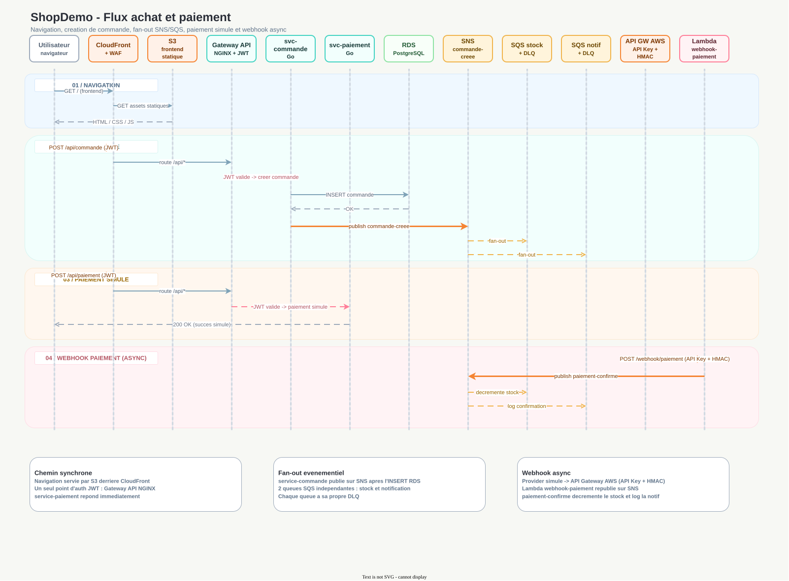

# IDP Platform - Internal Developer Platform

> Projet personnel de montee en competences DevOps/Cloud Architecture.  
> Une plateforme de deploiement interne complete, construite autour d'une application e-commerce de demonstration, auto-hebergee sur serveur Ubuntu local avec une architecture cible AWS multi-comptes.

## Table des matieres

- [Vue d'ensemble](#vue-densemble)
- [Contexte fonctionnel](#contexte-fonctionnel)
- [Objectif DevOps](#objectif-devops)
- [Contraintes et exigences non fonctionnelles](#contraintes-et-exigences-non-fonctionnelles)
- [Schema global](#schema-global)
- [Architecture](#architecture)
- [Arbitrages et limites](#arbitrages-et-limites)
- [Documentation detaillee](#documentation-detaillee)

## Schema global

> 📊 **Diagramme interactif** : [`docs/diagrams/plateforme-cible.html`](docs/diagrams/plateforme-cible.html).
>
> **Lecture rapide** :
> - le frontend statique est servi via `S3 + CloudFront + WAF` ;
> - le trafic applicatif passe par `ALB -> Gateway API -> services Go sur EKS` ;
> - `Cognito` porte l'identite, `RDS` la persistence ;
> - `API Gateway AWS + Lambda` gerent le webhook paiement entrant ;
> - `SNS + SQS` portent le fan-out asynchrone ;
> - le bootstrap local et les validations MiniStack servent a preparer l'infra avant les validations sur AWS reel ;
> - un tunnel Cloudflare **dedie ShopDemo** est prepare localement pour exposer plus tard `Argo CD`, `Grafana` et `Gitea` sans port entrant public, sans reprendre les autres tunnels preexistants de l'hote.

## Vue d'ensemble

ShopDemo sert de fil conducteur a une **plateforme d'apprentissage orientee Platform Engineering** :

- bootstrap local reproductible sur Ubuntu 24.04 ;
- outillage local pour valider du Terraform et des flux AWS sans consommer tout de suite du vrai AWS ;
- architecture cible AWS/EKS/GitOps versionnee, argumentee et reliee a des artefacts concrets.

Le projet n'est pas une production commerciale. Il optimise d'abord :

- la reproductibilite ;
- l'explicabilite ;
- la maitrise des couts ;
- la qualite des preuves et arbitrages pour le portfolio.

## Contexte fonctionnel

L'application metier reste volontairement simple : inscription, catalogue, panier, commande, paiement simule, webhook de confirmation et traitement asynchrone.

> 📊 **Diagramme interactif** : [`docs/diagrams/flux-achat-paiement.html`](docs/diagrams/flux-achat-paiement.html).

### Stack applicative

| Composant | Techno | Role |
|---|---|---|
| `frontend` | HTML + Pico.css (statique) | Login, catalogue, panier, confirmation |
| `service-catalogue` | Go (EKS) | CRUD produits |
| `service-panier` | Go (EKS) | Gestion panier par utilisateur |
| `service-commande` | Go (EKS) | Creation commande, publication event SNS |
| `service-paiement` | Go (EKS) | Paiement simule synchrone |
| `lambda-webhook-paiement` | Lambda (Go) | Recoit callback provider, publie sur SNS |
| `service-stock` | Go (EKS) | Consomme SQS queue-stock |
| `service-notification` | Go (EKS) | Consomme SQS queue-notification |

### Pourquoi cette application justifie l'architecture

- **Cognito** pour porter une vraie auth JWT avec Hosted UI.
- **Gateway API NGINX** comme frontiere d'auth et de routage du cluster.
- **API Gateway AWS + Lambda** pour le webhook paiement event-driven.
- **RDS PostgreSQL** pour une persistence relationnelle classique.
- **SNS + SQS** pour demontrer le fan-out, les DLQ et l'idempotence.
- **S3 + CloudFront + WAF** pour la partie edge/frontend.

## Objectif DevOps

Le projet couvre de bout en bout :

- **Landing Zone AWS** : Organizations, SCPs, IAM Identity Center, multi-compte ;
- **Kubernetes** : k3s local, EKS cible, Cilium, Gateway API, GitOps ;
- **Terraform** : modules internes, separation bootstrap/workload, validations locales ;
- **Ansible** : provisioning local, hardening, runner bootstrap, playbooks reproductibles ;
- **CI/CD** : GitLab Components, OIDC vers AWS, digest pinning, mise a jour GitOps ;
- **Observabilite** : Prometheus, Loki, Grafana, Hubble, Kubecost ;
- **DevSecOps** : pre-commit, scans CI, Kyverno, ESO, threat model ;
- **FinOps** : destruction hors session, Spot, Graviton, VPC Endpoints, posture toggle.

## Contraintes et exigences non fonctionnelles

| Dimension | Cible |
|---|---|
| Criticite | Lab / demonstrateur technique, pas production commerciale |
| Disponibilite | Haute disponibilite intra-region pour montrer les patterns Multi-AZ |
| Donnees sensibles | Aucune - donnees fictives uniquement |
| Conformite | Aucune exigence reelle - controles a visee pedagogique |
| Multi-region | Non |
| Budget | ~115-185$ total projet, destroy hors sessions |

Ces contraintes expliquent volontairement certains choix : pas de multi-region, posture securite graduee hors session, et arbitrages FinOps assumes.

## Architecture

### Architecture locale

Le poste local ne cherche pas a simuler toute la production. Il sert a accelerer l'apprentissage, les smoke tests et certaines validations IaC. La cible de reference reste AWS reel.

Le lab local inclut aussi un **tunnel Cloudflare dedie `shopdemo`**, pilote par
un service `systemd` isole et un token externe. Ce tunnel ne remplace pas les
autres tunnels preexistants sur l'hote ; il prepare l'exposition future de
`Argo CD`, `Grafana` et `Gitea` sans imposer de port entrant public sur le
serveur local. Les routes metier finales restent configurees cote Cloudflare
quand les origins locales existent reellement.

Detail : [`docs/architecture/01-local-lab.md`](docs/architecture/01-local-lab.md)

### Architecture cible AWS

L'architecture cible AWS couvre l'organisation multi-compte, la separation `bootstrap` / `workload`, la plateforme EKS et les composants managés exposes a l'application.

Detail : [`docs/architecture/02-aws-target.md`](docs/architecture/02-aws-target.md)

### Architecture Kubernetes : lab local vs EKS

Le modele Kubernetes n'est pas le meme en local et sur AWS : `k3s` sert au lab reproductible, alors que `EKS` porte la cible cloud. Cette difference couvre a la fois la distribution Kubernetes, le modele reseau et le role de `Cilium`.

Detail : [`docs/architecture/03-kubernetes-runtime.md`](docs/architecture/03-kubernetes-runtime.md)

### Architecture securite et DevSecOps

Les controles de securite et de posture sont repartis entre le poste local, la CI, le runtime Kubernetes et le compte AWS. Ils ne sont pas presentes comme un ajout annexe, mais comme une partie integrante de l'architecture.

Detail : [`docs/architecture/04-security-devsecops.md`](docs/architecture/04-security-devsecops.md)

### Architecture CI/CD et GitOps

La CI valide, build et scanne. Le cluster consomme ensuite l'etat desire via Argo CD, sans deploy imperatif direct depuis la pipeline applicative.

Detail : [`docs/architecture/05-delivery-gitops.md`](docs/architecture/05-delivery-gitops.md)

## Arbitrages et limites

### Lab local vs AWS reel

Le lab local accelere l'apprentissage et certains tests, mais il ne remplace pas une validation finale sur AWS reel pour les sujets sensibles comme `Organizations`, `SCPs` ou le comportement exact d'`EKS`.

### Separation bootstrap / workload

`bootstrap` est permanent et heberge ce dont `workload` depend pour vivre et etre detruit proprement. `workload` reste ephemere et detruit hors session.

### Posture FinOps

Le projet accepte explicitement une posture "session-based" : destroy hors session, Spot/Graviton, VPC Endpoints cibles, et certains controles de posture plus legers hors execution pour contenir les couts.

### Critere de realisme

Le projet cherche un bon equilibre entre fidelite technique, cout et vitesse d'apprentissage. Il documente donc explicitement ce qui est emule, ce qui est simplifie et ce qui doit etre confirme dans AWS.

## Documentation detaillee

### Pages d'architecture

- [`docs/architecture/README.md`](docs/architecture/README.md) - index des sous-pages
- [`docs/architecture/01-local-lab.md`](docs/architecture/01-local-lab.md) - bootstrap local, MiniStack, k3s, Cilium local
- [`docs/architecture/02-aws-target.md`](docs/architecture/02-aws-target.md) - organisation AWS, etats Terraform, vues cible AWS
- [`docs/architecture/03-kubernetes-runtime.md`](docs/architecture/03-kubernetes-runtime.md) - Kubernetes local vs EKS, runtime inter-pods, sequence de requete, control plane
- [`docs/architecture/04-security-devsecops.md`](docs/architecture/04-security-devsecops.md) - securite pod, DevSecOps, posture AWS
- [`docs/architecture/05-delivery-gitops.md`](docs/architecture/05-delivery-gitops.md) - GitOps, CI/CD, OIDC, runners
- [`docs/architecture/06-costs-risks-evidence.md`](docs/architecture/06-costs-risks-evidence.md) - couts, risques assumes, matrice de preuves
- [`docs/architecture/07-repo-learning-path.md`](docs/architecture/07-repo-learning-path.md) - structure du repo, sprints, lacunes couvertes

### Autres documents lies

- [`docs/decouverte-ministack.md`](docs/decouverte-ministack.md) - synthese de decouverte MiniStack
- [`docs/deep-dive-cilium-k3s-ufw.md`](docs/deep-dive-cilium-k3s-ufw.md) - deep dive de diagnostic local
- [`docs/sprint-planning.md`](docs/sprint-planning.md) - planification par sprint
- [`README.md`](README.md) - vue globale et avancement
