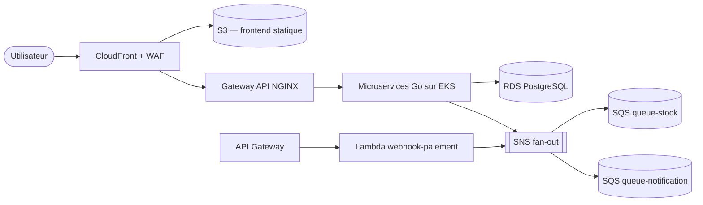

<div align="center">

# IDP Platform — ShopDemo

**Internal Developer Platform construite from scratch — du serveur Ubuntu local à une architecture cible AWS multi-comptes.**

    

[Pourquoi ce projet](#pourquoi-ce-projet) · [Architecture](#aperçu-du-flux-applicatif) · [Compétences démontrées](#compétences-démontrées) · [Quick start](#quick-start) · [Où en est le projet](#où-en-est-le-projet) · [Démarrer ici](#démarrer-ici)

</div>

---

## Pourquoi ce projet

Plutôt qu'une suite d'exercices isolés, ce projet relie Terraform, Ansible, Kubernetes, CI/CD, observabilité et sécurité dans **un seul système cohérent**, construit autour de **ShopDemo** — une application e-commerce de démonstration volontairement simple côté métier. L'objectif : que chaque brique d'infrastructure se justifie par un besoin fonctionnel réel (inscription, catalogue, panier, commande, paiement simulé), pas par accumulation de technologies.

## Aperçu du flux applicatif



> Le détail complet — séquence d'appels, justification de chaque service AWS, exigences non fonctionnelles — vit dans [`ARCHITECTURE.md`](ARCHITECTURE.md), qui fait foi sur la conception cible.

## Compétences démontrées

| Domaine | Ce qui est mis en œuvre |
|---|---|
| **Landing Zone AWS** | Organizations, SCPs, IAM Identity Center, multi-compte |
| **Kubernetes** | k3s local et EKS cible, Cilium, Gateway API, GitOps avec Argo CD |
| **Infrastructure as Code** | Modules Terraform internes versionnés, Ansible idempotent testé Molecule |
| **CI/CD** | GitLab CI Components, OIDC vers AWS, digest pinning, aucune clé statique |
| **Observabilité** | Prometheus, Loki, Grafana, Kubecost |
| **DevSecOps** | Scans Trivy / OWASP / GitLeaks, admission control Kyverno, shift-left |
| **FinOps** | Infra 100 % éphémère, Spot/Graviton, `terraform destroy` systématique |

## Quick start

Ce qui existe aujourd'hui (Sprint 0) : un role Ansible idempotent qui installe et valide `k3s` sur un hôte Ubuntu local.

```bash
git clone <url-du-depot>
cd shop-demo/ansible

# Installer les collections requises
ansible-galaxy collection install -r requirements.yml

# Installer et valider k3s sur l'hôte local (sudo requis)
ansible-playbook playbooks/k3s-install.yml --ask-become-pass

# Rejouer le role en isolation, avec tests d'idempotence (Molecule + Docker)
cd roles/k3s-install
molecule test
```

Le reste de la plateforme (Terraform, EKS, CI/CD) arrive sprint après sprint — voir [Où en est le projet](#où-en-est-le-projet).

## Où en est le projet

Le projet avance sprint par sprint, avec un suivi versionné dans `docs/`.

      

| | |
|---|---|
| Sprint actif | `Sprint 0` — Ansible et fondations bootstrap |
| Suivi détaillé | [`docs/CURRENT.md`](docs/CURRENT.md) |
| Vue globale | [`docs/ROADMAP.md`](docs/ROADMAP.md) |

## Démarrer ici

| Lien | Contenu |
|---|---|
| [`ARCHITECTURE.md`](ARCHITECTURE.md) | Conception cible, stack, arbitrages |
| [`AGENTS.md`](AGENTS.md) | Règles de travail pour les agents IA du dépôt |
| [`docs/CURRENT.md`](docs/CURRENT.md) | Sprint actif et tâches en cours |
| [`docs/ROADMAP.md`](docs/ROADMAP.md) | Vue globale des sprints |
| [`docs/CONTRIBUTING.md`](docs/CONTRIBUTING.md) | Règles de suivi et de documentation |
| [`docs/README.md`](docs/README.md) | Index complet de la documentation |
| [`LEARNING.md`](LEARNING.md) | Notions apprises au fil des sprints |

## Structure du dépôt

```text
.
├── ansible/   # Provisioning et configuration des hôtes (k3s, Cilium, runners, hardening)
├── docs/      # Suivi de projet : sprints, ADR, preuves
├── AGENTS.md
├── ARCHITECTURE.md
└── LEARNING.md
```

---

<div align="center">

Laboratoire d'apprentissage et portfolio personnel — pas un projet en production commerciale. Voir les [exigences non fonctionnelles](ARCHITECTURE.md#exigences-non-fonctionnelles-cibles) pour le détail des compromis assumés.

</div>
