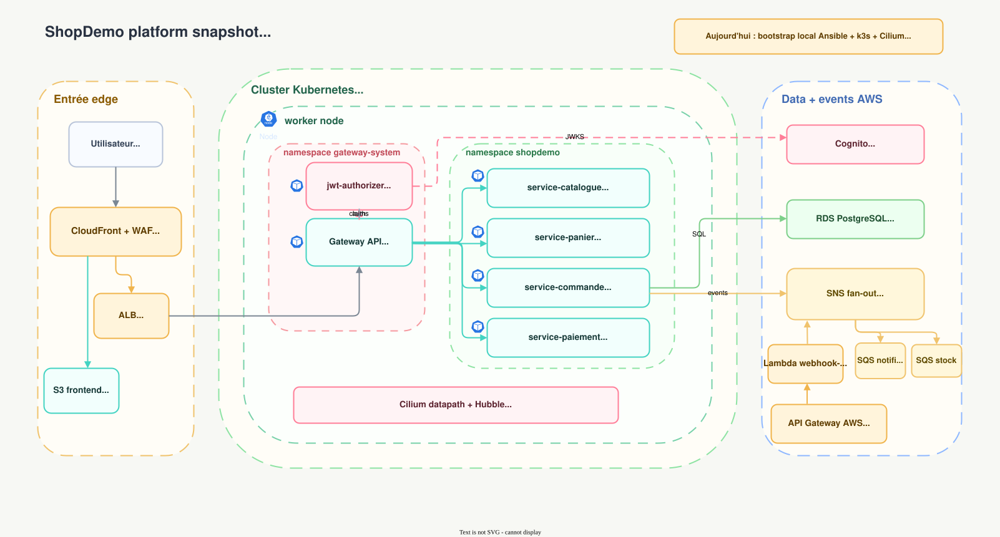

<div align="center">

# IDP Platform : ShopDemo

**Internal Developer Platform construite from scratch, du serveur Ubuntu local à une architecture cible AWS multi-comptes.**

*Un projet portfolio orienté Platform Engineering : bootstrap local reproductible aujourd'hui, architecture AWS/EKS/GitOps cible documentée et versionnée.*

    

[Pourquoi ce projet](#pourquoi-ce-projet) · [Comprendre](docs/comprendre-le-projet.md) · [Comment ça marche](docs/comment-ca-marche.md) · [Glossaire](docs/glossaire.md) · [Architecture](#aperçu-du-flux-applicatif) · [Compétences démontrées](#compétences-démontrées) · [Quick start](#quick-start) · [Où en est le projet](#où-en-est-le-projet) · [Démarrer ici](#démarrer-ici)

</div>

<p align="center">
  
</p>

---

## Pourquoi ce projet

Plutôt qu'une suite d'exercices isolés, ce projet relie Terraform, Ansible, Kubernetes, CI/CD, observabilité et sécurité dans **un seul système cohérent**, construit autour de **ShopDemo**, une application e-commerce de démonstration volontairement simple côté métier. L'objectif : que chaque brique d'infrastructure se justifie par un besoin fonctionnel réel (inscription, catalogue, panier, commande, paiement simulé), pas par accumulation de technologies.

## Ce que montre le dépôt

- **Déjà en place** : bootstrap local `Ansible + k3s + Cilium + MiniStack`, avec idempotence et tests ciblés.
- **Architecture cible** : AWS multi-comptes, EKS, Gateway API, Cognito, RDS, SNS/SQS, Argo CD et GitOps.
- **Cadrage agentique** : un MVP centre sur une requete `prompt/agentic`, avec scenarios reserves aux tests et sans mode `live`.
- **Documentation de travail** : roadmap, arbitrages, preuves et deep dives versionnés dans le dépôt.

## Aperçu du flux applicatif

> Le détail complet (séquence d'appels, justification de chaque service AWS, exigences non fonctionnelles) vit dans [`ARCHITECTURE.md`](ARCHITECTURE.md), qui fait foi sur la conception cible.

## Compétences démontrées

| Domaine | Ce qui est mis en œuvre |
|---|---|
| **Landing Zone AWS** | Organizations, SCPs, IAM Identity Center, multi-compte |
| **Kubernetes** | k3s local et EKS cible, Cilium, Gateway API, GitOps avec Argo CD |
| **Infrastructure as Code** | Modules Terraform internes versionnés, Ansible idempotent testé Molecule |
| **CI/CD** | GitLab CI Components, OIDC vers AWS, digest pinning, aucune clé statique |
| **Observabilité** | Prometheus, Loki, Grafana, Kubecost |
| **DevSecOps** | Scans Trivy / OWASP / GitLeaks, admission control Kyverno, shift-left |
| **FinOps** | Infra 100 % éphémère, Spot/Graviton, `terraform destroy` systématique |

## Quick start

Ce qui existe aujourd'hui : un bootstrap local reproductible autour d'Ansible,
avec les roles `k3s-install`, `cilium-setup`, `ministack-setup`,
`cloudflare-tunnel` et `gitlab-runner`, puis une premiere structure GitOps
locale dans [`gitops/`](gitops/). Les validations reelles vont jusqu'au
service `gitlab-runner` actif sur l'hote local, a son enregistrement sur
`GitLab.com`, puis a un pipeline de smoke passe sur la branche
`test/gitlab-runner-smoke`. Le reste de la plateforme AWS/EKS applicative
arrive sprint par sprint.

```bash
git clone https://gitlab.com/ClementV78/shopdemo.git
cd shop-demo/ansible

# Installer les collections requises
ansible-galaxy collection install -r requirements.yml

# Installer k3s puis Cilium sur l'hôte local (sudo requis)
ansible-playbook playbooks/k3s-install.yml --ask-become-pass
ansible-playbook playbooks/cilium-setup.yml --ask-become-pass
ansible-playbook playbooks/ministack-setup.yml --ask-become-pass

# Rejouer les roles en isolation, avec tests d'idempotence (Molecule + Docker)
cd roles/k3s-install
molecule test

cd ../cilium-setup
molecule test
```

GitLab.com est la source de verite pour le developpement, la CI/CD et GitOps.
GitHub reste un miroir public en lecture seule pour le portfolio.

Les roles `cloudflare-tunnel` et `gitlab-runner` existent aussi, mais demandent des secrets externes non versionnes (`TUNNEL_TOKEN`, token runner GitLab) et ne font donc pas partie du chemin "copier-coller" ci-dessus. Le reste de la plateforme (Terraform, EKS, CI/CD complet) arrive sprint après sprint, voir [Où en est le projet](#où-en-est-le-projet).

## Où en est le projet

Le projet avance sprint par sprint, avec un suivi versionné dans `docs/`.

      

| | |
|---|---|
| Sprint actif | `Sprint 1` - Argo CD et base GitOps locale |
| Suivi détaillé | [`docs/CURRENT.md`](docs/CURRENT.md) |

| Sprint | Sujet | État | Fichier de suivi |
|---|---|---|---|
| 0 | Ansible et fondations bootstrap | Terminé | [`sprint-0-ansible.md`](docs/sprints/sprint-0-ansible.md) |
| 1 | Argo CD et base GitOps locale | En cours | [`sprint-1-gitops-local.md`](docs/sprints/sprint-1-gitops-local.md) |
| 2 | Landing Zone AWS | Planifié | À créer avant démarrage |
| 3 | Plateforme AWS et EKS | Planifié | À créer avant démarrage |
| 4 | Observabilité | Planifié | À créer avant démarrage |
| 5 | DevSecOps | Planifié | À créer avant démarrage |
| 6 | CI/CD et GitOps | Planifié | À créer avant démarrage |

Règles de progression : un seul sprint `En cours` à la fois ; le prochain sprint est détaillé pendant la clôture du courant ; un sprint passe à `Terminé` lorsque ses livrables et validations obligatoires sont documentés dans son fichier de suivi.

**Focus courant** : `Sprint 1` est demarre. `S1-T1` a pose la structure
GitOps locale, puis `S1-T2` a installe Argo CD et valide une premiere
synchronisation depuis GitLab. La prochaine action est `S1-T3` : definir les
namespaces et NetworkPolicies de base.

## Démarrer ici

| Lien | Contenu |
|---|---|
| [`docs/comprendre-le-projet.md`](docs/comprendre-le-projet.md) | Vision globale, etat actuel, chemin cible et pitch entretien |
| [`docs/comment-ca-marche.md`](docs/comment-ca-marche.md) | Explication technique progressive : comment les sprints sont construits dans le code |
| [`docs/glossaire.md`](docs/glossaire.md) | Definitions courtes : Cilium, Hubble, CoreDNS, Terraform, GitOps, AWS, etc. |
| [`ARCHITECTURE.md`](ARCHITECTURE.md) | Conception cible, stack, arbitrages |
| [`docs/architecture/08-agentic-mvp.md`](docs/architecture/08-agentic-mvp.md) | MVP agentique, separation produit/tests |
| [`docs/gitops-structure.md`](docs/gitops-structure.md) | Structure GitOps locale, conventions et validations |
| [`docs/concepts-sprint-1.md`](docs/concepts-sprint-1.md) | Concepts GitOps/Argo CD du Sprint 1 |
| [`docs/sprint-planning.md`](docs/sprint-planning.md) | Détail des objectifs et livrables par sprint |
| [`AGENTS.md`](AGENTS.md) | Règles de travail pour les agents IA du dépôt |
| [`docs/CURRENT.md`](docs/CURRENT.md) | Sprint actif et tâches en cours |
| [`docs/CONTRIBUTING.md`](docs/CONTRIBUTING.md) | Règles de suivi et de documentation |
| [`docs/README.md`](docs/README.md) | Index complet de la documentation |
| [`LEARNING.md`](LEARNING.md) | Notions apprises au fil des sprints |

## Structure du dépôt

```text
.
├── ansible/   # Provisioning et configuration des hôtes (k3s, Cilium, runners, hardening)
├── docs/      # Suivi de projet : sprints, ADR, preuves
├── gitops/    # Etat Kubernetes desire, synchronise plus tard par Argo CD
├── AGENTS.md
├── ARCHITECTURE.md
└── LEARNING.md
```

---

<div align="center">

Laboratoire d'apprentissage et portfolio personnel, pas un projet en production commerciale. Voir les [exigences non fonctionnelles](ARCHITECTURE.md#exigences-non-fonctionnelles-cibles) pour le détail des compromis assumés.

</div>
