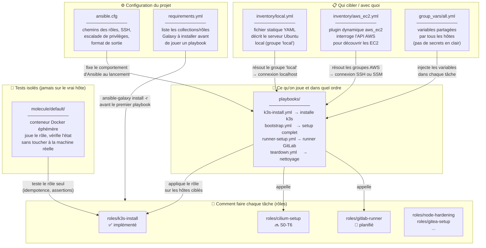
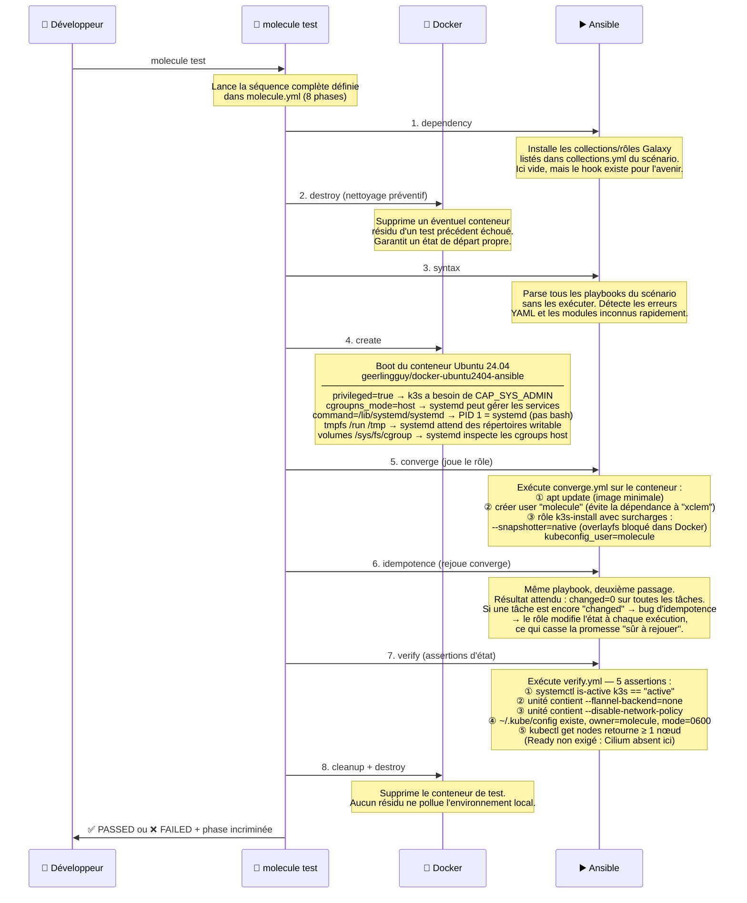
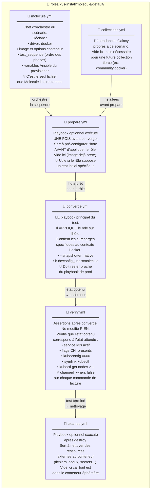

# Structure Ansible du projet

## Objectif

Ce document explique la configuration Ansible visee pour ShopDemo pendant le
Sprint 0, le role de chaque fichier, et la relation entre les differentes
pieces.

Source de verite architecture :
[`ARCHITECTURE.md`](../ARCHITECTURE.md), section Sprint 0 et structure du repo.

## Etat actuel

Verifie le 2026-06-12 :

- Le repertoire [`ansible/`](../ansible) existe.
- Les sous-repertoires `inventory/`, `group_vars/`, `roles/`, `playbooks/` et
  `molecule/` existent.
- Les fichiers de configuration Ansible du projet existent.
- Un premier role
  [`roles/k3s-install/`](../ansible/roles/k3s-install) a ete initialise.
- Un playbook de validation
  [`playbooks/k3s-install.yml`](../ansible/playbooks/k3s-install.yml) existe.
- L'ancien cluster `k3s` local a ete desinstalle pour repartir d'une base
  saine avant l'implementation reelle du role.
- `k3s` est de nouveau installe et gere par le role.
- Le kubeconfig systeme et le kubeconfig utilisateur sont maintenant
  synchronises explicitement.

Cela veut dire qu'Ansible est installe sur le poste, mais qu'il fonctionne
maintenant avec une configuration de projet versionnee.

## Vue d'ensemble



Lecture simple :

- `ansible.cfg` fixe les règles du projet.
- `inventory/` dit quelles machines viser (local statique ou AWS dynamique).
- `group_vars/` fournit les variables communes à tous les hôtes.
- `playbooks/` orchestre l'exécution en assemblant des rôles.
- `roles/` contient la logique réutilisable, une responsabilité par rôle.
- `molecule/` teste les rôles de manière isolée, sans toucher au vrai hôte.
- `requirements.yml` apporte les dépendances Galaxy externes.

## Flux interne d'un rôle : k3s-install

Ce schéma montre comment les tâches s'enchaînent à l'intérieur du rôle,
et comment les handlers se déclenchent uniquement sur changement.

```mermaid
flowchart TD
    START([ansible-playbook k3s-install.yml]) --> ASSERT

    %% ── Phase 1 : échouer tôt si le contexte est mauvais ──
    subgraph Préconditions["🛑 Phase 1 — Vérifier avant d'agir"]
        ASSERT["assert\n──────────────────────────\nOS = Linux, service_mgr = systemd\nos_family = Debian\nformat k3s_version = vX.Y.Z+k3sN\nkubeconfig_user non vide\n──────────────────────────\n💡 Échoue immédiatement si\nl'hôte est incompatible,\nevite des erreurs cryptiques\nplus tard dans l'exécution"]
    end

    ASSERT --> CHECK

    %% ── Phase 2 : inspecter l'état réel avant de décider ──
    subgraph Détection["🔍 Phase 2 — Lire l'état actuel (sans rien modifier)"]
        CHECK["stat /usr/local/bin/k3s\n💡 le module 'stat' ne modifie\nrien : compatible --check mode"]
        CHECK --> VERSION{"binaire\nexiste ?"}
        VERSION -->|oui| READVER["command: k3s --version\n→ extrait la version installée\nchanged_when: false\n💡 changed_when: false = jamais\ncompté comme changement même\nsi la commande tourne"]
        VERSION -->|non| SETFACT
        READVER --> SETFACT["set_fact: k3s_needs_install\n──────────────────────────\ntrue si :\n• binaire absent\n• version ≠ k3s_version\n• force_reinstall = true\n💡 centralise la décision\nen un seul booléen réutilisé\npar toutes les tâches suivantes"]
    end

    SETFACT --> INSTALL_GATE{"k3s_needs_install\n= true ?"}

    %% ── Phase 3 : installation uniquement si nécessaire → idempotence ──
    subgraph Installation["📦 Phase 3 — Installer (seulement si besoin)"]
        INSTALL_GATE -->|oui| PKG["package: curl\n💡 dépendance du script\nd'installation officiel k3s"]
        PKG --> DL["get_url: https://get.k3s.io\n→ /usr/local/bin/get-k3s.sh\nmode: 0755"]
        DL --> RUN["command: get-k3s.sh\n──────────────────────────\nINSTALL_K3S_VERSION = k3s_version\nINSTALL_K3S_EXEC =\n  server\n  --flannel-backend=none    ← pas de CNI intégré\n  --disable-network-policy  ← Cilium s'en charge\nINSTALL_K3S_SYMLINK = force"]
        RUN -->|"notify → exécuté\nune seule fois en fin\nde play si changed"| HANDLER["🔔 handler: restart k3s\n💡 Les handlers ne tournent\nqu'une fois même si plusieurs\ntâches les notifient"]
    end

    INSTALL_GATE -->|"non → skip\n(déjà à jour)"| SVC
    RUN --> SVC

    %% ── Phase 4 : attendre et synchroniser ──
    subgraph PostInstall["✅ Phase 4 — Attendre, exposer, vérifier"]
        SVC["service: k3s\nenabled=true, state=started\n💡 enabled = survit au reboot"]
        SVC --> WAIT_CFG["wait_for: /etc/rancher/k3s/k3s.yaml\ntimeout: 120s\n💡 k3s écrit ce fichier\nasynchronément après le start"]
        WAIT_CFG --> WAIT_API["wait_for: 127.0.0.1:6443\ntimeout: 120s\n💡 l'API server met\nquelques secondes à écouter"]
        WAIT_API --> SYMLINK["file: /usr/local/bin/kubectl → k3s\n💡 k3s embarque kubectl :\nun lien suffit, pas besoin\nd'installer kubectl séparément"]
        SYMLINK --> MKDIR["file: ~/.kube/\nowner=xclem, mode=0700\n💡 le répertoire doit\nexister avant la copie"]
        MKDIR --> SLURP["slurp: /etc/rancher/k3s/k3s.yaml\n💡 slurp lit le fichier\nen base64 via SSH sans\nbesoin de fetch temporaire"]
        SLURP --> COPY["copy: contenu décodé\n→ ~/.kube/config\nowner=xclem, mode=0600\n💡 0600 = lecture seule\npour le propriétaire,\nkubectl refuse les fichiers\ntrop permissifs"]
        COPY --> VERIFY["command: kubectl get nodes\nchanged_when: false\n💡 vérification finale :\nsi l'API répond, le rôle\nest fonctionnel"]
    end
```



Points clés de conception :

- Le binaire `/usr/local/bin/k3s` est la source de vérité pour détecter si
  une installation est nécessaire.
- La comparaison de version permet une montée de version automatique : changer
  `k3s_version` dans `defaults/main.yml` suffit pour déclencher la mise à jour.
- Les tâches post-installation sont toutes conditionnées par
  `not ansible_check_mode or not k3s_needs_install`, ce qui rend le rôle
  compatible avec `--check` même sur un hôte vierge.

## Role de chaque element

### `ansible/ansible.cfg`

But :

- centraliser la configuration du projet ;
- eviter les comportements implicites lies au poste local ;
- rendre les executions reproductibles.

Exemples de parametres typiques :

- inventaire par defaut ;
- chemin des roles et collections ;
- comportement SSH ;
- callbacks ou affichage ;
- options de privilege escalation si necessaire.

Point pratique pour ce projet :

- le callback de sortie reste sur `default` pour rester compatible avec une
  installation minimale de `ansible-core` via `pipx`.

Impact :

- tant que ce fichier n'existe pas, `ansible --version` affiche
  `config file = None`.
- une fois cree, Ansible devra charger ce fichier au lieu des valeurs par
  defaut uniquement.

### `ansible/requirements.yml`

But :

- declarer les dependances externes du projet ;
- installer de facon reproductible des roles ou collections.

Exemple d'usage :

```bash
ansible-galaxy install -r ansible/requirements.yml
```

Dans ce projet, ce fichier servira notamment lorsque des roles tiers seront
necessaires, par exemple pour le hardening.

### `ansible/inventory/local.yml`

But :

- decrire la machine locale cible du Sprint 0.

Mental model :

- l'inventaire est l'annuaire des machines ;
- ici, le premier cas d'usage est ton serveur Ubuntu local.

Ce fichier permettra plus tard a `ansible-inventory --graph` ou
`ansible-playbook` de savoir sur quel hote jouer les roles locaux.

### `ansible/inventory/aws_ec2.yml`

But :

- preparer l'inventaire dynamique AWS pour les etapes suivantes.

Important :

- ce fichier ne provisionne rien ;
- il sert a decouvrir des machines deja creees par Terraform ;
- il respecte donc la frontiere voulue par le projet : Terraform cree,
  Ansible configure.

Usage cible plus tard :

- EC2 runner bootstrap ;
- eventuellement hosts AWS existants a configurer ;
- jamais en remplacement du provisioning Terraform.

### `ansible/group_vars/all.yml`

But :

- stocker les variables globales partagees par tous les hosts et playbooks ;
- centraliser des valeurs par defaut du projet.

Exemples de contenu adapte :

- noms de repertoires ;
- versions par defaut ;
- toggles non sensibles ;
- conventions de tags ou chemins locaux.

Regle importante :

- aucun secret en clair ;
- les secrets devront venir d'Ansible Vault ou d'une source externe.

### `ansible/roles/`

But :

- contenir les briques reutilisables de configuration.

Dans l'architecture cible, on y trouvera notamment :

- `k3s-install`
- `cilium-setup`
- `ministack-setup`
- `cloudflare-tunnel`
- `gitlab-runner`
- `node-hardening`

Mental model :

- un role = une responsabilite technique claire ;
- un playbook assemble plusieurs roles dans un ordre donne.

Structure standard d'un role :

```text
roles/<role>/
  defaults/main.yml
  tasks/main.yml
  handlers/main.yml
```

Premier exemple present dans le projet :

- [`ansible/roles/k3s-install/defaults/main.yml`](../ansible/roles/k3s-install/defaults/main.yml)
  : variables par defaut du role
- [`ansible/roles/k3s-install/tasks/main.yml`](../ansible/roles/k3s-install/tasks/main.yml)
  : logique principale du role
- [`ansible/roles/k3s-install/handlers/main.yml`](../ansible/roles/k3s-install/handlers/main.yml)
  : actions declenchees seulement si necessaire, par exemple un redemarrage de
  service

Point de conception retenu :

- les taches systeme du role `k3s-install` s'executent avec `become: true` ;
- le kubeconfig source de verite reste
  [`/etc/rancher/k3s/k3s.yaml`](/etc/rancher/k3s/k3s.yaml:1) ;
- une copie utilisateur est synchronisee vers
  [`/home/xclem/.kube/config`](/home/xclem/.kube/config:1) pour l'usage courant
  sans `sudo`.

### `ansible/playbooks/`

But :

- decrire des scenarios complets d'execution en assemblant des roles.

Exemples cibles dans ce projet :

- `bootstrap.yml`
- `k3s-install.yml`
- `runner-setup.yml`
- `rds-setup.yml`
- `gitea-setup.yml`
- `harden.yml`
- `teardown.yml`

Mental model :

- le playbook dit "quoi lancer et dans quel ordre" ;
- le role contient "comment cette partie fonctionne".

Premier exemple present dans le projet :

- [`ansible/playbooks/k3s-install.yml`](../ansible/playbooks/k3s-install.yml)
  lance uniquement le role `k3s-install` sur le groupe `local`
- ce playbook sert a la fois a valider le role en lecture seule et a executer
  l'installation reelle sur le poste local

### `ansible/molecule/`

But :

- tester les rôles Ansible de manière reproductible et isolée.

Molecule orchestre un cycle de vie complet autour d'un conteneur Docker éphémère.
Chaque rôle embarque son propre scénario sous `roles/<role>/molecule/default/`.

#### Cycle de vie d'un scénario Molecule



#### Fichiers du scénario et leur rôle



#### Adaptations spécifiques au contexte Docker/k3s

Deux contraintes de l'environnement de test ont nécessité des ajustements
par rapport à la configuration de production :

| Contrainte | Production (bare-metal) | Molecule (Docker) |
|---|---|---|
| Snapshotter containerd | `overlayfs` (défaut) | `--snapshotter=native` (overlayfs bloqué dans Docker) |
| Utilisateur kubeconfig | `xclem` | `molecule` (isolé, évite la dépendance au compte réel) |
| Flannel + NetworkPolicy | désactivés | désactivés (identique) |

Ces différences sont confinées dans `converge.yml` via des surcharges de
variables (`vars:`), ce qui garde le rôle lui-même identique entre les deux
contextes.

#### Assertions vérifiées par le scénario

- Le service `k3s` est actif selon systemd.
- L'unité systemd contient `--flannel-backend=none` et
  `--disable-network-policy`.
- Le kubeconfig utilisateur existe en `0600`, owner `molecule:molecule`.
- `/usr/local/bin/kubectl` est un lien symbolique vers `/usr/local/bin/k3s`.
- `kubectl get nodes` retourne au moins un nœud (sans contrainte de `Ready`,
  car Cilium n'est pas installé dans ce scénario).

## Comment les pieces travaillent ensemble

Sequence de travail cible :

1. on installe les dependances avec `ansible-galaxy` via `requirements.yml` ;
2. Ansible charge `ansible.cfg` ;
3. Ansible lit l'inventaire pour savoir quels hosts cibler ;
4. Ansible charge les variables partagees ;
5. un playbook appelle un ou plusieurs roles ;
6. Molecule teste un role de maniere isolee si besoin.

Exemple mental simple :

- `inventory` = ou agir ;
- `group_vars` = avec quelles valeurs communes ;
- `playbook` = dans quel ordre agir ;
- `role` = comment faire la tache ;
- `molecule` = comment verifier que le role tient la route.

## Lien avec l'architecture cible

Cette structure soutient directement les objectifs du Sprint 0 :

- rendre le serveur Ubuntu local reproductible ;
- poser la frontiere Terraform/Ansible ;
- preparer la reutilisation vers le runner EC2 bootstrap, RDS et Gitea ;
- rendre les roles testables et reutilisables.

Elle est donc volontairement plus structuree qu'un simple playbook unique :
le projet cherche a demontrer une pratique d'ingenierie reproductible, pas
juste a faire "tourner quelque chose".

## Ce qui reste a faire

Non verifie a ce stade :

- installation reelle de k3s ;
- premier test Molecule.

Prochaine etape logique :

- enrichir le role `k3s-install` avec les premieres taches d'installation
  reelles, puis valider son comportement en syntax check et en mode `--check`.

Point d'attention actuel :

- le poste local a ete nettoye de son ancien cluster `k3s` ;
- la prochaine iteration du role pourra viser une installation initiale
  propre, sans heritage de pods ou de certificats anciens.
- apres installation de `k3s` sans Flannel, le noeud peut rester `NotReady`
  tant que `cilium-setup` n'a pas ete applique.
