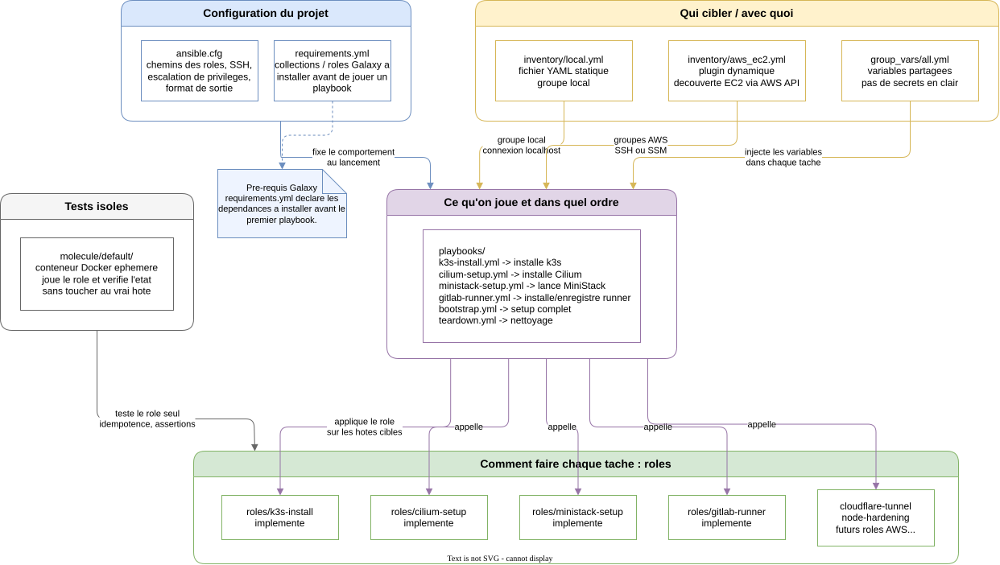
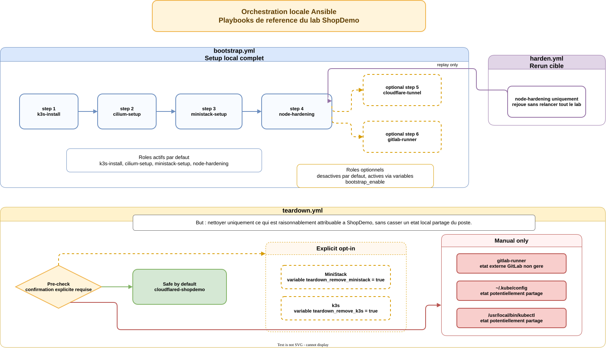
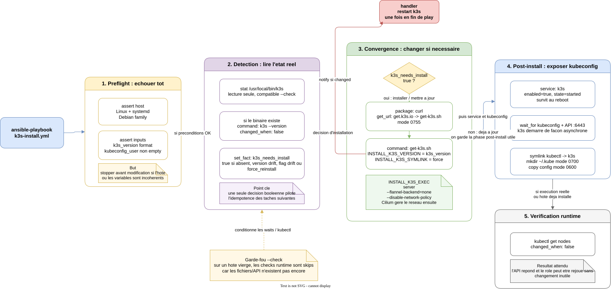
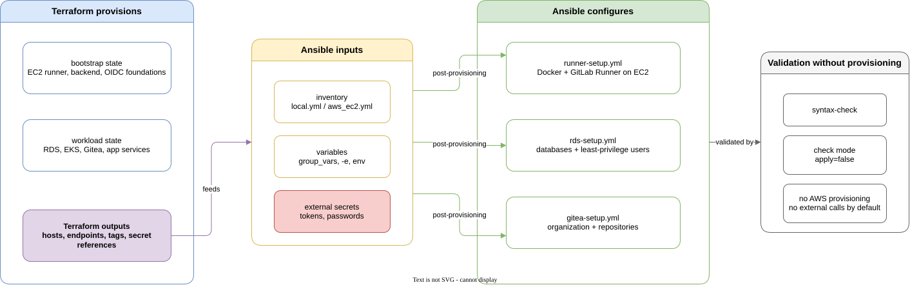
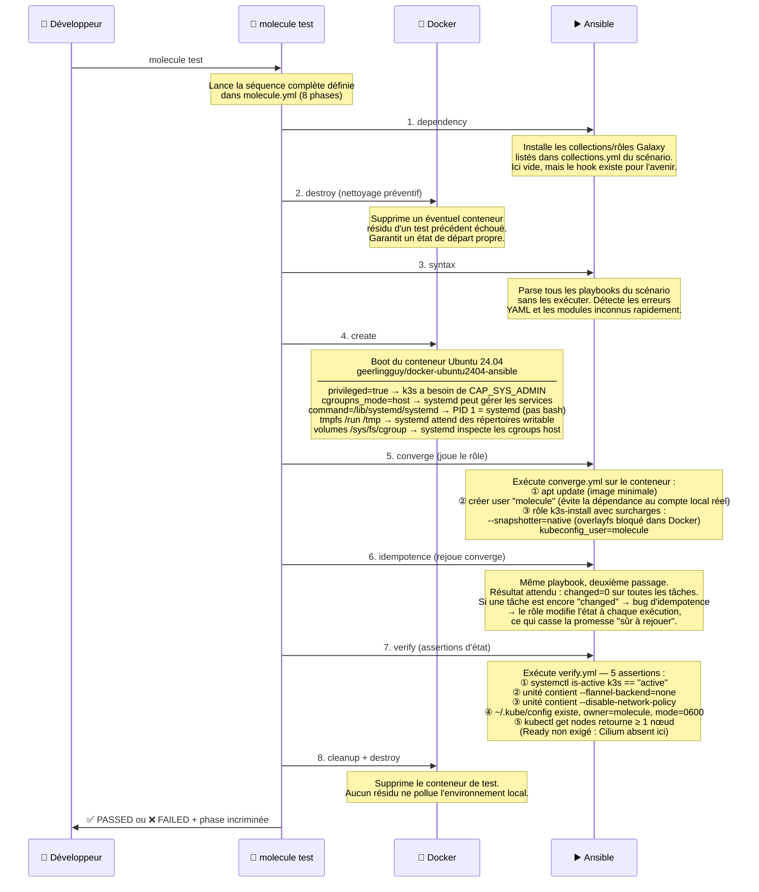
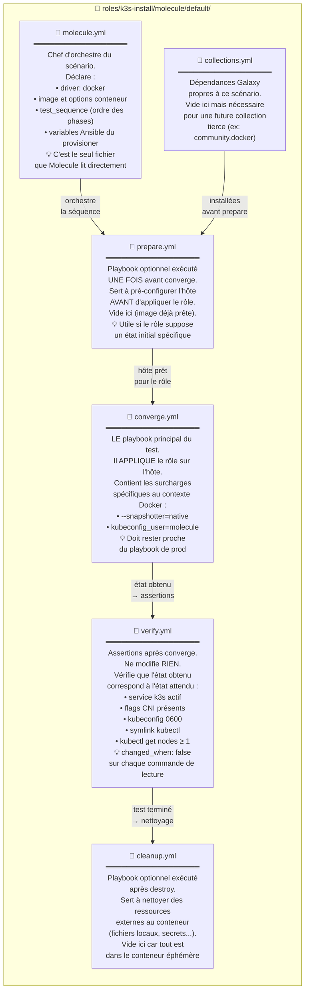

# Structure Ansible du projet

## Objectif

Ce document explique la configuration Ansible visee pour ShopDemo pendant le
Sprint 0, le role de chaque fichier, et la relation entre les differentes
pieces.

Source de verite architecture :
[`ARCHITECTURE.md`](../ARCHITECTURE.md), section Sprint 0 et structure du repo.

## Etat actuel

Verifie le 2026-07-06 :

- Le repertoire [`ansible/`](../ansible) existe.
- Les sous-repertoires `inventory/`, `group_vars/`, `roles/`, `playbooks/` et
  `molecule/` existent.
- Les fichiers de configuration Ansible du projet existent.
- Les roles
  [`roles/k3s-install/`](../ansible/roles/k3s-install),
  [`roles/cilium-setup/`](../ansible/roles/cilium-setup),
  [`roles/ministack-setup/`](../ansible/roles/ministack-setup),
  [`roles/cloudflare-tunnel/`](../ansible/roles/cloudflare-tunnel) et
  [`roles/gitlab-runner/`](../ansible/roles/gitlab-runner) existent.
- Les playbooks de validation correspondants existent dans
  [`ansible/playbooks/`](../ansible/playbooks).
- L'ancien cluster `k3s` local a ete desinstalle pour repartir d'une base
  saine avant l'implementation reelle du role.
- `k3s` est de nouveau installe et gere par le role.
- Le kubeconfig systeme et le kubeconfig utilisateur sont maintenant
  synchronises explicitement.

Cela veut dire qu'Ansible est installe sur le poste, mais qu'il fonctionne
maintenant avec une configuration de projet versionnee.

## Vue d'ensemble

<p align="center"></p>

> Source editable :
> [`diagrams/ansible-overview-drawio.drawio`](diagrams/ansible-overview-drawio.drawio).

Lecture simple :

- `ansible.cfg` fixe les règles du projet.
- `inventory/` dit quelles machines viser (local statique ou AWS dynamique).
- `group_vars/` fournit les variables communes à tous les hôtes.
- `playbooks/` orchestre l'exécution en assemblant des rôles.
- `roles/` contient la logique réutilisable, une responsabilité par rôle.
- `molecule/` teste les rôles de manière isolée, sans toucher au vrai hôte.
- `requirements.yml` apporte les dépendances Galaxy externes.

## Playbooks d'orchestration locale

Le document de reference pour `bootstrap.yml`, `harden.yml` et `teardown.yml`
vit ici plutot que dans le suivi de sprint, car il decrit la structure durable
de l'automatisation locale.

<p align="center"></p>

> ✏️ **Source editable** : [`diagrams/ansible-bootstrap-teardown.drawio`](diagrams/ansible-bootstrap-teardown.drawio).
>
> **Lecture** :
> - `bootstrap.yml` orchestre le socle local dans un ordre explicite :
>   `k3s-install -> cilium-setup -> ministack-setup -> node-hardening` ;
> - `cloudflare-tunnel` et `gitlab-runner` restent **optionnels** et
>   desactives par defaut via `bootstrap_enable_*` ;
> - `harden.yml` rejoue uniquement `node-hardening` ;
> - `teardown.yml` reste **conservateur** :
>   `cloudflared-shopdemo` seul est supprimable par defaut,
>   `MiniStack` et `k3s` demandent un opt-in explicite,
>   et `gitlab-runner`, `~/.kube/config`, `/usr/local/bin/kubectl`
>   restent hors teardown automatique.

## Flux interne d'un rôle : k3s-install

Ce schéma montre comment les tâches s'enchaînent à l'intérieur du rôle,
et comment les handlers se déclenchent uniquement sur changement.


```mermaid
flowchart TD
    START([ansible-playbook k3s-install.yml]) --> ASSERT

    %% ── Phase 1 : échouer tôt si le contexte est mauvais ──
    subgraph Préconditions["🛑 Phase 1 — Vérifier avant d'agir"]
        ASSERT["assert\n──────────────────────────\nOS = Linux, service_mgr = systemd\nos_family = Debian\nformat k3s_version = vX.Y.Z+k3sN\nkubeconfig_user non vide\n──────────────────────────\n💡 Échoue immédiatement si\nl'hôte est incompatible,\nevite des erreurs cryptiques\nplus tard dans l'exécution"]
    end

    ASSERT --> CHECK

    %% ── Phase 2 : inspecter l'état réel avant de décider ──
    subgraph Détection["🔍 Phase 2 — Lire l'état actuel (sans rien modifier)"]
        CHECK["stat /usr/local/bin/k3s\n💡 le module 'stat' ne modifie\nrien : compatible --check mode"]
        CHECK --> VERSION{"binaire\nexiste ?"}
        VERSION -->|oui| READVER["command: k3s --version\n→ extrait la version installée\nchanged_when: false\n💡 changed_when: false = jamais\ncompté comme changement même\nsi la commande tourne"]
        VERSION -->|non| SETFACT
        READVER --> SETFACT["set_fact: k3s_needs_install\n──────────────────────────\ntrue si :\n• binaire absent\n• version ≠ k3s_version\n• force_reinstall = true\n💡 centralise la décision\nen un seul booléen réutilisé\npar toutes les tâches suivantes"]
    end

    SETFACT --> INSTALL_GATE{"k3s_needs_install\n= true ?"}

    %% ── Phase 3 : installation uniquement si nécessaire → idempotence ──
    subgraph Installation["📦 Phase 3 — Installer (seulement si besoin)"]
        INSTALL_GATE -->|oui| PKG["package: curl\n💡 dépendance du script\nd'installation officiel k3s"]
        PKG --> DL["get_url: https://get.k3s.io\n→ /usr/local/bin/get-k3s.sh\nmode: 0755"]
        DL --> RUN["command: get-k3s.sh\n──────────────────────────\nINSTALL_K3S_VERSION = k3s_version\nINSTALL_K3S_EXEC =\n  server\n  --flannel-backend=none    ← pas de CNI intégré\n  --disable-network-policy  ← Cilium s'en charge\nINSTALL_K3S_SYMLINK = force"]
        RUN -->|"notify → exécuté\nune seule fois en fin\nde play si changed"| HANDLER["🔔 handler: restart k3s\n💡 Les handlers ne tournent\nqu'une fois même si plusieurs\ntâches les notifient"]
    end

    INSTALL_GATE -->|"non → skip\n(déjà à jour)"| SVC
    RUN --> SVC

    %% ── Phase 4 : attendre et synchroniser ──
    subgraph PostInstall["✅ Phase 4 — Attendre, exposer, vérifier"]
        SVC["service: k3s\nenabled=true, state=started\n💡 enabled = survit au reboot"]
        SVC --> WAIT_CFG["wait_for: /etc/rancher/k3s/k3s.yaml\ntimeout: 120s\n💡 k3s écrit ce fichier\nasynchronément après le start"]
        WAIT_CFG --> WAIT_API["wait_for: 127.0.0.1:6443\ntimeout: 120s\n💡 l'API server met\nquelques secondes à écouter"]
        WAIT_API --> SYMLINK["file: /usr/local/bin/kubectl → k3s\n💡 k3s embarque kubectl :\nun lien suffit, pas besoin\nd'installer kubectl séparément"]
        SYMLINK --> MKDIR["file: ~/.kube/\nowner=local_user, mode=0700\n💡 le répertoire doit\nexister avant la copie"]
        MKDIR --> SLURP["slurp: /etc/rancher/k3s/k3s.yaml\n💡 slurp lit le fichier\nen base64 via SSH sans\nbesoin de fetch temporaire"]
        SLURP --> COPY["copy: contenu décodé\n→ ~/.kube/config\nowner=local_user, mode=0600\n💡 0600 = lecture seule\npour le propriétaire,\nkubectl refuse les fichiers\ntrop permissifs"]
        COPY --> VERIFY["command: kubectl get nodes\nchanged_when: false\n💡 vérification finale :\nsi l'API répond, le rôle\nest fonctionnel"]
    end
```

Version Draw.io comparative :

<p align="center"></p>

> Source editable :
> [`diagrams/k3s-install-role-flow-drawio.drawio`](diagrams/k3s-install-role-flow-drawio.drawio).

Lecture détaillée :

| Phase | Ce que fait le rôle | Pourquoi c'est important | Garde-fou / idempotence |
|---|---|---|---|
| Preflight | Valide l'OS, `systemd`, la famille Debian, le format `k3s_version` et `k3s_kubeconfig_user`. | Le rôle échoue tôt avec une erreur lisible au lieu de casser plus loin pendant l'installation. | Aucune modification système avant que les préconditions soient validées. |
| Détection | Lit `/usr/local/bin/k3s`, récupère la version installée si le binaire existe et calcule `k3s_needs_install`. | La décision d'installation est centralisée dans un booléen clair. | `stat` est en lecture seule et les commandes de lecture utilisent `changed_when: false`. |
| Convergence | Installe `curl`, télécharge `get-k3s.sh`, puis lance l'installation seulement si `k3s_needs_install` vaut `true`. | Le rôle peut installer, mettre à jour ou ne rien faire selon l'état réel de l'hôte. | Les tâches d'installation sont conditionnées, ce qui évite les changements inutiles lors d'un rejeu. |
| Configuration k3s | Passe `--flannel-backend=none` et `--disable-network-policy` dans `INSTALL_K3S_EXEC`. | `k3s` démarre sans CNI intégré, car Cilium prend ensuite la responsabilité réseau. | Le choix réseau est explicite et visible dans les variables d'installation. |
| Handler | Notifie `restart k3s` uniquement quand l'installation ou la configuration change. | Le service est redémarré seulement quand c'est utile. | Un handler Ansible s'exécute une seule fois en fin de play, même si plusieurs tâches le notifient. |
| Post-install | Active le service, attend le kubeconfig système, attend l'API `:6443`, crée le lien `kubectl`, puis copie le kubeconfig utilisateur. | Après le rôle, l'utilisateur peut utiliser le cluster directement avec `kubectl`. | Permissions explicites : `~/.kube` en `0700`, kubeconfig en `0600`. |
| Validation runtime | Lance `kubectl get nodes`. | C'est la preuve simple que l'API Kubernetes répond. | `changed_when: false`, donc la vérification ne marque jamais le rôle comme modifié. |
| Check mode | Ignore les vérifications runtime sur un hôte vierge quand les fichiers et l'API n'existent pas encore. | Le rôle reste testable en `--check` avant installation réelle. | Condition `not ansible_check_mode or not k3s_needs_install` sur les tâches qui exigent un runtime existant. |

Points clés de conception :

- Le binaire `/usr/local/bin/k3s` est la source de vérité pour détecter si
  une installation est nécessaire.
- La comparaison de version permet une montée de version automatique : changer
  `k3s_version` dans `defaults/main.yml` suffit pour déclencher la mise à jour.
- Les tâches post-installation sont toutes conditionnées par
  `not ansible_check_mode or not k3s_needs_install`, ce qui rend le rôle
  compatible avec `--check` même sur un hôte vierge.

## Role de chaque element

### `ansible/ansible.cfg`

But :

- centraliser la configuration du projet ;
- eviter les comportements implicites lies au poste local ;
- rendre les executions reproductibles.

Exemples de parametres typiques :

- inventaire par defaut ;
- chemin des roles et collections ;
- comportement SSH ;
- callbacks ou affichage ;
- options de privilege escalation si necessaire.

Point pratique pour ce projet :

- le callback de sortie reste sur `default` pour rester compatible avec une
  installation minimale de `ansible-core` via `pipx`.

Impact :

- tant que ce fichier n'existe pas, `ansible --version` affiche
  `config file = None`.
- une fois cree, Ansible devra charger ce fichier au lieu des valeurs par
  defaut uniquement.

### `ansible/requirements.yml`

But :

- declarer les dependances externes du projet ;
- installer de facon reproductible des roles ou collections.

Exemple d'usage :

```bash
ansible-galaxy install -r ansible/requirements.yml
```

Dans ce projet, ce fichier servira notamment lorsque des roles tiers seront
necessaires, par exemple pour le hardening.

### `ansible/inventory/local.yml`

But :

- decrire la machine locale cible du Sprint 0.

Mental model :

- l'inventaire est l'annuaire des machines ;
- ici, le premier cas d'usage est ton serveur Ubuntu local.

Ce fichier permettra plus tard a `ansible-inventory --graph` ou
`ansible-playbook` de savoir sur quel hote jouer les roles locaux.

### `ansible/inventory/aws_ec2.yml`

But :

- preparer l'inventaire dynamique AWS pour les etapes suivantes.

Important :

- ce fichier ne provisionne rien ;
- il sert a decouvrir des machines deja creees par Terraform ;
- il respecte donc la frontiere voulue par le projet : Terraform cree,
  Ansible configure.

Usage cible plus tard :

- EC2 runner bootstrap ;
- eventuellement hosts AWS existants a configurer ;
- jamais en remplacement du provisioning Terraform.

### `ansible/group_vars/all.yml`

But :

- stocker les variables globales partagees par tous les hosts et playbooks ;
- centraliser des valeurs par defaut du projet.

Exemples de contenu adapte :

- noms de repertoires ;
- versions par defaut ;
- toggles non sensibles ;
- conventions de tags ou chemins locaux.

Regle importante :

- aucun secret en clair ;
- les secrets devront venir d'Ansible Vault ou d'une source externe.

### `ansible/roles/`

But :

- contenir les briques reutilisables de configuration.

Dans l'architecture cible, on y trouvera notamment :

- `k3s-install`
- `cilium-setup`
- `ministack-setup`
- `cloudflare-tunnel`
- `gitlab-runner`
- `node-hardening`

Mental model :

- un role = une responsabilite technique claire ;
- un playbook assemble plusieurs roles dans un ordre donne.

Structure standard d'un role :

```text
roles/<role>/
  defaults/main.yml
  tasks/main.yml
  handlers/main.yml
```

Exemples presents dans le projet :

- [`ansible/roles/k3s-install/defaults/main.yml`](../ansible/roles/k3s-install/defaults/main.yml)
- [`ansible/roles/gitlab-runner/tasks/main.yml`](../ansible/roles/gitlab-runner/tasks/main.yml)
  : variables par defaut du role
- [`ansible/roles/k3s-install/tasks/main.yml`](../ansible/roles/k3s-install/tasks/main.yml)
  : logique principale du role
- [`ansible/roles/k3s-install/handlers/main.yml`](../ansible/roles/k3s-install/handlers/main.yml)
  : actions declenchees seulement si necessaire, par exemple un redemarrage de
  service

Point de conception retenu :

- les taches systeme du role `k3s-install` s'executent avec `become: true` ;
- le kubeconfig source de verite reste
  [`/etc/rancher/k3s/k3s.yaml`](/etc/rancher/k3s/k3s.yaml:1) ;
- une copie utilisateur est synchronisee vers
  `~/.kube/config` pour l'usage courant
  sans `sudo`.

### `ansible/playbooks/`

But :

- decrire des scenarios complets d'execution en assemblant des roles.

Exemples cibles dans ce projet :

- `bootstrap.yml`
- `k3s-install.yml`
- `runner-setup.yml`
- `rds-setup.yml`
- `harden.yml`
- `teardown.yml`

Mental model :

- le playbook dit "quoi lancer et dans quel ordre" ;
- le role contient "comment cette partie fonctionne".

Premier exemple present dans le projet :

- [`ansible/playbooks/k3s-install.yml`](../ansible/playbooks/k3s-install.yml)
  lance uniquement le role `k3s-install` sur le groupe `local`
- ce playbook sert a la fois a valider le role en lecture seule et a executer
  l'installation reelle sur le poste local

## Playbooks AWS futurs : frontiere Terraform / Ansible

`S0-T12` prepare les playbooks qui seront utilises apres creation des
ressources AWS par Terraform. Le but n'est pas de faire provisionner AWS par
Ansible, mais de rendre explicite le contrat de post-provisioning.

<p align="center"></p>

> Source editable : [`diagrams/terraform-ansible-boundary.drawio`](diagrams/terraform-ansible-boundary.drawio).

Lecture :

- Terraform cree les ressources et expose les outputs utiles ;
- l'inventaire dynamique, les variables et les secrets externes alimentent les
  playbooks Ansible ;
- Ansible configure uniquement ce qui existe deja ;
- les playbooks restent proteges par defaut avec `*_apply=false`.

| Playbook | Ressource deja creee | Inputs principaux | Secrets attendus | Configure | Ne fait pas |
|---|---|---|---|---|---|
| `runner-setup.yml` | EC2 runner bootstrap | host cible, URL GitLab, tags runner, executor | token runner GitLab | Docker executor via le role `gitlab-runner` | Creation EC2, IAM, Security Groups |
| `rds-setup.yml` | Instance RDS PostgreSQL | endpoint, port, admin user, liste databases/users | mot de passe admin RDS, mots de passe applicatifs | databases et users least-privilege | Creation RDS, rotation Secrets Manager, migrations schema |

Les deux playbooks affichent leur plan en mode par defaut et n'appellent pas
de service externe tant que la variable d'activation correspondante reste a
`false`.

Commandes de validation initiales :

```bash
cd ansible
ansible-playbook --syntax-check playbooks/runner-setup.yml
ansible-playbook --syntax-check playbooks/rds-setup.yml

ansible-playbook --check playbooks/rds-setup.yml
```

Pour `runner-setup.yml`, le check mode dependra de l'inventaire AWS futur ou
d'un host cible explicite. Sans EC2 creee par Terraform, sa validation initiale
reste limitee au `--syntax-check`.

### `ansible/molecule/`

But :

- tester les rôles Ansible de manière reproductible et isolée.

Molecule orchestre un cycle de vie complet autour d'un conteneur Docker éphémère.
Chaque rôle embarque son propre scénario sous `roles/<role>/molecule/default/`.

#### Cycle de vie d'un scénario Molecule


```mermaid
sequenceDiagram
    participant DEV as 👤 Développeur
    participant MOL as 🧪 molecule test
    participant DOCKER as 🐳 Docker
    participant ANSIBLE as ▶️ Ansible

    DEV->>MOL: molecule test
    Note over MOL: Lance la séquence complète définie<br/>dans molecule.yml (8 phases)

    MOL->>ANSIBLE: 1. dependency
    Note over ANSIBLE: Installe les collections/rôles Galaxy<br/>listés dans collections.yml du scénario.<br/>Ici vide, mais le hook existe pour l'avenir.

    MOL->>DOCKER: 2. destroy (nettoyage préventif)
    Note over DOCKER: Supprime un éventuel conteneur<br/>résidu d'un test précédent échoué.<br/>Garantit un état de départ propre.

    MOL->>ANSIBLE: 3. syntax
    Note over ANSIBLE: Parse tous les playbooks du scénario<br/>sans les exécuter. Détecte les erreurs<br/>YAML et les modules inconnus rapidement.

    MOL->>DOCKER: 4. create
    Note over DOCKER: Boot du conteneur Ubuntu 24.04<br/>geerlingguy/docker-ubuntu2404-ansible<br/>─────────────────────────────────────<br/>privileged=true        → k3s a besoin de CAP_SYS_ADMIN<br/>cgroupns_mode=host     → systemd peut gérer les services<br/>command=/lib/systemd/systemd → PID 1 = systemd (pas bash)<br/>tmpfs /run /tmp        → systemd attend des répertoires writable<br/>volumes /sys/fs/cgroup → systemd inspecte les cgroups host

    MOL->>ANSIBLE: 5. converge (joue le rôle)
    Note over ANSIBLE: Exécute converge.yml sur le conteneur :<br/>① apt update (image minimale)<br/>② créer user "molecule" (évite la dépendance au compte local réel)<br/>③ rôle k3s-install avec surcharges :<br/>   --snapshotter=native  (overlayfs bloqué dans Docker)<br/>   kubeconfig_user=molecule

    MOL->>ANSIBLE: 6. idempotence (rejoue converge)
    Note over ANSIBLE: Même playbook, deuxième passage.<br/>Résultat attendu : changed=0 sur toutes les tâches.<br/>Si une tâche est encore "changed" → bug d'idempotence<br/>→ le rôle modifie l'état à chaque exécution,<br/>  ce qui casse la promesse "sûr à rejouer".

    MOL->>ANSIBLE: 7. verify (assertions d'état)
    Note over ANSIBLE: Exécute verify.yml — 5 assertions :<br/>① systemctl is-active k3s == "active"<br/>② unité contient --flannel-backend=none<br/>③ unité contient --disable-network-policy<br/>④ ~/.kube/config existe, owner=molecule, mode=0600<br/>⑤ kubectl get nodes retourne ≥ 1 nœud<br/>(Ready non exigé : Cilium absent ici)

    MOL->>DOCKER: 8. cleanup + destroy
    Note over DOCKER: Supprime le conteneur de test.<br/>Aucun résidu ne pollue l'environnement local.

    MOL->>DEV: ✅ PASSED ou ❌ FAILED + phase incriminée
```

#### Fichiers du scénario et leur rôle


```mermaid
flowchart LR
    subgraph Scénario["📁 roles/k3s-install/molecule/default/"]

        MOL_YML["📄 molecule.yml\n══════════════════\nChef d'orchestre du scénario.\nDéclare :\n• driver: docker\n• image et options conteneur\n• test_sequence (ordre des phases)\n• variables Ansible du provisioner\n💡 C'est le seul fichier\nque Molecule lit directement"]

        COLL["📄 collections.yml\n══════════════════\nDépendances Galaxy\npropres à ce scénario.\nVide ici mais nécessaire\npour une future collection\ntierce (ex: community.docker)"]

        PREP["📄 prepare.yml\n══════════════════\nPlaybook optionnel exécuté\nUNE FOIS avant converge.\nSert à pré-configurer l'hôte\nAVANT d'appliquer le rôle.\nVide ici (image déjà prête).\n💡 Utile si le rôle suppose\nun état initial spécifique"]

        CONV["📄 converge.yml\n══════════════════\nLE playbook principal du test.\nIl APPLIQUE le rôle sur l'hôte.\nContient les surcharges\nspécifiques au contexte Docker :\n• --snapshotter=native\n• kubeconfig_user=molecule\n💡 Doit rester proche\ndu playbook de prod"]

        VERIFY["📄 verify.yml\n══════════════════\nAssertions après converge.\nNe modifie RIEN.\nVérifie que l'état obtenu\ncorrespond à l'état attendu :\n• service k3s actif\n• flags CNI présents\n• kubeconfig 0600\n• symlink kubectl\n• kubectl get nodes ≥ 1\n💡 changed_when: false\nsur chaque commande de lecture"]

        CLEAN["📄 cleanup.yml\n══════════════════\nPlaybook optionnel exécuté\naprès destroy.\nSert à nettoyer des ressources\nexternes au conteneur\n(fichiers locaux, secrets...).\nVide ici car tout est\ndans le conteneur éphémère"]
    end

    MOL_YML -->|"orchestre\nla séquence"| PREP
    COLL -->|"installées\navant prepare"| PREP
    PREP -->|"hôte prêt\npour le rôle"| CONV
    CONV -->|"état obtenu\n→ assertions"| VERIFY
    VERIFY -->|"test terminé\n→ nettoyage"| CLEAN
```

#### Adaptations spécifiques au contexte Docker/k3s

Deux contraintes de l'environnement de test ont nécessité des ajustements
par rapport à la configuration de production :

| Contrainte | Production (bare-metal) | Molecule (Docker) |
|---|---|---|
| Snapshotter containerd | `overlayfs` (défaut) | `--snapshotter=native` (overlayfs bloqué dans Docker) |
| Utilisateur kubeconfig | `local_user` | `molecule` (isolé, évite la dépendance au compte réel) |
| Flannel + NetworkPolicy | désactivés | désactivés (identique) |

Ces différences sont confinées dans `converge.yml` via des surcharges de
variables (`vars:`), ce qui garde le rôle lui-même identique entre les deux
contextes.

#### Assertions vérifiées par le scénario

- Le service `k3s` est actif selon systemd.
- L'unité systemd contient `--flannel-backend=none` et
  `--disable-network-policy`.
- Le kubeconfig utilisateur existe en `0600`, owner `molecule:molecule`.
- `/usr/local/bin/kubectl` est un lien symbolique vers `/usr/local/bin/k3s`.
- `kubectl get nodes` retourne au moins un nœud (sans contrainte de `Ready`,
  car Cilium n'est pas installé dans ce scénario).

## Comment les pieces travaillent ensemble

Sequence de travail cible :

1. on installe les dependances avec `ansible-galaxy` via `requirements.yml` ;
2. Ansible charge `ansible.cfg` ;
3. Ansible lit l'inventaire pour savoir quels hosts cibler ;
4. Ansible charge les variables partagees ;
5. un playbook appelle un ou plusieurs roles ;
6. Molecule teste un role de maniere isolee si besoin.

Exemple mental simple :

- `inventory` = ou agir ;
- `group_vars` = avec quelles valeurs communes ;
- `playbook` = dans quel ordre agir ;
- `role` = comment faire la tache ;
- `molecule` = comment verifier que le role tient la route.

## Lien avec l'architecture cible

Cette structure soutient directement les objectifs du Sprint 0 :

- rendre le serveur Ubuntu local reproductible ;
- poser la frontiere Terraform/Ansible ;
- preparer la reutilisation vers le runner EC2 bootstrap et RDS ;
- rendre les roles testables et reutilisables.

Elle est donc volontairement plus structuree qu'un simple playbook unique :
le projet cherche a demontrer une pratique d'ingenierie reproductible, pas
juste a faire "tourner quelque chose".

## Reference rapide

Cette section sert de catalogue de reprise. Elle reste volontairement en bas du
document pour garder la lecture principale du general vers le particulier.

### Roles Ansible

| Role | Responsabilite | Appele par | Activation | Validation principale |
|---|---|---|---|---|
| `k3s-install` | Installer `k3s` local sans CNI integre et synchroniser le kubeconfig utilisateur | `bootstrap.yml`, `k3s-install.yml` | Obligatoire en bootstrap local | Molecule, `--syntax-check`, validation runtime locale |
| `cilium-setup` | Installer Cilium/Hubble comme CNI du cluster `k3s` local | `bootstrap.yml`, `cilium-setup.yml` | Obligatoire en bootstrap local | Molecule partiel, validation runtime locale |
| `ministack-setup` | Lancer MiniStack et configurer le profil AWS CLI local | `bootstrap.yml`, `ministack-setup.yml` | Obligatoire en bootstrap local | Molecule partiel, healthcheck local, idempotence |
| `node-hardening` | Appliquer un hardening local minimal et non intrusif | `bootstrap.yml`, `harden.yml`, `node-hardening.yml` | Obligatoire en bootstrap local | `--syntax-check`, `--check`, validation locale ciblee |
| `cloudflare-tunnel` | Gerer uniquement le tunnel Cloudflare dedie ShopDemo | `bootstrap.yml`, `cloudflare-tunnel.yml` | Optionnel, secret requis | Molecule, validation service/tunnel locale |
| `gitlab-runner` | Installer et enregistrer GitLab Runner avec Docker executor | `bootstrap.yml`, `gitlab-runner.yml`, `runner-setup.yml` | Optionnel, token requis | `--syntax-check`, `--check`, service actif, pipeline smoke |

### Playbooks Ansible

| Playbook | Cible | Roles / logique principale | Usage | Garde-fous |
|---|---|---|---|---|
| `bootstrap.yml` | `local` | `k3s-install`, `cilium-setup`, `ministack-setup`, `node-hardening`, roles optionnels | Bootstrap complet du lab local | Roles a secrets desactives par defaut |
| `k3s-install.yml` | `local` | `k3s-install` | Installation ou validation ciblee de `k3s` | Assertions OS/version/kubeconfig |
| `cilium-setup.yml` | `local` | `cilium-setup` | Installation ou validation ciblee de Cilium | Depend d'un cluster `k3s` operationnel |
| `ministack-setup.yml` | `local` | `ministack-setup` | Installation ou validation ciblee de MiniStack | Healthcheck local, pas de compte AWS |
| `node-hardening.yml` | `local` | `node-hardening` | Validation ciblee du hardening local | Hardening volontairement non intrusif |
| `harden.yml` | `local` | `node-hardening` | Rejouer le hardening sans bootstrap complet | Scope limite au hardening |
| `cloudflare-tunnel.yml` | `local` | `cloudflare-tunnel` | Configurer le tunnel ShopDemo dedie | Token externe, pas de takeover global |
| `gitlab-runner.yml` | `all` | `gitlab-runner` | Installer/enregistrer un runner cible | Token externe si registration active |
| `runner-setup.yml` | EC2 runner bootstrap futur | `gitlab-runner` via `include_role` | Post-provisioning EC2 apres Terraform | `runner_setup_apply=false` par defaut |
| `rds-setup.yml` | `localhost` | Modules `community.postgresql` | Post-provisioning databases/users RDS | `rds_setup_apply=false`, secrets externes |
| `teardown.yml` | `local` | Tasks de nettoyage ShopDemo local | Nettoyage conservateur du lab | `teardown_confirm=true` obligatoire |

## Ce qui reste a faire

Prochaine etape logique :

- clore le Sprint 0 avec `S0-T13` ;
- rejouer les validations finales utiles ;
- documenter les validations non executees et les risques residuels ;
- preparer le fichier de suivi du Sprint 1.

Point d'attention actuel :

- les playbooks `runner-setup.yml` et `rds-setup.yml`
  sont prepares, mais leurs chemins `*_apply=true` attendent les ressources
  reelles creees par Terraform.
