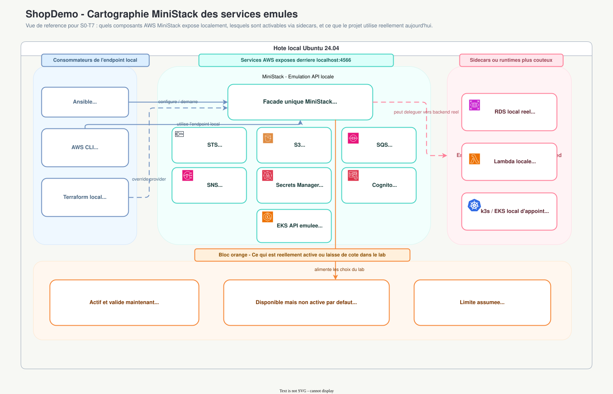
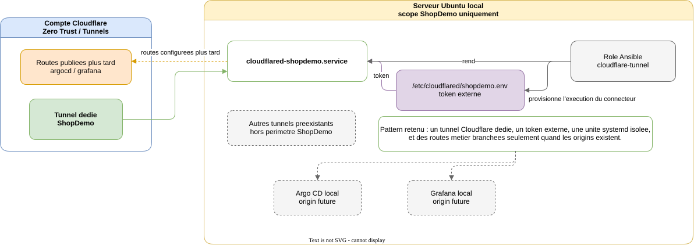

# Local Lab

[Retour a `ARCHITECTURE.md`](../../ARCHITECTURE.md)

## Role du lab local

Le lab local sert a :

- valider des automatismes Ansible et Terraform sans declencher tout de suite de cout AWS ;
- verifier des hypotheses de connectivite et de comportement Kubernetes local ;
- produire des smoke tests et des preuves pedagogiques avant validation finale sur AWS reel.

Il ne vise pas a reproduire parfaitement AWS.

## MiniStack

> **Note sur MiniStack** : LocalStack Community a passe ses services core en payant. MiniStack est le drop-in replacement MIT-licensie, zero compte, zero telemetrie - meme port `4566`. Il supporte `EKS API`, `Cognito` (JWTs valides), `RDS` (vrai Postgres), `SQS`, `Secrets Manager`. Pour `Organizations` et `SCPs`, un compte sandbox AWS reste la seule option fiable.

### Cartographie MiniStack - services AWS emules

<p align="center"></p>

> ✏️ **Source editable** : [`../diagrams/ministack-emulated-services.drawio`](../diagrams/ministack-emulated-services.drawio).
>
> **Lecture** :
> - `Ansible`, `AWS CLI` et des overrides Terraform pointent tous vers un **endpoint local unique** : `localhost:4566` ;
> - `MiniStack` joue le role de **facade AWS locale unique** ;
> - le bloc central montre les **emulations API utiles au projet** (`STS`, `S3`, `SQS`, `SNS`, `Secrets Manager`, `Cognito`, `EKS API`) ;
> - le bloc rose distingue les composants **plus lourds ou Docker-backed** (`RDS`, `Lambda`, `k3s/EKS local d'appoint`) ;
> - `Docker` reste donc un **prerequis fort** ;
> - le bloc orange explicite la decision `S0-T7` : une posture volontairement **sobre et reproductible**, sans persistance agressive ni service lourd active par defaut.

## k3s local

Le cluster local sert de support a :

- l'installation reproductible via Ansible ;
- la validation de `Cilium` en replacement mode ;
- les tests de connectivite et d'observabilite `Hubble` ;
- les futurs composants locaux de bootstrap comme `Argo CD`.

## Cloudflare Tunnel local

`S0-T8` ajoute une **couche d'integration dediee ShopDemo** au-dessus d'un
hote deja utilise pour d'autres besoins. L'objectif n'etait donc pas de
"prendre en charge Cloudflare" globalement,
mais de preparer un **tunnel `shopdemo` isole** pour les futurs services de
bootstrap local.

<p align="center"></p>

> ✏️ **Source editable** : [`../diagrams/cloudflare-tunnels-local.drawio`](../diagrams/cloudflare-tunnels-local.drawio).
>
> **Lecture** :
> - `shopdemo` est **dedie au projet** ;
> - sur l'hote, `cloudflared-shopdemo.service` reste separe des autres tunnels
>   deja presents, volontairement hors schema detaille ;
> - le token `shopdemo` est lu depuis `/etc/cloudflared/shopdemo.env`, donc
>   **hors Git** et hors `ExecStart` ;
> - les routes `argocd`, `grafana` et `gitea` sont **planifiees** cote
>   Cloudflare, mais ne doivent etre branchees qu'une fois les origins locales
>   reelles disponibles.

### Pattern retenu

- `cloudflared` n'est **pas reinstalle** par Ansible dans `S0-T8` ; le binaire
  est un prerequis de l'hote.
- Le role Ansible `cloudflare-tunnel` ne prend en charge que la
  **surcouche ShopDemo** :
  - fichier d'environnement `shopdemo.env` ;
  - unite `cloudflared-shopdemo.service` ;
  - gestion `systemd` dediee ;
  - variables de routes futures documentees.
- Le tunnel `shopdemo` est traite comme un **tunnel Cloudflare remote-managed** :
  - l'objet tunnel et son token existent cote Cloudflare ;
  - le serveur local ne gere que l'execution du connecteur ;
  - les routes publiees restent configurees dans le dashboard ou via l'API
    Cloudflare quand les services cibles existent.

### Pourquoi ce choix

- **Securite** : aucun takeover des autres tunnels deja presents sur
  le serveur.
- **Maintenabilite** : `cloudflared-shopdemo.service` est identifiable sans
  ambiguite, contrairement a un nom generique.
- **Reversibilite** : le tunnel ShopDemo peut etre coupe ou supprime sans
  impacter les autres tunnels hors perimetre du projet.
- **Pedagogie** : le sprint prouve le pattern "tunnel dedie + secret externe +
  service systemd" sans attendre le Sprint 1 pour disposer d'`Argo CD`,
  `Grafana` et `Gitea`.

### Ce qui est implemente vs planifie

**Implemente**

- playbook Ansible [`ansible/playbooks/cloudflare-tunnel.yml`](../../ansible/playbooks/cloudflare-tunnel.yml) ;
- role [`ansible/roles/cloudflare-tunnel/`](../../ansible/roles/cloudflare-tunnel) ;
- unite `systemd` `cloudflared-shopdemo.service` rendue par template ;
- token externe via `/etc/cloudflared/shopdemo.env` ;
- scenario Molecule minimal pour verifier le rendu et les permissions.

**Planifie**

- creation ou mise a jour des routes `argocd`, `grafana`, `gitea` cote
  Cloudflare une fois les services locaux disponibles ;
- validation end-to-end de chaque hostname public ;
- eventuelle integration de ce role dans un futur `bootstrap.yml`.

### Prerequis operatoires

Le role ne cree pas l'objet tunnel cote Cloudflare a lui seul. Il suppose :

- un tunnel `shopdemo` deja cree dans Cloudflare ;
- un token `cloudflared` associe a ce tunnel ;
- des routes publiees ajoutees plus tard dans Cloudflare pour `argocd`,
  `grafana` et `gitea` quand les services locaux seront reels.

Usage retenu pour le token `shopdemo` :

- la persistence runtime du secret est portee par
  `/etc/cloudflared/shopdemo.env` ;
- la variable shell `SHOPDEMO_TUNNEL_TOKEN` n'est utile que pour rejouer le
  playbook manuellement ;
- cette variable est donc exportee **temporairement** au besoin, puis peut
  disparaitre a la fermeture du terminal sans impacter le service `systemd`.

Commande utile pour recharger temporairement le token deja present sur l'hote :

```bash
export SHOPDEMO_TUNNEL_TOKEN="$(sudo awk -F= '/^TUNNEL_TOKEN=/{print $2}' /etc/cloudflared/shopdemo.env)"
```

Commande type de lancement :

```bash
cd ansible
ansible-playbook playbooks/cloudflare-tunnel.yml \
  -e cloudflare_tunnel_shopdemo_token="$SHOPDEMO_TUNNEL_TOKEN"
```

Ce lancement est **verifie syntaxiquement** dans le repo, mais la connexion
effective au compte Cloudflare depend ensuite du vrai token fourni hors Git.

## Cilium local

En local, `Cilium` remplace entierement le CNI :

- `Flannel` est desactive ;
- `kube-proxy` est desactive et remplace par le datapath Cilium ;
- `Hubble` est active pour visualiser les flux ;
- l'objectif est de comprendre le comportement reseau et l'enforcement localement.

Pour le detail du modele `replacement mode` local vs `chaining mode` EKS, voir [`03-kubernetes-runtime.md`](03-kubernetes-runtime.md).

## Limites explicites du lab local

- les sujets `Organizations`, `SCPs` et gouvernance multi-comptes se valident sur AWS reel ;
- le comportement `EKS` localement emule n'est pas une equivalence fonctionnelle complete ;
- le lab optimise l'apprentissage et la rapidite, pas la fidelite parfaite.
