# AWS Target

[Retour a `ARCHITECTURE.md`](../../ARCHITECTURE.md)

## Organisation AWS

> 📊 **Diagramme interactif** : [`../diagrams/organisation-aws.html`](../diagrams/organisation-aws.html).
>
> **SCP `deny-regions-outside-eu`** : s'applique uniquement aux services regionaux. Les services globaux (`iam`, `route53`, `cloudfront`, `sts`, `support`, `s3` control plane) sont explicitement exclus.

## Terraform - 2 states separes (bootstrap vs workload)

> 📊 **Diagramme interactif** : [`../diagrams/terraform-states.html`](../diagrams/terraform-states.html).

Le state `bootstrap` contient l'EC2 runner et le bucket S3 qui heberge le state `workload`. Si tout etait dans un seul state, `terraform destroy` detruirait le runner en train d'executer le destroy.

- `bootstrap` : permanent ;
- `workload` : ephemere, detruit hors session ;
- `apply/destroy workload` : executes sur les shared runners GitLab.com ;
- `EC2 runner bootstrap` : reserve aux jobs necessitant le reseau prive (`kubectl apply`, acces RDS, etc.).

## Vue plateforme - chemin HTTP synchrone

> 📊 **Diagramme interactif** : [`../diagrams/plateforme-cible.html`](../diagrams/plateforme-cible.html).

Lecture cible :

- `CloudFront + WAF` pour le frontend et l'entree edge ;
- `ALB + Gateway API` comme frontiere du cluster ;
- `services Go` sur `EKS` ;
- `RDS` pour la persistence ;
- `Cognito` pour l'identite.

## Vue plateforme - webhook paiement async

> 📊 **Diagramme interactif** : [`../diagrams/webhook-paiement-async.html`](../diagrams/webhook-paiement-async.html).

Clarification terminologique :

- **API Gateway AWS** : service manage AWS, utilise uniquement pour le webhook paiement entrant ;
- **Gateway API Kubernetes** : spec CNCF implemente par NGINX, utilisee pour le routage dans le cluster.
