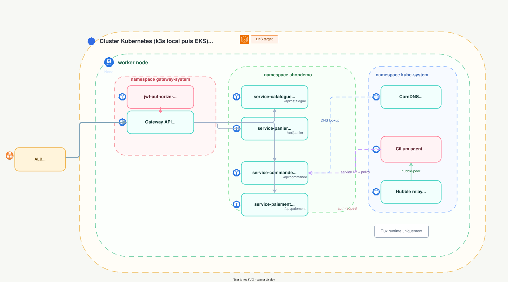
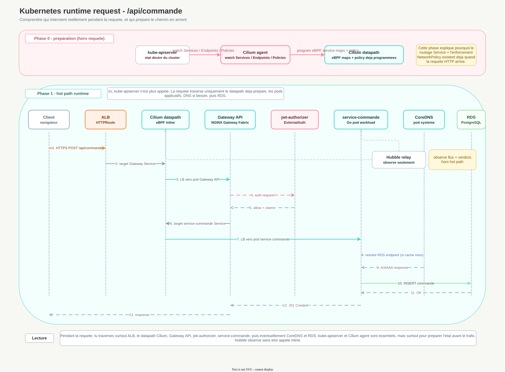

# Kubernetes Runtime

[Retour a `ARCHITECTURE.md`](../../ARCHITECTURE.md)

## Architecture Kubernetes : lab local vs EKS

En local, `k3s` sert de cluster de lab reproductible et `Cilium` remplace entierement le CNI puisqu'il n'y a aucune contrainte d'integration cloud a respecter. Sur EKS, le `VPC CNI` AWS reste obligatoire pour l'attribution d'IP reelles depuis le VPC et l'integration native. `Cilium` est donc chaine par-dessus pour porter l'enforcement reseau et l'observabilite `Hubble`.

| Domaine | Local k3s | Cible EKS |
|---|---|---|
| CNI / routage pod-a-pod | **Remplace par Cilium** : Flannel desactive | **Partage** : VPC CNI pour IP/routage, Cilium par-dessus |
| Routage des Services (`kube-proxy`) | **Remplace par Cilium** | **Non retenu comme axe principal a ce stade** |
| `NetworkPolicy` | **Gere par Cilium** | **Gere par Cilium** |
| Observabilite reseau | **Oui** : Hubble active | **Oui** : Hubble prevu |
| Chiffrement noeud-a-noeud | **Non prevu actuellement** | **Non prevu actuellement** |
| Service mesh L7 | **Non** | **Non** |

## Vue securite des pods EKS

> 📊 **Diagramme interactif** : [`../diagrams/securite-pods-eks.html`](../diagrams/securite-pods-eks.html).

Cette vue montre la composition interne du pod et les controles autour :

- `init containers` ;
- conteneur applicatif Go ;
- sidecars techniques ;
- identite IAM via `IRSA` ;
- politiques d'admission et projection des secrets hors pod.

## Vue runtime inter-pods

> 📊 **Diagramme interactif** : [`../diagrams/flux-runtime-k8s.html`](../diagrams/flux-runtime-k8s.html).

Lecture :

- `ALB -> Gateway API -> jwt-authorizer / services Go` ;
- `CoreDNS` pour la resolution ;
- `Cilium` pour l'enforcement et le service load-balancing ;
- `Hubble` pour l'observabilite.

## Vue Kubernetes - sequence d'une requete runtime

> ✏️ **Source editable** : [`../diagrams/flux-runtime-requete-k8s-sequence.drawio`](../diagrams/flux-runtime-requete-k8s-sequence.drawio).

### Etapes - ce qu'il se passe concretement

1. `kube-apiserver` porte l'etat desire mais ne route pas le trafic applicatif.
2. `Cilium agent` consomme cet etat et prepare le datapath.
3. Le datapath `eBPF` est deja pret quand le trafic arrive.
4. Le client envoie `POST /api/commande` vers l'`ALB`.
5. Cilium fait le service load-balancing vers un vrai pod `Gateway API`.
6. La Gateway appelle `jwt-authorizer` et propage seulement les claims utiles.
7. La Gateway route vers `service-commande`.
8. Le service Go traite la logique metier et peut resoudre l'endpoint RDS via `CoreDNS`.
9. `CoreDNS` sert a la resolution, pas au routage HTTP.
10. Le pod appelle `RDS`.
11. La reponse remonte via `service-commande -> Gateway API -> ALB -> client`.
12. `Hubble` observe le flux mais n'est pas dans le hot path.

### Mental model utile

- `kube-apiserver` et `Cilium agent` servent a **preparer** ;
- `Cilium datapath`, la Gateway, `jwt-authorizer`, le pod Go et eventuellement `CoreDNS` servent a **faire passer** ;
- `Hubble` sert a **voir**.

## Vue Kubernetes - control plane

> 📊 **Diagramme interactif** : [`../diagrams/control-plane-k8s.html`](../diagrams/control-plane-k8s.html).

Cette vue separe les flux de pilotage du cluster des flux runtime applicatifs.
