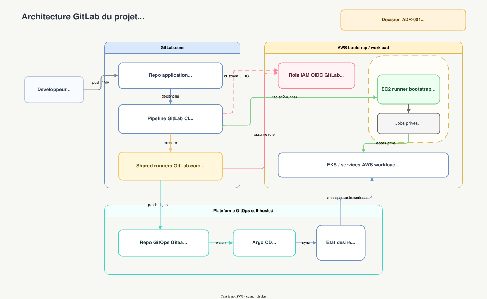

# Delivery And GitOps

[Retour a `ARCHITECTURE.md`](../../ARCHITECTURE.md)

## Flux GitOps

> 📊 **Diagramme interactif** : [`../diagrams/pipeline-gitops.html`](../diagrams/pipeline-gitops.html).

Le pipeline separe :

- la **validation** de l'artefact ;
- la **mise a jour GitOps** de l'etat desire ;
- la **synchronisation** du cluster par `Argo CD`.

`Trivy` ne met pas a jour le repo GitOps. Son role est de bloquer ou laisser passer l'artefact. Le commit GitOps est fait par l'etape dediee `update-gitops-tag`, typiquement avec `[skip ci]`.

## Base GitOps locale

Le Sprint 1 demarre par une structure GitOps locale, versionnee dans
[`../../gitops/`](../../gitops/), avant l'installation effective d'Argo CD.

Le cadrage detaille vit dans
[`../gitops-structure.md`](../gitops-structure.md). Il separe :

- `platform/` pour les ressources transverses du cluster ;
- `apps/` pour les bases applicatives reutilisables ;
- `environments/` pour les assemblages staging/prod ;
- `argocd/` pour les objets Argo CD qui arriveront a partir de `S1-T2`.

Etat actuel : seuls la structure, les namespaces et les validations locales
sont en place. Aucun `ApplicationSet` n'est encore applique au cluster.

## Vue GitLab cible

> Source editable : [`../diagrams/gitlab-architecture.drawio`](../diagrams/gitlab-architecture.drawio).

Ce schema met l'accent sur les responsabilites :

- `GitLab.com` porte la CI et les shared runners ;
- le role OIDC AWS permet l'authentification sans cle longue duree ;
- le runner bootstrap prive reste reserve aux jobs qui doivent entrer dans le reseau AWS ;
- le repo GitOps vit sur `GitLab.com`, source de verite unique pour le code,
  la CI et Argo CD ; `GitHub` reste un miroir public en lecture seule
  ([`ADR-007`](../adr/ADR-007-gitlab-source-of-truth-github-mirror.md)),
  puis `Argo CD` applique l'etat desire sur le workload.

## Principes de livraison

- builds rootless ;
- digest pinning ;
- SBOM et scans associes ;
- OIDC GitLab vers AWS ;
- separation entre shared runners GitLab.com et runner bootstrap prive.

## Pourquoi GitOps ici

GitOps rend visibles :

- le changement desire ;
- la promotion d'image par digest ;
- le delta reel entre intention et cluster ;
- le role respectif de la CI et du control plane GitOps.
