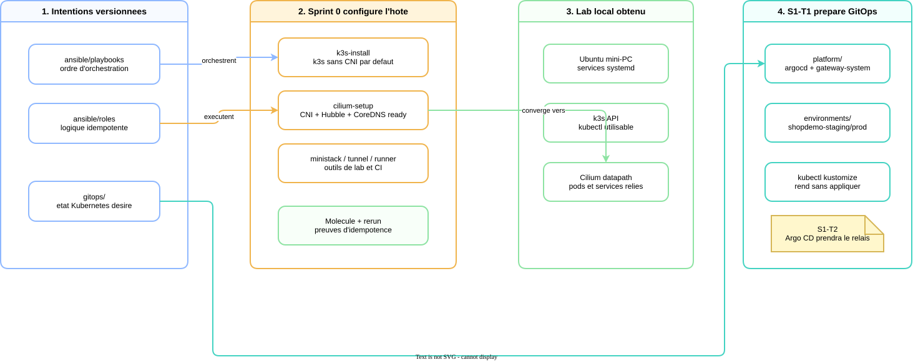
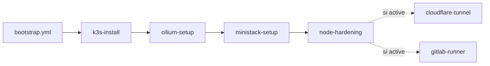
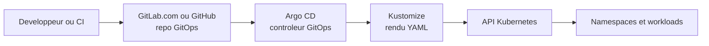

# Comment ca marche techniquement

## Pourquoi ce document existe

Les documents d'architecture expliquent **ce que le projet veut construire**.
Les documents de sprint expliquent **ce qui est fait et valide**. Celui-ci sert
a expliquer **comment on l'a fait techniquement**, avec les fichiers reels du
repo comme support.

L'objectif est de pouvoir parler du projet en entretien sans rester au niveau
"j'ai installe k3s, Cilium et GitOps". Il faut pouvoir raconter le chemin :

> J'ai d'abord rendu le serveur local reproductible avec Ansible. Ensuite, j'ai
> commence a deplacer l'intention Kubernetes dans Git, pour preparer Argo CD.

Ce document sera complete sprint par sprint.

## Vue d'ensemble actuelle

<p align="center">
  
</p>

> Source editable :
> [`diagrams/comment-ca-marche-s0-s1.drawio`](diagrams/comment-ca-marche-s0-s1.drawio).

Le projet part d'un serveur Ubuntu local. Au lieu de le configurer a la main,
on decrit sa configuration avec Ansible. Le point important n'est pas seulement
"installer des outils". Le point important est de rendre cette installation
rejouable, lisible et testable.

Le Sprint 0 fabrique donc un lab local : `k3s` fournit l'API Kubernetes,
`Cilium` fournit le reseau des pods, `MiniStack` aide a tester des flux AWS en
local, `cloudflare-tunnel` prepare l'exposition future d'outils, et
`gitlab-runner` permet de raccorder le lab a la CI.

`S1-T1` ne deploie pas encore Argo CD. Il commence par une etape plus simple :
mettre l'etat Kubernetes desire dans [`../gitops/`](../gitops/). A ce stade,
Kustomize sert seulement a rendre les YAML localement pour verifier ce qui
serait applique plus tard.

Mise a jour `S1-T2` (2026-09-07) : Argo CD est desormais reellement installe
et synchronise depuis GitLab. La section `S1-T1` ci-dessous decrit
volontairement l'etat d'avant Argo CD, pour expliquer la progression pas a
pas ; la suite se trouve dans le chapitre
["S1-T2 - Comment Argo CD est installe et synchronise"](#s1-t2---comment-argo-cd-est-installe-et-synchronise)
plus bas dans ce document.

## Sprint 0 - Comment le lab local est construit

### Le point d'entree : un playbook qui raconte l'ordre

Le fichier [`ansible/playbooks/bootstrap.yml`](../ansible/playbooks/bootstrap.yml)
est le point d'entree principal du lab local.

Il ne contient pas toute la logique. Il raconte plutot l'ordre dans lequel les
briques doivent arriver :

```yaml
roles:
  - role: k3s-install
  - role: cilium-setup
    cilium_runtime_validation_enabled: "{{ not ansible_check_mode }}"
  - role: ministack-setup
    ministack_runtime_validation_enabled: "{{ not ansible_check_mode }}"
  - role: node-hardening
  - role: cloudflare-tunnel
    when: bootstrap_enable_cloudflare_tunnel | bool
  - role: gitlab-runner
    when: bootstrap_enable_gitlab_runner | bool
```

La logique est volontairement separee :

- le playbook orchestre ;
- chaque role sait configurer une responsabilite technique ;
- les roles optionnels restent desactives par defaut quand ils exigent un
  secret externe.

C'est une bonne pratique importante : si `bootstrap.yml` contenait directement
toutes les tasks k3s, Cilium, MiniStack, tunnel et runner, il serait plus dur a
relire, plus dur a tester, et plus risque a rejouer.



### Comment Ansible sait ou agir

Le lab local est cible par un inventaire tres simple :
[`ansible/inventory/local.yml`](../ansible/inventory/local.yml).

```yaml
all:
  children:
    local:
      hosts:
        localhost:
          ansible_connection: local
          ansible_host: 127.0.0.1
```

Cette configuration dit : "le groupe `local` pointe vers la machine courante".
Ansible ne se connecte pas en SSH a une autre machine ; il agit localement.

Le fichier [`ansible/ansible.cfg`](../ansible/ansible.cfg) donne ensuite les
regles de base : quel inventaire charger, ou trouver les roles, quelles
collections utiliser, et quels plugins d'inventaire autoriser.

Ce detail est important pour expliquer le projet : Ansible n'est pas lance dans
le vide. Il a toujours besoin de trois choses :

```text
inventaire -> variables -> playbook
```

Dans ce projet, les variables communes viennent de
[`ansible/group_vars/all.yml`](../ansible/group_vars/all.yml). C'est la que l'on
retrouve par exemple les flags qui gardent `cloudflare-tunnel` et
`gitlab-runner` desactives par defaut.

### Comment `k3s-install` evite les surprises

Le role [`ansible/roles/k3s-install`](../ansible/roles/k3s-install/) installe le
cluster Kubernetes local. La decision importante est visible dans ses defaults :

```yaml
k3s_install_extra_args:
  - "--flannel-backend=none"
  - "--disable-network-policy"
  - "--disable-kube-proxy"
```

Cela veut dire : k3s demarre sans son reseau par defaut. Ce n'est pas une
optimisation gratuite ; c'est une preparation pour Cilium. On evite d'avoir
Flannel et Cilium qui essaient tous les deux de gerer le reseau des pods.

Le role commence aussi par des assertions. Dans
[`ansible/roles/k3s-install/tasks/main.yml`](../ansible/roles/k3s-install/tasks/main.yml),
il verifie que l'hote ressemble bien a la cible attendue : Linux, famille
Debian, systemd. C'est une barriere simple mais utile : si quelqu'un lance le
role sur une machine qui ne correspond pas, l'erreur arrive tot et clairement.

Ensuite le role ne reinstalle pas aveuglement k3s. Il observe d'abord l'etat :

```yaml
- name: Check whether k3s is already installed
  ansible.builtin.stat:
    path: /usr/local/bin/k3s
  register: k3s_binary
```

Puis il lit la version actuelle et le service systemd, calcule si les flags ont
derive, et produit une variable de decision : `k3s_needs_install`.

Le raisonnement est :

```text
k3s absent -> installer
mauvaise version -> installer
flags systemd differents -> reinstaller
force_reinstall=true -> reinstaller
sinon -> ne pas toucher
```

C'est exactement l'idempotence en pratique : relancer le role ne doit pas
modifier la machine si elle est deja conforme.

<p align="center">
  
</p>

> Source editable :
> [`diagrams/concepts-s0-role-contract.drawio`](diagrams/concepts-s0-role-contract.drawio).

### Pourquoi il y a un handler

Le role `k3s-install` a aussi un handler dans
[`ansible/roles/k3s-install/handlers/main.yml`](../ansible/roles/k3s-install/handlers/main.yml).

```yaml
- name: Restart k3s
  ansible.builtin.service:
    name: k3s
    state: restarted
```

La task d'installation notifie ce handler uniquement quand elle change quelque
chose. Le handler ne tourne donc pas a chaque execution. Il sert a dire :
"si l'installation ou la configuration a vraiment change, alors redemarre k3s".

La nuance est importante :

```text
task = action dans le flux normal
handler = reaction declenchee par un changement
```

Ce pattern evite de redemarrer des services sans raison, tout en garantissant
qu'un changement reel est bien pris en compte.

### Comment le kubeconfig est rendu utilisable

k3s cree un kubeconfig systeme dans `/etc/rancher/k3s/k3s.yaml`. Ce fichier est
utile, mais il appartient au monde systeme. Le role le copie ensuite vers le
compte utilisateur cible :

```yaml
- name: Synchronize kubeconfig for target user
  ansible.builtin.copy:
    content: "{{ k3s_system_kubeconfig.content | b64decode }}"
    dest: "{{ k3s_user_kubeconfig_path }}"
    owner: "{{ k3s_kubeconfig_user }}"
    group: "{{ k3s_kubeconfig_group }}"
    mode: "0600"
```

Techniquement, cela permet d'utiliser `kubectl` sans `sudo`. Cote securite, le
mode `0600` est important : le kubeconfig donne un acces administrateur au
cluster local, donc il ne doit pas etre lisible par tout le monde.

### Comment Cilium prend le relais du reseau

Une fois k3s installe, le cluster n'est pas complet : on a l'API Kubernetes,
mais on a volontairement retire le CNI par defaut. C'est le role
[`ansible/roles/cilium-setup`](../ansible/roles/cilium-setup/) qui rend le
cluster vraiment utilisable.

Ses defaults expliquent plusieurs choix non triviaux :

```yaml
cilium_kube_proxy_replacement: true
cilium_k8s_service_host: "{{ ansible_facts['default_ipv4']['address'] }}"
cilium_devices: "{{ ansible_facts['default_ipv4']['interface'] }}"
cilium_operator_replicas: 1
```

Le mode `kubeProxyReplacement` signifie que Cilium remplace kube-proxy pour le
routage des Services Kubernetes. Comme k3s a ete demarre avec
`--disable-kube-proxy`, ce choix n'est pas optionnel : quelqu'un doit assurer le
routage des Services, et ici c'est Cilium.

Le `k8sServiceHost` est aussi important. Dans ce setup local, Cilium doit savoir
joindre directement l'API Kubernetes sur l'IP du noeud. C'est justement un des
points qui avait pose probleme quand l'ancien etat k3s pointait vers une
ancienne IP.

Enfin, `cilium_operator_replicas: 1` vient du fait que le lab est mono-noeud.
Deux replicas d'operator seraient plus proches d'un cluster multi-noeud, mais
ici ils peuvent rester Pending a cause des contraintes locales. On documente le
compromis au lieu de pretendre que le lab est une production.

<p align="center">
  
</p>

> Source editable :
> [`diagrams/concepts-s0-k3s-cilium-lifecycle.drawio`](diagrams/concepts-s0-k3s-cilium-lifecycle.drawio).

### Pourquoi le role touche a `ufw`

Le role contient cette task :

```yaml
- name: Allow the Cilium pod CIDR to reach the host through ufw
  community.general.ufw:
    rule: allow
    from_ip: "{{ cilium_pod_cidr }}"
    comment: "Cilium pod CIDR to host (k3s API, cilium agent, hubble-peer)"
```

Elle existe parce que, dans ce lab, certains flux pod -> hote sont legitimes :
API Kubernetes, agent Cilium, Hubble. Si `ufw` bloque tout trafic entrant, des
pods peuvent ne pas reussir a parler a l'IP du noeud, meme si le cluster semble
partiellement demarre.

Le point a savoir expliquer : ouvrir ce flux ne veut pas dire abandonner toute
isolation reseau. L'isolation fine entre workloads doit venir ensuite des
NetworkPolicies Cilium.

### Pourquoi CoreDNS peut etre redemarre

CoreDNS est le DNS interne de Kubernetes. Au boot, il peut etre programme avant
que Cilium soit completement pret. Le role detecte donc si CoreDNS n'est pas
Ready, puis le redemarre une fois le reseau en place.

Ce n'est pas un redemarrage systematique. La task est conditionnee :

```yaml
when:
  - cilium_runtime_validation_enabled | bool
  - "'True' not in cilium_coredns_initial.stdout"
```

C'est une bonne illustration de la logique "observer avant d'agir". On ne
corrige que si l'etat observe le justifie.

### Comment MiniStack sert le projet

[`ansible/roles/ministack-setup`](../ansible/roles/ministack-setup/) prepare un
petit environnement local qui expose une API compatible avec certains usages AWS
de test.

Le role fait trois choses :

1. il verifie que Docker et AWS CLI sont disponibles ;
2. il lance le container MiniStack ;
3. il ecrit un profil AWS CLI dedie.

Le controle interessant est le smoke test STS :

```bash
aws --profile "{{ ministack_aws_profile_name }}" \
  --endpoint-url "{{ ministack_effective_endpoint_url }}" \
  sts get-caller-identity
```

Ce test ne prouve pas qu'AWS reel fonctionne. Il prouve que le chemin local
profil AWS CLI -> endpoint MiniStack -> reponse compatible est coherent. Pour
un lab, c'est utile : on valide des mecanismes sans payer ni toucher une vraie
ressource cloud.

### Comment le runner GitLab est rendu optionnel

Le role [`ansible/roles/gitlab-runner`](../ansible/roles/gitlab-runner/) est
plus sensible, parce qu'il a besoin d'un token externe. C'est pour cela que
`bootstrap.yml` ne l'active que si `bootstrap_enable_gitlab_runner` vaut `true`.

Dans le role, l'enregistrement est aussi protege :

```yaml
- name: Assert token is present when registration is enabled
  ansible.builtin.assert:
    that:
      - gitlab_runner_token | length > 0
  when: gitlab_runner_manage_registration | bool
  no_log: true
```

Deux idees sont importantes ici :

- on ne versionne pas le token ;
- on masque les donnees sensibles dans les logs Ansible avec `no_log: true`.

En entretien, c'est un bon exemple pour montrer que l'automatisation ne veut pas
dire "mettre des secrets dans Git".

### Comment on prouve que les roles sont rejouables

Molecule sert a tester un role dans un environnement isole. Sur
[`ansible/roles/k3s-install/molecule/default/converge.yml`](../ansible/roles/k3s-install/molecule/default/converge.yml),
le scenario cree un utilisateur de test, puis applique le role.

Le fichier
[`ansible/roles/k3s-install/molecule/default/verify.yml`](../ansible/roles/k3s-install/molecule/default/verify.yml)
ne configure plus rien. Il observe :

- le service `k3s` est actif ;
- le service systemd contient les bons flags ;
- le kubeconfig utilisateur existe avec les bonnes permissions ;
- `kubectl` peut lister au moins un noeud.

La boucle mentale est :

```text
converge -> le role configure
idempotence -> le role rejoue sans changement inutile
verify -> on observe l'etat attendu
```

Ce n'est pas juste du test pour cocher une case. C'est ce qui permet de dire :
"je peux rejouer mon bootstrap apres une coupure, une correction ou une
evolution, et voir precisement ce qui change".

### Pourquoi les playbooks futurs ont `apply=false`

Le Sprint 0 a aussi cadre deux playbooks futurs :

- [`ansible/playbooks/runner-setup.yml`](../ansible/playbooks/runner-setup.yml)
- [`ansible/playbooks/rds-setup.yml`](../ansible/playbooks/rds-setup.yml)

Ils existent pour clarifier la frontiere Terraform / Ansible. Terraform creera
les ressources AWS ; Ansible configurera ce qui vit apres la creation :
runner, bases et users.

Le point cle est qu'ils sont inoffensifs par defaut :

```yaml
runner_setup_apply: false
rds_setup_apply: false
```

Cela permet de versionner l'interface attendue sans appeler AWS ou RDS trop
tot. Les playbooks documentent deja les inputs et les secrets attendus, mais
ils ne font rien tant que l'activation n'est pas explicite.

## S1-T1 - Comment la base GitOps commence

### Vue globale : Git, Argo CD, Kustomize et Kubernetes

Avant de rentrer dans les fichiers, il faut separer les responsabilites. Dans
un flux GitOps, plusieurs outils apparaissent cote a cote, mais ils ne font pas
le meme travail.



Git et Argo CD ne font pas le meme travail. Git stocke des repositories, des
commits et des branches. Argo CD est un controleur Kubernetes : il lit un
repository Git, compare ce qu'il y trouve avec l'etat reel du cluster, puis
synchronise le cluster quand c'est autorise.

Le projet ne deploie plus de forge Git self-hosted dans le MVP. La relation
cible est donc :

```text
GitLab.com ou GitHub = la source de verite Git
Argo CD = le moteur qui reconcilie cette source avec Kubernetes
Kustomize = l'outil qui transforme les dossiers YAML en manifests finaux
Kubernetes = le systeme qui stocke et execute l'etat reel
```

Aujourd'hui, dans `S1-T1`, on ne deploie pas encore Argo CD. On prepare
seulement le contenu que GitOps devra lire : les dossiers, les namespaces et
les points d'entree Kustomize.

### Le probleme qu'on resout

Apres Sprint 0, on a un cluster local utilisable. La question devient :
"comment va-t-on decrire ce que Kubernetes doit contenir ?".

Une mauvaise reponse serait de lancer a la main des commandes `kubectl apply`
sans structure durable. Ca marcherait peut-etre une fois, mais on perdrait vite
la trace de l'intention.

La reponse du Sprint 1 est GitOps : l'etat desire vit dans Git, et Argo CD le
synchronisera plus tard.

### Ce que `S1-T1` met vraiment en place

Le repertoire [`../gitops/`](../gitops/) est volontairement simple :

```text
gitops/
  platform/
  apps/
  environments/
  argocd/
```

`platform/` contient ce qui appartient au cluster, pas a une application. En
`S1-T1`, cela se limite aux namespaces techniques :

```yaml
apiVersion: v1
kind: Namespace
metadata:
  name: argocd
```

`environments/staging/` et `environments/prod/` contiennent ce qui depend d'un
environnement applicatif. Pour l'instant, chaque environnement cree seulement
son namespace :

```yaml
metadata:
  name: shopdemo-staging
  labels:
    shopdemo.io/environment: staging
```

Cette separation evite qu'un environnement staging transporte par accident des
ressources prod ou des ressources globales du cluster.

<p align="center">
  
</p>

> Source editable :
> [`diagrams/s1-gitops-repo-structure.drawio`](diagrams/s1-gitops-repo-structure.drawio).

### Le role exact de Kustomize

La vue globale de Kustomize est simple : il ne decide pas quoi deployer, il ne
parle pas a Git, et il ne surveille pas le cluster. Il prend un dossier en
entree et produit du YAML Kubernetes en sortie.

Dans chaque dossier deployable, il y a donc un `kustomization.yaml`. Ce fichier
est la table des matieres du dossier.

Exemple dans
[`gitops/platform/kustomization.yaml`](../gitops/platform/kustomization.yaml) :

```yaml
resources:
  - namespaces/base
```

Ce fichier ne cree rien par lui-meme. Il dit seulement a Kustomize :
"pour rendre ce dossier, inclus le dossier `namespaces/base`".

Kustomize suit alors le chemin et lit
[`gitops/platform/namespaces/base/kustomization.yaml`](../gitops/platform/namespaces/base/kustomization.yaml) :

```yaml
resources:
  - namespaces.yaml
```

Ce deuxieme fichier pointe enfin vers
[`gitops/platform/namespaces/base/namespaces.yaml`](../gitops/platform/namespaces/base/namespaces.yaml),
qui contient les vrais objets Kubernetes :

```yaml
apiVersion: v1
kind: Namespace
metadata:
  name: argocd
  labels:
    app.kubernetes.io/part-of: shopdemo-platform
    app.kubernetes.io/managed-by: gitops
    shopdemo.io/environment: platform
---
apiVersion: v1
kind: Namespace
metadata:
  name: gateway-system
  labels:
    app.kubernetes.io/part-of: shopdemo-platform
    app.kubernetes.io/managed-by: gitops
    shopdemo.io/environment: platform
```

La reponse concrete a "ou est-ce qu'on lui dit de creer les namespaces ?" est
donc : on ne le dit pas a Kustomize sous forme d'ordre special. On met des
objets Kubernetes `kind: Namespace` dans `namespaces.yaml`, puis on reference ce
fichier dans la chaine des `resources`.

Quand on lance :

```bash
kubectl kustomize gitops/platform
```

Kustomize lit le fichier `kustomization.yaml`, suit la liste `resources`, puis
sort un YAML final. Dans ce lot, ce YAML final contient les namespaces `argocd`
et `gateway-system`.

La nuance importante :

```text
kubectl kustomize = rendre le YAML
kubectl apply -k = rendre puis appliquer
Argo CD sync = rendre puis reconcilier depuis Git
```

Pour `S1-T1`, on utilise seulement le rendu. C'est ce qui permet de valider la
structure GitOps sans modifier le cluster.

Le meme principe existe pour les environnements applicatifs :

```text
gitops/environments/staging/kustomization.yaml
  -> namespace.yaml
  -> Namespace shopdemo-staging

gitops/environments/prod/kustomization.yaml
  -> namespace.yaml
  -> Namespace shopdemo-prod
```

Les labels donnent une information lisible et filtrable :

```yaml
app.kubernetes.io/part-of: shopdemo
app.kubernetes.io/managed-by: gitops
shopdemo.io/environment: staging
```

`argocd` existe parce que ce namespace accueille le control plane Argo CD,
installe depuis `S1-T2`. `gateway-system` existe parce que Gateway API, NGINX Gateway
Fabric et les composants d'entree/authentification doivent rester separes des
applications metier. `shopdemo-staging` et `shopdemo-prod` existent pour que les
workloads applicatifs aient des frontieres claires par environnement.

### Comment les validations prouvent le cadrage

Les validations de `S1-T1` ne cherchent pas a prouver qu'Argo CD marche,
puisqu'il n'est pas encore installe.

Elles prouvent plutot trois choses :

- Kustomize peut rendre chaque point d'entree ;
- les YAML respectent le style attendu ;
- les manifests rendus ressemblent a des objets Kubernetes valides.

Les commandes utiles sont :

```bash
kubectl kustomize gitops/platform
kubectl kustomize gitops/environments/staging
kubectl kustomize gitops/environments/prod
yamllint gitops
kubeconform -strict -ignore-missing-schemas <rendered-yaml>
```

C'est une validation adaptee au niveau du sprint. On ne simule pas une maturite
qui n'existe pas encore ; on prouve seulement le contrat du lot courant.

## S1-T2 - Comment Argo CD est installe et synchronise

### Le probleme qu'on resout

`S1-T1` a pose l'intention dans Git (namespaces, structure `gitops/`), mais
rien ne la lisait encore. Sans un controleur qui observe le repository, cette
intention reste juste du YAML inerte : personne ne compare, personne ne
reconcilie. `S1-T2` installe ce controleur : Argo CD.

### Ce que `S1-T2` met vraiment en place

Trois objets concrets, dans [`../gitops/argocd/`](../gitops/argocd/) :

```text
gitops/argocd/
  install.yaml                        # Argo CD lui-meme (CRD, controllers, RBAC)
  bootstrap-application-platform.yaml # la premiere Application
  README.md
```

`install.yaml` est le manifest officiel du projet Argo CD, telecharge depuis
un tag versionne (`v3.5.2`), pas depuis l'alias flottant `stable` :

```bash
curl -sL -o gitops/argocd/install.yaml \
  https://raw.githubusercontent.com/argoproj/argo-cd/v3.5.2/manifests/install.yaml
```

Pourquoi un tag et pas `stable` : `stable` peut pointer vers une version
differente demain, ce qui rendrait l'installation non reproductible d'une
session a l'autre. Un tag fige la version que ce depot documente reellement.

Premiere subtilite technique : ce manifest ne s'installe pas avec un simple
`kubectl apply`. Le CRD `applicationsets.argoproj.io` est trop volumineux pour
l'annotation `kubectl.kubernetes.io/last-applied-configuration` que le
client-side apply essaie d'y ecrire (limite de 262144 octets). Il faut
utiliser l'apply cote serveur, qui ne pose pas cette annotation :

```bash
kubectl apply -n argocd -f gitops/argocd/install.yaml \
  --server-side --force-conflicts
```

Une fois Argo CD vivant (7 pods dans le namespace `argocd`), il lui faut une
premiere `Application` : l'objet qui lui dit *quel* repo Git lire et *quel*
chemin y surveiller.

```yaml
apiVersion: argoproj.io/v1alpha1
kind: Application
metadata:
  name: platform
  namespace: argocd
spec:
  project: default
  source:
    repoURL: https://gitlab.com/ClementV78/shopdemo.git
    targetRevision: main
    path: gitops/platform
  destination:
    server: https://kubernetes.default.svc
    namespace: argocd
  syncPolicy:
    automated:
      prune: true
      selfHeal: true
```

`prune: true` supprime du cluster ce qui disparait de Git. `selfHeal: true`
annule automatiquement toute derive manuelle (un `kubectl edit` fait a la main
sur une ressource geree serait ecrase au prochain cycle). C'est volontaire :
le but de GitOps est que Git reste la seule source d'ecriture durable.

### Le repo prive et le credential Git

Le repo `ClementV78/shopdemo` est prive sur GitLab. Argo CD a donc besoin d'un
identifiant pour cloner. Ce credential ne vit jamais dans Git : il est cree
directement comme `Secret` Kubernetes, avec un token GitLab dedie et minimal
(role `Reporter`, scope `read_repository` uniquement, pas le token plus
privilegie deja utilise par la CI).

Deuxieme subtilite technique, facile a oublier : Argo CD ne reconnait un
`Secret` comme credential de repository que s'il porte un label precis. Sans
ce label, le secret existe mais Argo CD l'ignore silencieusement :

```bash
kubectl label secret argocd-repo-shopdemo -n argocd \
  argocd.argoproj.io/secret-type=repository
```

### Ce qui peut casser autour d'Argo CD sans que ce soit Argo CD

Le premier essai de synchronisation de `S1-T2` a echoue non pas a cause d'Argo
CD, mais a cause d'une panne d'egress reseau du cluster (une regression
Cilium heritee du reset du 2026-09-05) : aucun pod ne pouvait sortir vers
Internet, donc Argo CD ne pouvait pas cloner le repo. La lecon a retenir : un
`Sync Status: Unknown` avec une erreur `dial tcp: lookup ... server
misbehaving` n'est pas forcement un probleme de configuration GitOps, ca peut
etre la couche reseau en dessous. Diagnostic complet, boucle
hypothese/commande/observation et schema du blocage :
[`evidence/sprint-1/s1-t2-cilium-egress-blocker.md`](evidence/sprint-1/s1-t2-cilium-egress-blocker.md).

### Comment les validations prouvent que ca marche

```bash
kubectl get pods -n argocd
kubectl get applications -n argocd
kubectl get application platform -n argocd \
  -o jsonpath='{.status.sync.status}{" / "}{.status.health.status}{"\n"}'
```

La preuve attendue est `Synced / Healthy`, sans qu'aucun secret n'ait ete
committe dans Git a aucun moment de ce lot.

## Ce qu'il faut savoir raconter en entretien

Le discours court :

> J'ai commence par automatiser mon lab local avec Ansible. Le playbook
> principal orchestre des roles specialises. Les roles observent l'etat avant
> d'agir, utilisent des handlers quand un service doit reagir a un changement,
> et sont testes avec Molecule pour verifier converge, idempotence et etat
> final. Ensuite, j'ai introduit une structure GitOps : Git porte l'etat desire,
> Kustomize rend les manifests, et Argo CD synchronise le cluster depuis un
> repo GitLab prive.

Les points techniques a maitriser :

- pourquoi k3s est installe sans Flannel, kube-proxy et NetworkPolicy native ;
- pourquoi Cilium doit ensuite etre installe en replacement mode ;
- pourquoi `ufw` peut bloquer des flux pod -> hote dans un lab local ;
- pourquoi les secrets ne sont pas versionnes et les roles sensibles sont
  optionnels ;
- pourquoi Molecule ne remplace pas tous les tests runtime, mais prouve
  l'idempotence d'un role ;
- pourquoi `kubectl kustomize` est une validation sans effet de bord ;
- pourquoi `platform/`, `apps/` et `environments/` sont separes dans GitOps.

## Ou aller ensuite

Pour approfondir :

- [`ansible-structure.md`](ansible-structure.md) pour la structure Ansible ;
- [`cours-accelere-ansible.md`](cours-accelere-ansible.md) pour les notions
  Ansible de base ;
- [`concepts-sprint-0.md`](concepts-sprint-0.md) pour les concepts Sprint 0 ;
- [`gitops-structure.md`](gitops-structure.md) pour la structure GitOps ;
- [`concepts-sprint-1.md`](concepts-sprint-1.md) pour les concepts GitOps ;
- [`recit-s1-t2.md`](recit-s1-t2.md) pour le recit narratif de `S1-T2`, avec
  schemas commentes et l'histoire de l'incident reseau ;
- [`sprints/sprint-0-ansible.md`](sprints/sprint-0-ansible.md) et
  [`sprints/sprint-1-gitops-local.md`](sprints/sprint-1-gitops-local.md) pour
  les preuves detaillees.
