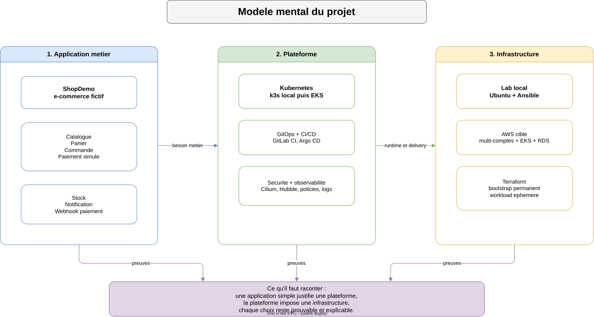
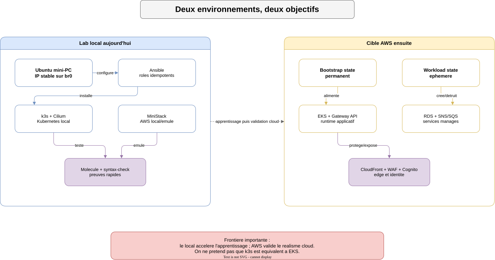
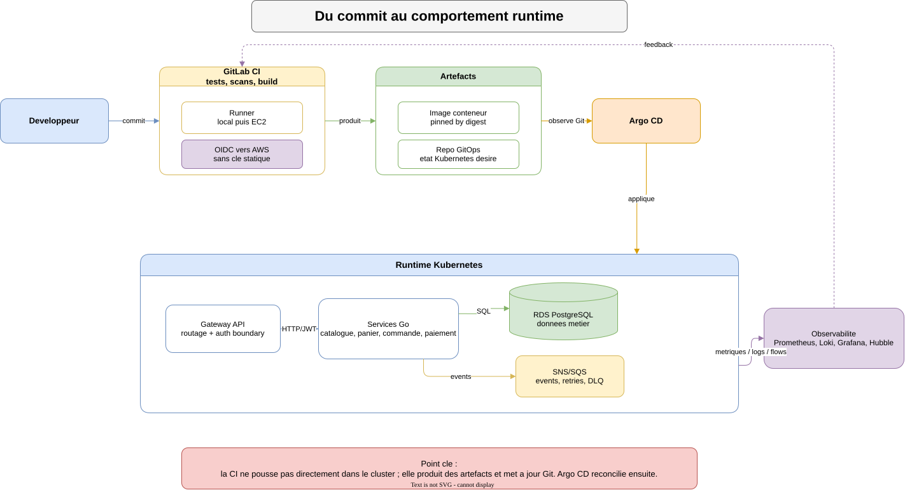

# Comprendre le projet ShopDemo

## Idee en une phrase

ShopDemo est un lab portfolio qui montre comment construire une Internal
Developer Platform autour d'une application e-commerce simple, depuis un
serveur Ubuntu local jusqu'a une cible AWS/EKS/GitOps plus realiste.

Le projet ne cherche pas a etre une production commerciale. Il cherche a
prouver des competences d'architecture cloud, DevOps, Kubernetes, IaC,
securite, observabilite et conception agentique, avec des choix explicables.

## Le modele mental

Le projet se lit en trois niveaux.

| Niveau | Question | Reponse courte |
|---|---|---|
| Application | Qu'est-ce qu'on deploie ? | Une demo e-commerce : catalogue, panier, commande, paiement simule, stock, notification |
| Plateforme | Comment on deploie et exploite ? | Kubernetes, GitOps, CI/CD, observabilite, secrets, policies |
| Infrastructure | Ou ca tourne ? | Lab local aujourd'hui, cible AWS multi-comptes et EKS ensuite |

La valeur du projet vient du lien entre ces niveaux : chaque brique technique
sert un besoin visible du systeme, au lieu d'etre ajoutee pour cocher une case.

<p align="center">
  
</p>

## Ce qui existe aujourd'hui

Etat verifie : Sprint 0 est clos ; Sprint 1 a demarre avec `S1-T1`, centre sur
la structure GitOps locale.

Le depot contient actuellement :

- une documentation d'architecture cible dans [`../ARCHITECTURE.md`](../ARCHITECTURE.md) ;
- un bootstrap Ansible local avec `k3s`, `Cilium`, `MiniStack`,
  `cloudflare-tunnel`, `gitlab-runner` et `node-hardening` ;
- une premiere structure GitOps locale dans [`../gitops/`](../gitops/),
  encore sans Argo CD installe ;
- des tests Molecule pour les roles Ansible applicables ;
- des playbooks futurs cadres pour `runner-setup` et `rds-setup`, mais sans
  execution cloud par defaut ;
- une roadmap par sprint dans [`sprint-planning.md`](sprint-planning.md).

<p align="center">
  
</p>

Ce qui n'existe pas encore comme implementation complete :

- les microservices Go de ShopDemo ;
- les modules Terraform AWS complets ;
- le cluster EKS reel ;
- Argo CD installe et synchronisant le repo GitOps local ;
- l'observabilite complete ;
- le runtime agentique applicatif.

## Le chemin cible

Le chemin cible est volontairement progressif.

| Etape | But | Role dans le portfolio |
|---|---|---|
| Sprint 0 | Rendre le serveur local reproductible avec Ansible | Montrer idempotence, roles, validations, limites de lab |
| Sprint 1 | Installer la base GitOps locale | Montrer Argo CD, reconciliation et separation CI/deploiement |
| Sprint 2 | Poser la Landing Zone AWS | Montrer multi-compte, IAM, OIDC, backend Terraform |
| Sprint 3 | Construire EKS et les services manages | Montrer Kubernetes cloud, RDS, SNS/SQS, IAM pod-level |
| Sprint 4 | Ajouter observabilite | Montrer logs, metriques, traces utiles, Hubble, Grafana |
| Sprint 5 | Ajouter DevSecOps | Montrer scans, policies, supply chain, guardrails |
| Sprint 6 | Finaliser CI/CD et GitOps | Montrer delivery end-to-end et rollback |

## Architecture cible en clair

L'utilisateur interagit avec un frontend statique. Le frontend appelle des APIs
protegees. Les services applicatifs tournent dans Kubernetes. Les donnees sont
dans PostgreSQL. Les evenements metier passent par SNS/SQS. Le webhook paiement
arrive par API Gateway AWS et Lambda.

```text
Utilisateur
  -> CloudFront + S3 frontend
  -> ALB
  -> Gateway API Kubernetes
  -> services Go sur EKS
  -> RDS PostgreSQL
  -> SNS/SQS pour les traitements asynchrones
```

Le lab local ne remplace pas AWS. Il sert a apprendre vite, valider les roles,
tester des comportements Kubernetes et preparer les workflows avant de payer
des ressources cloud.

<p align="center">
  
</p>

## Pourquoi ces choix techniques

| Choix | Pourquoi il existe |
|---|---|
| `Ansible` | Configurer les hotes et rendre le setup local rejouable |
| `Terraform` | Provisionner les ressources AWS et separer bootstrap/workload |
| `k3s` | Avoir un Kubernetes local leger pour apprendre et tester |
| `EKS` | Porter la cible cloud Kubernetes managée |
| `Cilium` | Gerer le reseau Kubernetes, les policies et l'observabilite reseau |
| `GitLab CI` | Construire, tester, scanner et declencher les changements |
| `Argo CD` | Appliquer l'etat Kubernetes depuis Git, sans deploy imperatif |
| `MiniStack` | Emuler certains services AWS localement pour limiter le cout |
| `Cloudflare Tunnel` | Exposer plus tard certains outils sans ouvrir de port entrant |
| `Cognito` | Porter une vraie authentification JWT |
| `RDS` | Utiliser une persistence relationnelle managée |
| `SNS/SQS` | Demontrer fan-out, retries, DLQ et idempotence |

## Ce qu'il faut savoir expliquer

Le discours simple est :

> J'ai construit ShopDemo comme support d'une plateforme interne. Le metier est
> volontairement simple, mais l'architecture couvre les sujets importants :
> IaC, CI/CD, GitOps, Kubernetes, securite, observabilite et cout. Le Sprint 0
> stabilise le lab local avec Ansible. Les sprints suivants deplacent
> progressivement le systeme vers AWS/EKS.

Points importants a savoir defendre :

- le projet est un lab, donc certains compromis sont assumés et documentés ;
- le state Terraform `bootstrap` est permanent, le state `workload` est
  ephemere ;
- Ansible configure les hotes, Terraform cree l'infrastructure ;
- GitLab CI valide et produit les artefacts, Argo CD applique l'etat GitOps ;
- k3s sert au lab local, EKS reste la cible cloud ;
- Cilium en local remplace le reseau k3s par defaut pour se rapprocher des
  sujets reseau/policies vises ;
- le MVP agentique doit rester centre sur une requete utilisateur en prompt,
  avec scenarios reserves aux tests.

## Comment lire le depot sans se perdre

Lecture recommandee :

1. [`../README.md`](../README.md) pour l'etat du projet.
2. Ce document pour le modele mental.
3. [`glossaire.md`](glossaire.md) pour les termes.
4. [`../ARCHITECTURE.md`](../ARCHITECTURE.md) pour la cible complete.
5. [`CURRENT.md`](CURRENT.md) pour savoir quoi faire maintenant.
6. Le fichier du sprint actif, actuellement
   [`sprints/sprint-1-gitops-local.md`](sprints/sprint-1-gitops-local.md).

Regle pratique : si un document de sprint devient trop detaille, il sert de
journal de preuves. Pour comprendre le projet, commencer par les documents
generaux, puis descendre vers les sprints seulement quand une preuve ou une
decision precise est necessaire.
