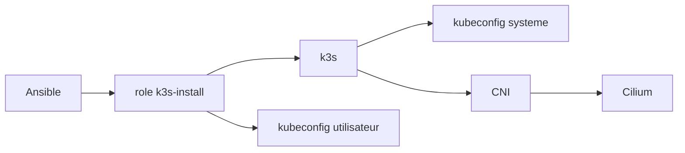
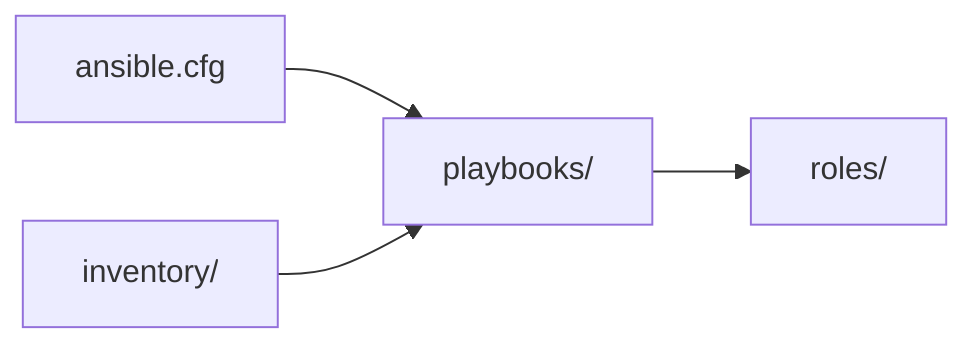
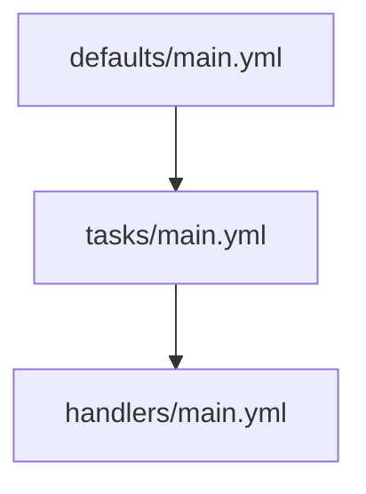
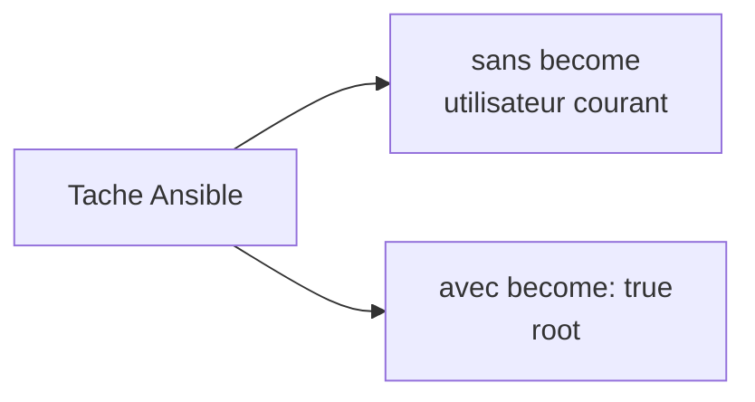
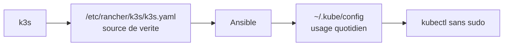
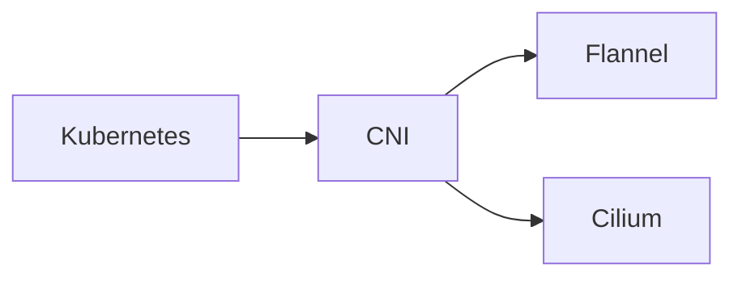
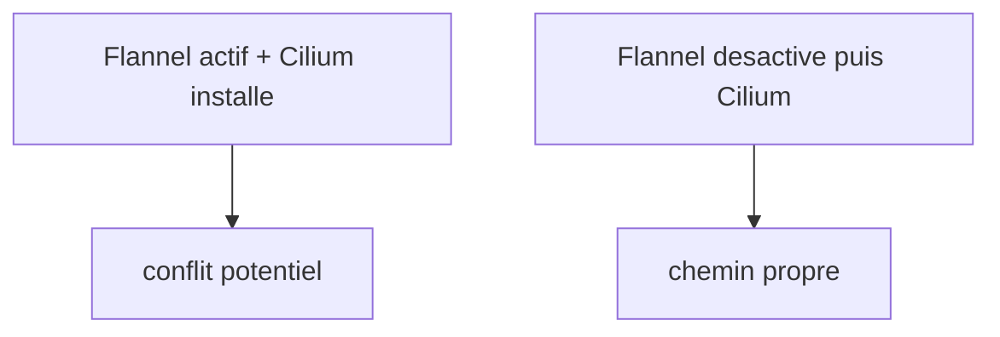

# Concepts appris - Sprint 0

## Objectif

Ce document garde uniquement les concepts cles vraiment pratiques pendant le
Sprint 0.

Perimetre :

- structure Ansible du projet ;
- role Ansible ;
- `become: true` ;
- `k3s` et kubeconfig ;
- Flannel vs Cilium.

Pour le detail de structure du repo :
[`docs/ansible-structure.md`](ansible-structure.md)

## Vue d'ensemble

Lecture rapide :

- Ansible pilote le role `k3s-install`
- le role installe `k3s`
- `k3s` produit un kubeconfig systeme
- Ansible le synchronise vers l'utilisateur
- le cluster a besoin d'un CNI
- dans ce projet, ce CNI sera `Cilium`

## 1. Structure Ansible

Le premier apprentissage cle du sprint est la structure standard d'un projet
Ansible.

Mental model :

- `ansible.cfg` = les regles du projet
- `inventory/` = les machines cibles
- `playbooks/` = les scenarios d'execution
- `roles/` = les briques reutilisables

Le point important du Sprint 0 :

- on ne met pas toute la logique dans un seul fichier ;
- on structure des le debut pour rendre le provisioning reproductible.

## 2. Role Ansible

Le deuxieme concept cle est le role.

Dans ce sprint, on a cree un vrai premier role : `k3s-install`.

Role de chaque partie :

- `defaults/` = variables par defaut
- `tasks/` = logique principale
- `handlers/` = actions declenchees seulement si necessaire

Ce qu'il faut retenir :

- un role porte une responsabilite claire ;
- un playbook appelle un ou plusieurs roles ;
- un handler sert surtout aux redemarrages propres.

## 3. `become: true`

Le troisieme concept cle est la separation entre administration systeme et
usage courant.

Idee a retenir :

- `become: true` sert aux taches systeme ;
- il ne faut pas l'utiliser partout sans reflechir.

Exemples vus dans le sprint :

- installer `k3s`
- ecrire dans `/etc`
- gerer `systemd`

Bonne pratique retenue :

- administration du cluster : taches Ansible avec `become: true`
- usage quotidien du cluster : commandes utilisateur normales

## 4. `k3s` et kubeconfig

Le quatrieme concept cle est la difference entre le cluster lui-meme et le
fichier client qui permet d'y parler.

Ce qu'on a appris :

- `k3s` peut etre installe sans etre demarre ;
- un kubeconfig peut exister mais etre obsolete ;
- le kubeconfig systeme et le kubeconfig utilisateur ne doivent pas diverger.

Regle retenue pour le projet :

- source de verite : `/etc/rancher/k3s/k3s.yaml`
- usage courant : `~/.kube/config`
- synchronisation : geree explicitement par Ansible

Le benefice :

- `kubectl` s'utilise sans `sudo`
- on separe proprement l'admin systeme et l'usage du cluster

## 5. Flannel vs Cilium

Le dernier concept cle du sprint est le reseau Kubernetes.

`Flannel` et `Cilium` sont deux CNIs, donc deux solutions pour donner du
reseau au cluster Kubernetes.

Difference simple :

- `Flannel` = reseau simple
- `Cilium` = reseau + securite + observabilite

Pourquoi on desactive Flannel :

Consequence importante vue pendant le sprint :

- juste apres installation de `k3s` sans Flannel,
- le noeud peut etre `NotReady`,
- et c'est attendu tant que `Cilium` n'est pas installe.

## A retenir

Les 5 idees les plus importantes du Sprint 0 sont :

1. structurer proprement un projet Ansible ;
2. raisonner en roles, pas en commandes isolees ;
3. utiliser `become: true` seulement pour l'administration systeme ;
4. garder un kubeconfig systeme comme source de verite et une copie utilisateur
   pour `kubectl` ;
5. desactiver Flannel si on veut que `Cilium` soit le vrai CNI du cluster.
