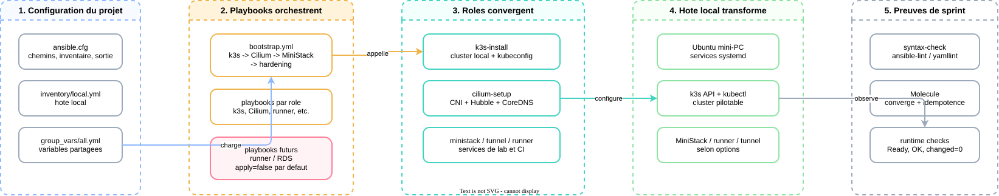
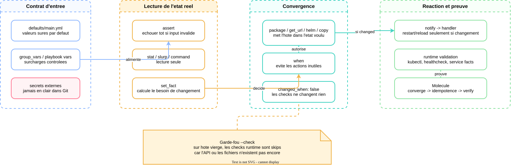
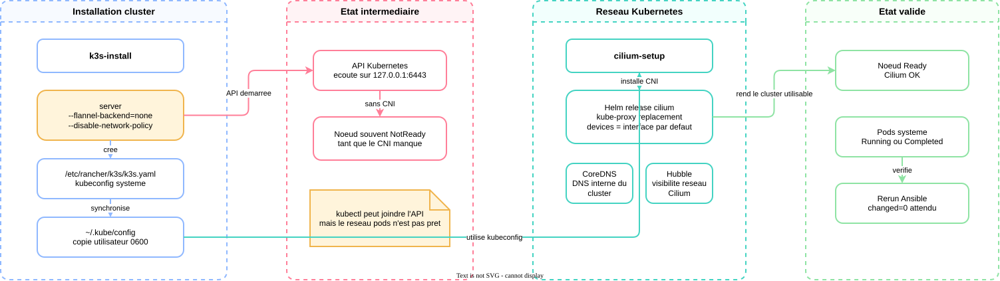

# Concepts appris - Sprint 0

## Objectif

Ce document resume les concepts pratiques appris pendant le Sprint 0 :
**Ansible et fondations bootstrap**.

Il sert a comprendre le sprint sans relire tous les journaux de suivi. Il ne
remplace pas :

- [`docs/ansible-structure.md`](ansible-structure.md), qui decrit la structure
  Ansible durable du projet ;
- [`docs/comprendre-le-projet.md`](comprendre-le-projet.md), qui donne la vue
  globale de ShopDemo ;
- [`docs/sprints/sprint-0-ansible.md`](sprints/sprint-0-ansible.md), qui garde
  le suivi detaille, les preuves et les risques residuels.

## Lecture rapide

Le Sprint 0 a transforme le mini-PC Ubuntu en socle de lab reproductible :

- Ansible orchestre les playbooks.
- Les playbooks appellent des roles.
- Les roles convergent l'hote vers un etat attendu.
- Les handlers ne reagissent qu'aux changements.
- Molecule et les checks runtime prouvent que les roles restent rejouables.

<p align="center"></p>

> Source editable :
> [`diagrams/concepts-s0-ansible-execution.drawio`](diagrams/concepts-s0-ansible-execution.drawio).

La phrase a retenir :

> Un playbook dit **quoi orchestrer** ; un role sait **comment converger** une
> responsabilite technique precise.

## 1. Structure Ansible du projet

La premiere notion importante est la separation des responsabilites dans
[`ansible/`](../ansible).

| Element | Role mental | Exemple dans le projet |
|---|---|---|
| `ansible.cfg` | Regles locales d'execution Ansible | chemins, inventaire, sortie |
| `inventory/` | Liste des hotes cibles | `local.yml`, futur `aws_ec2.yml` |
| `group_vars/` | Variables partagees | nom projet, flags bootstrap, versions |
| `playbooks/` | Scenarios d'orchestration | `bootstrap.yml`, `k3s-install.yml` |
| `roles/` | Briques reutilisables | `k3s-install`, `cilium-setup` |
| `molecule/` | Tests isoles des roles | converge, idempotence, verify |
| `requirements.yml` | Dependances externes | collections Ansible |

Le piege evite : mettre toute la logique dans un seul playbook geant. Ce serait
rapide au debut, mais difficile a tester, relire et rejouer proprement.

## 2. Playbook, role, task et handler

Le Sprint 0 clarifie quatre niveaux Ansible.

| Niveau | Question a laquelle il repond | Exemple |
|---|---|---|
| Playbook | Sur quels hotes et dans quel ordre ? | `bootstrap.yml` lance k3s, Cilium, MiniStack, hardening |
| Role | Quelle responsabilite technique ? | `k3s-install` installe et expose un cluster local |
| Task | Quelle action elementaire ? | installer `curl`, copier un kubeconfig, attendre l'API |
| Handler | Quelle reaction si une task change ? | redemarrer `k3s` apres installation ou changement de config |

Le point cle :

- une task tourne dans l'ordre ou elle est declaree ;
- un handler est declenche par `notify`, mais s'execute a la fin du play ;
- si plusieurs tasks notifient le meme handler, il ne s'execute qu'une fois.

<p align="center"></p>

> Source editable :
> [`diagrams/concepts-s0-role-contract.drawio`](diagrams/concepts-s0-role-contract.drawio).

## 3. Idempotence

L'idempotence veut dire : **relancer la meme automatisation ne doit pas refaire
inutilement ce qui est deja conforme**.

Dans ce projet, on la voit avec plusieurs patterns :

- `stat` lit l'existence d'un fichier sans modifier l'hote ;
- `command` avec `changed_when: false` sert aux controles ;
- `set_fact` centralise une decision comme `k3s_needs_install` ;
- `when` conditionne les actions qui ne doivent tourner que si necessaire ;
- Molecule verifie qu'un deuxieme passage donne `changed=0`.

Exemple concret :

```text
/usr/local/bin/k3s absent
-> installation necessaire

/usr/local/bin/k3s present avec la bonne version et les bons flags
-> pas de reinstall
```

Ce point est important pour un futur role cloud : un role idempotent peut etre
rejoue apres une interruption, une correction ou une evolution de version.

## 4. `become: true`

`become: true` indique qu'une task doit s'executer avec privilege eleve,
generalement `root`.

Dans Sprint 0, on en a besoin pour :

- installer des paquets ;
- ecrire dans `/usr/local/bin`, `/etc` ou `/etc/systemd`;
- gerer des services `systemd` ;
- lire le kubeconfig systeme de k3s.

On ne l'utilise pas partout par reflexe, car cela brouille la frontiere entre :

- l'administration systeme ;
- l'usage quotidien en utilisateur normal.

Regle retenue :

| Cas | Privilege |
|---|---|
| Modifier l'hote | `become: true` |
| Lire un etat non sensible | sans `become` si possible |
| Utiliser `kubectl` au quotidien | utilisateur normal avec `~/.kube/config` |

## 5. `k3s`, kubeconfig et `kubectl`

`k3s` est la distribution Kubernetes locale du lab. Elle sert a apprendre et
valider les mecanismes Kubernetes sans lancer tout de suite EKS.

Trois pieces doivent etre distinguees :

| Piece | Role |
|---|---|
| `k3s` | serveur Kubernetes local |
| `/etc/rancher/k3s/k3s.yaml` | kubeconfig systeme produit par k3s |
| `~/.kube/config` | kubeconfig utilisateur pour lancer `kubectl` sans `sudo` |

Le kubeconfig est un fichier client : il dit a `kubectl` ou se trouve l'API
Kubernetes et avec quels certificats s'authentifier.

Point appris pendant le sprint : un kubeconfig peut exister mais pointer vers
une ancienne adresse IP ou un ancien cluster. Il faut donc raisonner sur l'etat
runtime, pas seulement sur la presence du fichier.

## 6. Flannel, Cilium, CoreDNS et Hubble

Un cluster Kubernetes a besoin d'un CNI pour connecter les pods entre eux.

| Concept | Definition courte | Role dans Sprint 0 |
|---|---|---|
| CNI | Plugin reseau Kubernetes | donne une connectivite aux pods |
| Flannel | CNI simple souvent active par defaut avec k3s | desactive volontairement |
| Cilium | CNI avance base sur eBPF | CNI cible du projet |
| CoreDNS | DNS interne Kubernetes | permet aux services de se resoudre par nom |
| Hubble relay | composant Cilium d'observation reseau | collecte/expose les flux reseau |
| Hubble UI | interface visuelle Hubble | aide a comprendre les flux |

Pourquoi desactiver Flannel ?

- pour eviter deux CNIs en concurrence ;
- pour forcer Cilium a porter le reseau du cluster ;
- pour rester coherent avec l'architecture cible, ou Cilium a aussi un role
  securite et observabilite.

<p align="center"></p>

> Source editable :
> [`diagrams/concepts-s0-k3s-cilium-lifecycle.drawio`](diagrams/concepts-s0-k3s-cilium-lifecycle.drawio).

Point important :

```text
k3s sans Flannel installe
-> API Kubernetes disponible
-> noeud possiblement NotReady
-> Cilium installe
-> noeud Ready
```

Donc `NotReady` juste apres `k3s-install` n'est pas forcement une erreur : cela
peut etre l'etat attendu avant `cilium-setup`.

## 7. Molecule

Molecule sert a tester un role Ansible dans un environnement isole.

La sequence utile est :

```text
converge -> idempotence -> verify
```

Lecture simple :

- `converge` applique le role ;
- `idempotence` relance le role et attend `changed=0` ;
- `verify` execute des controles specifiques.

Ce que cela prouve :

- le role peut installer/configurer ;
- le role peut etre rejoue ;
- les controles attendus passent dans un environnement propre.

Limite :

- Molecule ne remplace pas un test runtime sur le vrai mini-PC ;
- certains comportements systeme, reseau ou Kubernetes doivent encore etre
  verifies sur l'hote reel.

## 8. Check mode et validations sans effet de bord

`ansible-playbook --check` simule autant que possible les changements.

Dans Sprint 0, il sert surtout a verifier que les playbooks futurs sont
correctement cadres :

- `runner-setup.yml` ;
- `rds-setup.yml` ;
- `gitea-setup.yml`.

Ces playbooks ont une protection volontaire :

```text
*_apply=false par defaut
```

Cela veut dire :

- on peut verifier leurs inputs ;
- on peut documenter leur contrat ;
- aucune connexion GitLab/RDS/Gitea n'est faite tant que l'apply n'est pas
  explicitement active.

Limite importante : le check mode n'est pas une preuve complete d'idempotence
runtime. Pour cela, il faut aussi des reruns reels et des validations de
service.

## 9. Frontiere Terraform / Ansible

Le Sprint 0 pose aussi une frontiere importante :

| Terraform | Ansible |
|---|---|
| Cree l'infrastructure | Configure les hotes et services |
| Gere les states `bootstrap` et `workload` | Gere k3s, Cilium, runner, Gitea, RDS |
| Produit des outputs | Consomme des inputs |
| Decrit des ressources cloud | Decrit l'etat attendu d'un systeme |

Exemple futur :

```text
Terraform cree RDS
-> output: endpoint, port, secret reference
-> Ansible rds-setup configure databases et users applicatifs
```

Le bon reflexe :

- ne pas faire provisionner AWS par Ansible quand Terraform porte deja cette
  responsabilite ;
- ne pas faire configurer finement les hotes par Terraform quand Ansible est
  plus adapte.

## 10. Ce que Sprint 0 a vraiment apporte

Sprint 0 n'est pas seulement "installer k3s". Il a pose les habitudes qui
serviront aux sprints suivants :

- structurer l'automatisation ;
- separer orchestration, logique, variables et secrets ;
- verifier avant d'agir ;
- rejouer sans casser ;
- documenter les compromis de lab ;
- produire des preuves exploitables.

## A retenir

Les idees les plus importantes :

1. Un playbook orchestre, un role implemente.
2. `tasks/main.yml` contient la logique d'etat voulu.
3. `handlers/main.yml` contient les reactions declenchees par changement.
4. L'idempotence est une propriete centrale, pas un bonus.
5. `become: true` doit rester lie aux actions systeme.
6. `k3s` donne le cluster local, Cilium donne le reseau pods.
7. `NotReady` entre k3s et Cilium peut etre un etat transitoire normal.
8. Molecule prouve les roles en isolation ; les checks runtime prouvent le lab
   reel.
9. Terraform cree l'infra ; Ansible configure ce qui vit dessus.
