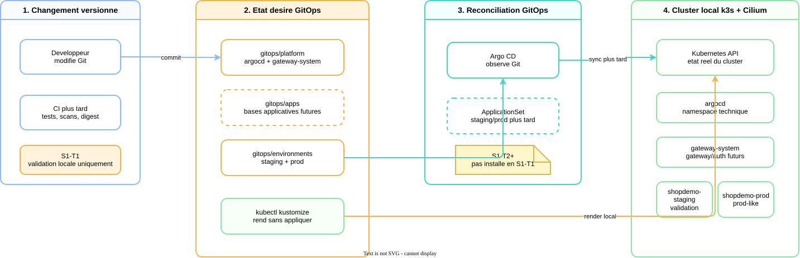
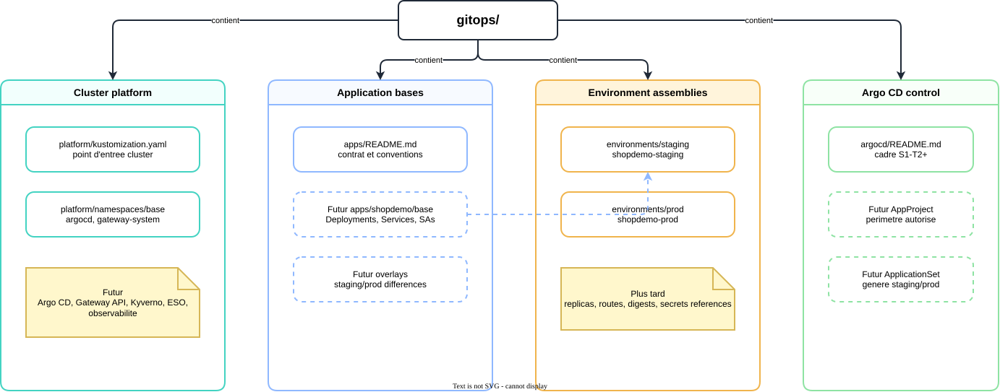
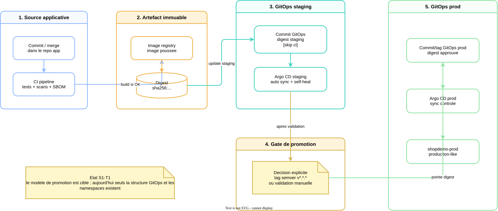

# Concepts appris - Sprint 1

## Objectif

Ce document explique les concepts GitOps utiles pour le Sprint 1.

Il sert a comprendre le sprint sans relire tous les manifests. Il ne remplace
pas :

- [`gitops-structure.md`](gitops-structure.md), qui decrit la structure GitOps ;
- [`sprints/sprint-1-gitops-local.md`](sprints/sprint-1-gitops-local.md), qui
  garde le suivi, les preuves et les risques ;
- [`architecture/05-delivery-gitops.md`](architecture/05-delivery-gitops.md),
  qui decrit la cible delivery/GitOps.

## Lecture rapide

Le Sprint 1 commence par un changement de modele mental :

```text
Avant : lancer des commandes pour changer le cluster
Apres : changer Git, puis laisser Argo CD reconcilier le cluster
```

Dans `S1-T1`, on ne deploie pas encore Argo CD. On prepare le terrain :

- une arborescence GitOps claire ;
- des namespaces Kubernetes declaratifs ;
- des validations locales sans effet de bord ;
- une separation entre plateforme, applications et environnements.

<p align="center">
  
</p>

> Source editable :
> [`diagrams/s1-gitops-local-overview.drawio`](diagrams/s1-gitops-local-overview.drawio).

## 1. GitOps

GitOps veut dire que Git porte l'etat desire du systeme.

Dans ce projet :

- les manifests Kubernetes vivent dans `gitops/` ;
- Argo CD lira Git ;
- Kubernetes sera mis en conformite avec ce qui est versionne ;
- une derive manuelle pourra etre detectee, puis corrigee selon la politique
  choisie.

La phrase a retenir :

> Git decrit ce que le cluster doit etre ; Argo CD compare et reconcilie.

## 2. Etat desire et etat reel

Deux etats existent en permanence.

| Etat | Ou il vit | Exemple |
|---|---|---|
| Etat desire | Git | `namespace.yaml` declare `shopdemo-staging` |
| Etat reel | Cluster Kubernetes | le namespace existe ou non dans k3s |

Argo CD est utile parce qu'il rend visible l'ecart entre ces deux etats.

## 3. Argo CD

Argo CD est le control plane GitOps prevu pour le projet.

Il fera trois choses :

- observer un chemin Git ;
- comparer les manifests rendus avec le cluster ;
- synchroniser le cluster si la politique l'autorise.

`S1-T1` cree seulement le namespace `argocd`. L'installation reelle est prevue
dans `S1-T2`.

## 4. Kustomize

Kustomize assemble des fichiers YAML Kubernetes sans templating lourd.

Dans ce projet, il sert a garder une structure simple :

- `platform/` rend les ressources communes ;
- `environments/staging/` rend ce qui est propre a staging ;
- `environments/prod/` rend ce qui est propre a prod.

<p align="center">
  
</p>

> Source editable :
> [`diagrams/s1-gitops-repo-structure.drawio`](diagrams/s1-gitops-repo-structure.drawio).

## 5. Platform, apps, environments

La separation evite de tout mettre dans un seul dossier Kubernetes.

| Zone | Question | Exemple |
|---|---|---|
| `platform/` | Qu'est-ce qui appartient au cluster ? | Argo CD, Gateway API, policies |
| `apps/` | Qu'est-ce qui appartient aux applications ? | Deployments et Services ShopDemo |
| `environments/` | Qu'est-ce qui change selon l'environnement ? | namespace, replicas, image digest |

Le piege evite : faire un dossier `k8s/` geant ou les decisions plateforme,
applicatives et environnementales sont melangees.

## 6. Application et ApplicationSet

Dans Argo CD :

- une `Application` decrit une source Git et une destination Kubernetes ;
- un `ApplicationSet` genere plusieurs `Application` a partir d'une regle.

Pour ShopDemo, la cible est :

- un flux `staging` qui se synchronise automatiquement ;
- un flux `prod` active par promotion explicite.

## 7. Promotion

La promotion evite de redeployer en production par accident.

<p align="center">
  
</p>

> Source editable :
> [`diagrams/s1-gitops-promotion-model.drawio`](diagrams/s1-gitops-promotion-model.drawio).

Modele cible :

- la CI produit une image ;
- les scans bloquent ou autorisent la suite ;
- un commit GitOps met a jour le digest en staging ;
- la prod ne suit qu'une promotion explicite.

## 8. NetworkPolicy

Une `NetworkPolicy` limite qui peut parler a qui dans Kubernetes.

Dans ce projet, elle servira a montrer :

- default deny par namespace ;
- autorisations explicites vers CoreDNS ;
- autorisations explicites entre gateway et services ;
- autorisations explicites vers les dependances externes necessaires.

Les NetworkPolicies ne sont pas dans `S1-T1`. Elles arrivent en `S1-T3`, apres
le cadrage GitOps.

## 9. Sync Wave

Une sync wave donne un ordre d'application aux ressources Argo CD.

Exemple mental :

```text
namespace -> CRD/control plane -> secrets -> deployments -> routes
```

Sans ordre, un `Deployment` pourrait etre applique avant le namespace ou les
secrets dont il depend.

## 10. Rollback

En GitOps, un rollback revient souvent a revenir a un commit ou a un digest
connu.

Ce modele est plus lisible qu'une suite de commandes manuelles parce que :

- le changement est versionne ;
- la difference est relisible ;
- Argo CD montre l'etat de synchronisation ;
- la preuve de retour arriere reste dans Git.

## A retenir

- `S1-T1` ne cherche pas a tout deployer.
- Le vrai produit technique du sprint est le flux GitOps lisible.
- Git porte l'intention ; Argo CD portera la reconciliation.
- Les tests de ce premier lot doivent etre locaux et sans effet de bord.
- Les objets plus risques, comme Argo CD et les policies, arrivent ensuite.

