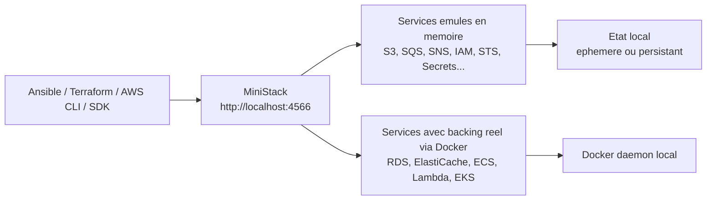
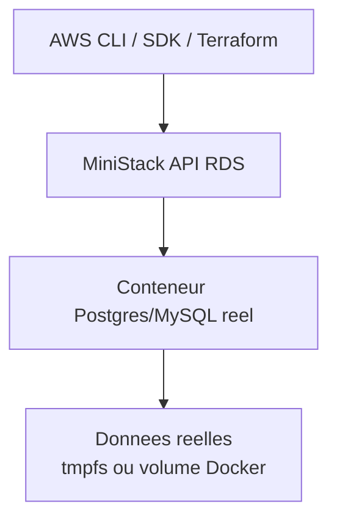
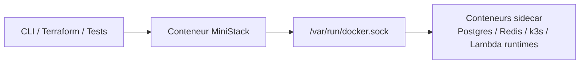

# Decouverte MiniStack

> Audience : proprietaire du projet, futur toi, reviewer.
>
> Statut : `Verifie` sur documentation officielle et sources publiques MiniStack au **3 juillet 2026**.
>
> Objectif : comprendre ce qu'est MiniStack, ce qu'il emule vraiment, ses limites, et ce que cela implique concretement pour `S0-T7` avant d'implementer `ministack-setup`.

---

## TL;DR

MiniStack est un **emulateur AWS local** open-source qui expose **un point d'entree unique** sur `localhost:4566` et essaie de rester compatible avec les SDK AWS, l'AWS CLI et les outils IaC comme Terraform.

Le bon modele mental n'est pas "un mini AWS complet sur mon laptop", mais plutot :

- une **gateway unique** qui parle plusieurs protocoles AWS ;
- des **services controles en memoire** ou via metadata ;
- quelques **data planes reels** pour certains services, surtout `RDS`, `ElastiCache`, `ECS`, `Lambda` et `EKS`, qui s'appuient sur Docker ;
- une **bonne plateforme de dev/test local** pour valider de la logique applicative, de l'IaC et des flux d'integration simples ;
- **pas** un substitut fidele a AWS pour les sujets reseau, IAM, isolation VPC ou comportements distribues complexes.

Pour notre projet, MiniStack est pertinent parce qu'il peut nous aider a :

- tester localement des providers Terraform AWS et des playbooks autour d'un endpoint unique ;
- valider des flux `S3`, `SQS`, `SNS`, `Secrets Manager`, `RDS`, `Cognito`, parfois `EKS`, sans consommer AWS ;
- raccourcir la boucle de feedback du Sprint 0 et des sprints suivants.

---

## 1. Pourquoi MiniStack existe

MiniStack se positionne explicitement comme une **alternative libre a LocalStack Community** pour le dev et les tests locaux.

Ce que la documentation officielle met en avant :

- pas de compte ;
- pas de cle de licence ;
- pas de telemetry ;
- compatibilite "drop-in" avec `AWS CLI`, `boto3`, Terraform, CDK, Pulumi ;
- un seul port `4566` ;
- licence `MIT`.

Pour nous, la question utile n'est pas "est-ce mieux que LocalStack dans l'absolu ?", mais :

**Est-ce suffisant pour le perimetre de ShopDemo local ?**

La reponse est plutot **oui**, tant qu'on le traite comme :

- un **simulateur de flux et d'API AWS** ;
- pas comme un **simulateur realiste de reseau AWS** ni de securite IAM.

---

## 2. Le modele mental simple

### Vue d'ensemble



### Ce que ca veut dire en pratique

- Tous les appels vont vers **le meme endpoint**.
- Le service cible est deduit a partir de la requete signee AWS.
- Certains services sont **purement emules**.
- D'autres declenchent **de vrais conteneurs Docker**.

Donc MiniStack n'est pas juste un "mock HTTP" :

- pour `SQS`, `SNS`, `Secrets Manager`, on parle surtout d'**emulation d'API et d'etat** ;
- pour `RDS`, on obtient **une vraie base Postgres/MySQL/MariaDB** dans un conteneur ;
- pour `EKS`, on n'obtient pas un vrai plan de controle AWS EKS, mais **un cluster k3s sidecar** qui permet de tester certaines integrations ;
- pour `Lambda`, le code s'execute vraiment.

---

## 3. Comment MiniStack route les requetes

La doc d'architecture officielle explique que MiniStack tourne comme **un seul process ASGI / Hypercorn** sur un port unique.

Le routage se fait principalement via :

- le **credential scope** de la signature AWS dans `Authorization` ;
- `X-Amz-Target` pour les APIs JSON type DynamoDB / Step Functions / EventBridge ;
- l'URL path pour les APIs REST comme `S3` ou `Route53`.

Exemple mental :

```text
aws --endpoint-url=http://localhost:4566 s3 ls
aws --endpoint-url=http://localhost:4566 sqs create-queue --queue-name demo
```

Les deux commandes parlent au **meme port**, mais MiniStack les dispatch vers des handlers differents.

### Ce que ca nous apprend pour `S0-T7`

- on n'a **pas besoin** d'un port par service ;
- un simple profil AWS CLI `ministack` + `endpoint_url` suffit ;
- le role Ansible doit surtout gerer :
  - le conteneur/service MiniStack ;
  - la persistance eventuelle ;
  - la disponibilite du port `4566` ;
  - le profil CLI local.

---

## 4. Ce que MiniStack emule bien vs ce qu'il faut traiter avec prudence

## Ce qui est bien aligne avec notre besoin local

- `S3`
- `SQS`
- `SNS`
- `Secrets Manager`
- `SSM Parameter Store`
- `STS`
- `CloudFormation`
- `RDS`
- `RDS Data API`
- `Cognito`

## Ce qui existe mais avec limites importantes

- `EKS`
- `IAM`
- `EC2`
- `VPC`
- `CloudFront`
- `EventBridge Scheduler`
- `CloudWatch alarms`

### Tableau utile

| Surface | Niveau de confiance pour le lab | Ce qu'il faut retenir |
|---|---|---|
| `S3` / `SQS` / `SNS` / `Secrets Manager` | Bon | Tres utile pour tests locaux et IaC. |
| `RDS` | Bon | Data plane reel, conteneur de BDD reel. |
| `Cognito` | Moyen a bon | Utile pour certains parcours auth/JWT, mais pas 100 % d'AWS. |
| `CloudFormation` | Moyen | Tres utile, mais couverture partielle des types de ressources. |
| `EKS` | Moyen | Interressant pour experimentation, mais backed par `k3s`, pas par un vrai control plane EKS. |
| `IAM` / `VPC` / `EC2` | Faible pour le comportement securite/reseau | Surtout metadata/control plane, pas une vraie enforcement AWS. |

---

## 5. Les "vrais" services derriere MiniStack

La doc officielle distingue les services purement emules et ceux qui s'appuient sur de **vrais processus / conteneurs**.

### RDS

MiniStack peut lancer un vrai conteneur Postgres/MySQL/MariaDB.

Modele mental :



Implications :

- bon pour tester migrations, creation de DB, users, secret wiring ;
- utile pour ShopDemo car on veut justement separer **provisioning** et **configuration** ;
- attention a la persistence et a la consommation disque locale.

### EKS

MiniStack expose une API `EKS`, mais la doc est claire : le cluster est soutenu par un **sidecar `k3s`**.

Ca veut dire :

- utile pour tester certains appels EKS et une partie de l'IaC ;
- **pas** un substitut fidele a un vrai cluster EKS AWS ;
- les concepts `addons`, `access entries`, `Fargate profiles` peuvent etre **metadata-only**.

### Lambda

Le code Lambda s'execute vraiment :

- soit localement ;
- soit dans Docker selon la configuration.

Tres utile pour :

- tester du code event-driven ;
- valider des flux `SNS -> Lambda` ou `API Gateway -> Lambda` a petite echelle ;
- mais attention aux details de runtime et reseau.

---

## 6. Persistance : ephemere ou durable

MiniStack se configure surtout par variables d'environnement.

Les couches de persistance importantes sont :

- `PERSIST_STATE=1` : persiste les metadonnees de services ;
- `S3_PERSIST=1` : persiste les objets S3 ;
- `RDS_PERSIST=1` : persiste les bases RDS via volumes Docker.

### Decision mentale utile

Pour un **CI run**, on veut souvent :

- tout ephemere ;
- reset propre a chaque execution.

Pour un **poste local de dev**, on peut vouloir :

- garder les buckets, queues, tables, secrets ;
- conserver aussi les donnees S3 et/ou RDS entre deux redemarrages.

### Pour `S0-T7`

Je recommande de commencer simple :

- MiniStack via Docker ;
- etat plutot **ephemere par defaut** ;
- persistance comme option documentee, pas activee agressivement tant qu'on n'a pas clarifie le besoin.

Raison :

- ton poste heberge deja plusieurs services ;
- on sort d'un sujet `DiskPressure` ;
- activer tout en persistant des le debut sans cadrage serait une mauvaise hygiene.

---

## 7. Docker n'est pas un detail : c'est un composant central

MiniStack lui-meme peut tourner dans un conteneur simple, mais certains services demandent l'acces au **Docker daemon de l'hote** pour lancer d'autres conteneurs.

Exemples :

- `RDS`
- `ElastiCache`
- `EKS`
- `Lambda` en mode Docker
- `ECS`

Donc la vraie architecture locale ressemble plutot a ca :



### Consequence importante

`ministack-setup` n'est pas juste "docker run ministack".

Il faut penser :

- acces au socket Docker ;
- politique de restart ;
- volumes si persistance ;
- reseau Docker si on veut que des sidecars se parlent correctement.

---

## 8. Multi-tenancy : utile a connaitre, pas forcement a utiliser tout de suite

MiniStack supporte une separation par **compte** et **region** derivee de la requete.

En pratique :

- si la requete est signee pour `us-east-1`, les ARNs et reponses sont scopes a cette region ;
- les comptes sont scopes par identifiants de credentials ;
- le compte par defaut est souvent `000000000000`.

Pour `S0-T7`, on n'a probablement pas besoin d'exploiter fortement cette feature.

Le bon premier niveau est :

- une region stable `us-east-1` ;
- un profil local simple ;
- des credentials factices predictibles.

---

## 9. Ce que MiniStack ne fait pas, ou fait volontairement moins bien qu'AWS

C'est la partie la plus importante pour eviter les fausses hypotheses.

### Limites structurelles

- **pas de vraie enforcement IAM** ;
- **pas de vrai reseau VPC** ;
- beaucoup de ressources `EC2`, `VPC`, `Security Groups` sont surtout de la **metadata** ;
- certaines integrations sont **stockees mais non declenchees**.

Exemples cites par la doc :

- `CloudWatch Alarm -> SNS/Lambda` : configuration stockee, action non declenchee ;
- `EventBridge Scheduler` : schedules stockes, non tires ;
- `Cognito Lambda triggers` : stockes, non invoques ;
- `Secrets Manager rotation` : metadata de rotation, pas invocation reelle ;
- `CloudFront` : metadata, pas vrai edge caching ;
- certains comportements de date / account ID / formats de reponse ne sont pas strictement identiques a AWS.

### Traduction pour notre projet

MiniStack est tres bien pour :

- valider la **forme** des appels ;
- valider une partie des **workflows** ;
- valider certains **plans Terraform** ;
- tester des **scripts d'initialisation** et des **playbooks**.

MiniStack n'est pas suffisant pour :

- valider des hypotheses reseau AWS fines ;
- valider des policies IAM comme garde-fou de securite ;
- prouver un comportement de prod sur des integrations asynchrones complexes.

---

## 10. Ce que MiniStack apporte concretement au projet ShopDemo

### Cas d'usage probablement utiles a court terme

- profil AWS local `ministack` pour commandes de smoke test ;
- validation de providers Terraform AWS avec `endpoint` override ;
- tests locaux autour de `S3`, `SQS`, `SNS`, `Secrets Manager`, `RDS` ;
- experimentation autour de `Cognito` pour comprendre l'API et certains flux JWT ;
- eventuellement `CloudFormation` ou `EKS` pour de la comprehension, pas comme preuve finale equivalente a AWS.

### Cas d'usage a manier avec prudence

- `Organizations` / `SCPs` : hors sujet pour MiniStack, AWS reel requis ;
- securite IAM reelle : MiniStack ne la remplace pas ;
- comportements reseau EKS/VPC reels : AWS reel requis ;
- webhook / API Gateway / Lambda avec exigences de fidelity elevee : possible en partie, mais a valider cas par cas.

---

## 11. Ce qu'on va probablement mettre en place dans `S0-T7`

### Perimetre minimal raisonnable

1. Un role Ansible `ministack-setup`.
2. Un conteneur MiniStack expose sur `4566`.
3. Un healthcheck simple via `/_ministack/health`.
4. Un profil AWS CLI local `ministack`.
5. Une validation smoke test du type :
   - `sts get-caller-identity`
   - `s3 ls` ou `sqs create-queue`

### Configuration initiale probable

- image Docker `ministackorg/ministack`
- port `4566:4566`
- credentials factices
- region par defaut `us-east-1`
- pas de persistance lourde activee par defaut
- reseau et volumes ajoutes seulement si besoin clair

### Pourquoi ce choix est bon

Il optimise :

- la simplicite ;
- la reversibilite ;
- la comprehension ;
- le faible risque disque/memoire ;
- la valeur pedagogique.

Il evite de partir trop vite sur :

- une simulation AWS "too much" ;
- de la persistance inutile ;
- des sidecars reels qu'on ne consomme pas encore.

---

## 12. Questions a garder en tete avant l'implementation

### Question 1

Veut-on MiniStack comme **outil de smoke test local** seulement, ou aussi comme **plateforme d'exercices IaC plus durable** ?

Impact :

- smoke test local -> setup ephemere minimal ;
- plateforme plus durable -> volumes, persistance, seeding, conventions d'etat.

### Question 2

Veut-on demarrer avec un **profil AWS CLI uniquement**, ou aussi preparer des overrides Terraform des maintenant ?

Impact :

- CLI seul -> `S0-T7` plus simple ;
- CLI + Terraform -> utile, mais peut etendre le perimetre plus vite que necessaire.

### Question 3

Veut-on exploiter tout de suite les services "reels" comme `RDS`, ou juste poser la base MiniStack puis monter en puissance plus tard ?

Impact :

- base simple -> meilleur controle du scope ;
- `RDS` immediat -> plus demonstratif, mais plus de responsabilite Docker/disque.

---

## 13. Recommandation pragmatique pour le projet

### Recommandation

Traiter MiniStack d'abord comme un **backend AWS local minimal et reproductible**, pas comme un faux AWS complet.

### Concretement

- `S0-T7` doit viser un setup **simple, propre, idempotent** ;
- on prouve d'abord :
  - que MiniStack demarre ;
  - que le port `4566` repond ;
  - que le profil AWS CLI local fonctionne ;
  - qu'une ou deux commandes AWS simples passent ;
- ensuite seulement, on ajoute du detail :
  - persistance ;
  - seed de ressources ;
  - services reels type `RDS` ;
  - integration Terraform locale plus complete.

### Pourquoi cette approche est saine

- elle limite la dette locale ;
- elle garde le role Ansible lisible ;
- elle preserve la separation entre **outil de dev local** et **preuve d'architecture AWS reelle** ;
- elle colle a l'esprit du projet : pedagogique, reproductible, sobre en cout et en complexite.

---

## 14. Sources verifiees

### Documentation officielle MiniStack

- Documentation overview : <https://ministack.org/docs>
- Architecture : <https://ministack.org/docs/architecture>
- Configuration : <https://ministack.org/docs/configuration>
- Known limitations : <https://ministack.org/docs/limitations>
- Migration from LocalStack : <https://ministack.org/docs/migrating-from-localstack>
- Services catalog : <https://ministack.org/docs/services/>
- EKS service : <https://ministack.org/docs/services/eks>
- Cognito service : <https://ministack.org/docs/services/cognito>
- RDS service : <https://ministack.org/docs/services/rds>

### Blog officiel MiniStack

- Quick Start Guide, **30 mars 2026** : <https://ministack.org/blog/quick-start-guide>
- AWS CLI bundled + Python init scripts, **13 avril 2026** : <https://ministack.org/blog/aws-cli-init-scripts>
- Release `v1.3.70`, **30 juin 2026** : <https://ministack.org/blog/changelog-v1-3-70>

### Source publique du projet

- GitHub repository : <https://github.com/ministackorg/ministack>

---

## 15. Resume actionnable pour `S0-T7`

Si on resume ce qu'il faut retenir avant de coder :

- MiniStack est pertinent pour le projet.
- Son endpoint unique `4566` simplifie beaucoup le role Ansible.
- Docker est une dependance centrale, surtout si on veut profiter de `RDS`, `EKS`, `Lambda` ou `ElastiCache`.
- Il faut traiter la persistance comme un **choix**, pas comme un defaut.
- Il ne faut pas lui demander de prouver des comportements IAM/VPC/EKS AWS de production.
- Le bon premier objectif est un **bootstrap local minimal + validation CLI simple**.

La suite logique est donc :

1. cadrer le perimetre exact du role `ministack-setup` ;
2. choisir la politique de persistance par defaut ;
3. implementer le role ;
4. ajouter Molecule ;
5. valider sur l'hote reel avec `aws --profile ministack ...`.
