# Deep dive : Cilium, k3s et ufw

## Sommaire

- [A qui s'adresse ce document](#a-qui-sadresse-ce-document)
- [Resume en trois phrases](#resume-en-trois-phrases)
- [1. Les briques de base (rappel rapide)](#1-les-briques-de-base-rappel-rapide)
  - [1.4 Le pod hostNetwork](#14-le-pod-hostnetwork--partager-la-pile-de-lhote)
- [2. La stack du projet](#2-la-stack-du-projet)
- [3. Le symptome](#3-le-symptome)
- [4. Le diagnostic, couche par couche](#4-le-diagnostic-couche-par-couche)
- [5. La mecanique fine : le voyage d'un paquet](#5-la-mecanique-fine--le-voyage-dun-paquet)
- [6. La preuve par le test](#6-la-preuve-par-le-test)
- [7. Les decisions prises (et la nuance importante)](#7-les-decisions-prises-et-la-nuance-importante)
- [8. La configuration finale](#8-la-configuration-finale)
- [9. Rendre tout ca idempotent (le reflexe Ansible)](#9-rendre-tout-ca-idempotent-le-reflexe-ansible)
- [10. Ce qu'il faut retenir](#10-ce-quil-faut-retenir)
- [Annexe : la boite a outils de diagnostic reseau](#annexe--la-boite-a-outils-de-diagnostic-reseau)

## A qui s'adresse ce document

A un profil DevOps intermediaire qui sait ce qu'est un pod, un Service et une regle iptables, mais qui veut comprendre **ce qui se passe reellement en arriere-plan** quand on remplace le reseau par defaut de k3s par Cilium, et pourquoi un pare-feu hote peut casser silencieusement tout le plan de controle interne du cluster.

Ce document raconte un incident reel rencontre pendant le Sprint 0 du projet, le diagnostic couche par couche, la mecanique sous-jacente, et surtout le **raisonnement derriere chaque decision**.

## Resume en trois phrases

1. On installe k3s **sans son reseau par defaut** (Flannel) pour mettre Cilium a la place.
2. Une fois Cilium en place, tous les pods systeme (CoreDNS, Hubble, etc.) restaient bloques `Ready=False` : ils n'arrivaient pas a joindre l'API Kubernetes.
3. La cause decisive n'etait **pas** Cilium mais `ufw`, le pare-feu de l'hote, qui jetait le trafic des pods vers le noeud. On l'a corrige, et on a profite de l'occasion pour basculer Cilium dans son mode propre (kube-proxy replacement).

---

## 1. Les briques de base (rappel rapide)

Avant l'incident, il faut trois notions claires.

### 1.1 Le CNI : qui donne une IP aux pods

Kubernetes ne sait pas lui-meme brancher un pod sur le reseau. Il delegue ca a un plugin **CNI** (Container Network Interface). Le CNI fait deux choses :

- il attribue une IP a chaque pod (depuis un pool, le *pod CIDR*) ;
- il programme le routage pour que les pods se parlent entre eux et sortent vers l'exterieur.

Sans CNI fonctionnel, le noeud reste `NotReady` : kubelet refuse de planifier des pods sur un reseau inexistant.

Par defaut, k3s embarque **Flannel**. Dans ce projet on le desactive (`--flannel-backend=none`) pour installer **Cilium**, qui apporte en plus le filtrage par NetworkPolicy et l'observabilite via Hubble.

### 1.2 Le Service ClusterIP : une IP virtuelle stable

Les pods sont jetables : leur IP change a chaque redemarrage. Un **Service** de type ClusterIP donne une IP virtuelle stable (par exemple `10.43.0.1` pour l'API Kubernetes elle-meme) qui redirige vers les pods reels derriere.

Point cle : `10.43.0.1` **n'existe sur aucune carte reseau**. C'est une IP fictive. Quelque chose doit intercepter le trafic vers cette IP et le rediriger (DNAT) vers une vraie adresse. Ce "quelque chose", c'est historiquement kube-proxy.

### 1.3 kube-proxy : le traducteur d'IP virtuelles

**kube-proxy** programme des regles iptables sur chaque noeud. Quand un pod envoie un paquet vers `10.43.0.1:443`, une regle `KUBE-SVC-...` fait un DNAT vers l'adresse reelle de l'API, par exemple `192.168.31.106:6443` (l'IP du noeud).

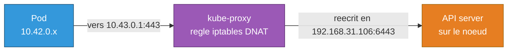

Cilium peut **remplacer entierement kube-proxy** : au lieu d'iptables, il fait la meme traduction en **eBPF** (du code charge dans le noyau Linux, plus rapide et plus fin). C'est le mode `kubeProxyReplacement`. On y reviendra, car c'est au coeur des decisions prises.

### 1.4 Le pod hostNetwork : partager la pile de l'hote

Un pod **normal** vit dans son propre *network namespace* : il a une IP du pod CIDR (`10.42.0.x`), ses propres interfaces et sa propre table de routage, isole de la machine.

Un pod **hostNetwork** (`hostNetwork: true`) n'a pas de namespace a lui : il partage directement celui de l'hote. Consequences concretes :

- son IP **est** celle du noeud (`192.168.31.106`), pas une IP du pod CIDR ;
- quand il ouvre un port, il l'ouvre **sur la machine elle-meme**, comme un service systemd ;
- il voit les memes interfaces et les memes regles iptables que l'hote.

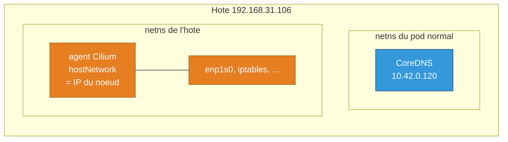

Une confusion frequente : `hostNetwork` n'est pas un type de Service comme `NodePort`. Ce sont deux couches differentes. `hostNetwork` se declare dans le **spec du Pod** (comment le conteneur est branche sur le reseau) ; `NodePort` est un `type` de **Service** (comment on adresse un ensemble de pods). Le tableau suivant les compare, avec `hostPort` (le mapping d'un seul port, cote conteneur) qui se situe entre les deux.

| | hostNetwork | hostPort | NodePort |
|---|---|---|---|
| **Ou ca se declare** | spec du **Pod** | spec du **conteneur** (un port) | spec du **Service** |
| **IP du pod** | celle du noeud | reste `10.42.0.x` | reste `10.42.0.x` |
| **Ce que ca expose** | *tous* les ports du pod, sur le noeud | *un* port, mappe sur le noeud | *un* port haut, sur *tous* les noeuds |
| **Passe par un Service ?** | non | non | oui |
| **Usage typique** | agents CNI, exporters node | rare, cas particuliers | exposer un service vers l'exterieur |

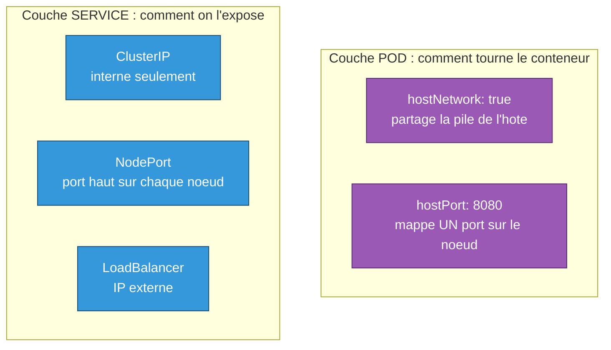

Le point commun trompeur : `hostNetwork`, `hostPort` et `NodePort` ouvrent tous, in fine, un port **sur le noeud**. Les trois traversent donc la chaine INPUT de l'hote et sont soumis a `ufw`. C'est pour ca que la regle ufw large posee plus loin dans ce document couvre aussi bien l'agent Cilium (hostNetwork) que d'eventuels `NodePort` futurs.

#### Trois schemas pour lever l'ambiguite hostNetwork / type de Service

La confusion vient souvent du fait qu'on melange deux questions independantes : "quelle IP le pod utilise" (`hostNetwork`) et "comment on entre dans le cluster" (`type` du Service). Les trois schemas suivants isolent chaque question.

**Schema A : le trajet complet d'une requete, avec CoreDNS et kube-proxy/eBPF explicites.**

Une requete vers un Service traverse toujours deux etapes distinctes avant d'atteindre un pod : d'abord la **resolution DNS** (CoreDNS traduit le nom en ClusterIP), puis la **traduction reseau** (kube-proxy ou l'eBPF Cilium traduit la ClusterIP en une vraie adresse). Le schema ci-dessous montre ces deux etapes, avec la seule chose qui change entre `hostNetwork: false` et `true` : l'adresse finale a la sortie de l'etape 2.

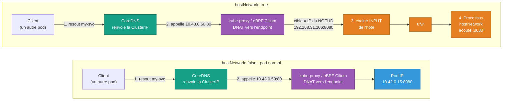

Ce qui est identique dans les deux cas : CoreDNS fait toujours la meme resolution de nom, et kube-proxy/eBPF fait toujours le meme travail de traduction d'adresse. La difference apparait ensuite. Cote pod normal, l'endpoint est une IP pod : le paquet reste dans le reseau Cilium et arrive directement au conteneur, sans jamais croiser le pare-feu de l'hote. Cote hostNetwork, l'endpoint **est** l'IP du noeud : le paquet remonte dans la pile reseau de l'hote (chaine INPUT), passe par la decision `ufw`, et n'atteint le conteneur qu'une fois cette porte franchie. `ufw` n'est donc pas la destination finale, c'est une **porte intermediaire** sur le chemin vers le processus qui ecoute reellement sur ce port. C'est le meme mecanisme que celui deja vu en 1.2 et 1.3, applique ici au cas particulier du hostNetwork.

**Schema B : le `type` du Service ne change que le point d'entree, pas le composant qui fait le travail final.**

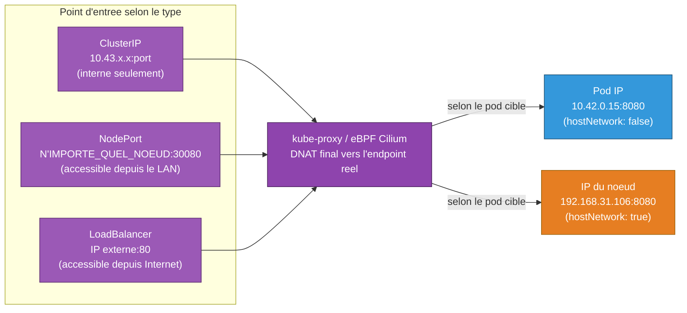

`ClusterIP`, `NodePort` et `LoadBalancer` repondent a "comment j'entre dans le cluster". `hostNetwork` repond a "ou atterrit le paquet une fois arrive au pod". Ce sont deux etages independants : n'importe quelle combinaison des deux est possible. Dans les trois cas, c'est le **meme composant** (kube-proxy ou l'eBPF Cilium) qui fait la traduction finale ; seul le point d'entree differe.

**Schema C : la vraie contrainte pratique du hostNetwork, un seul pod par noeud.**

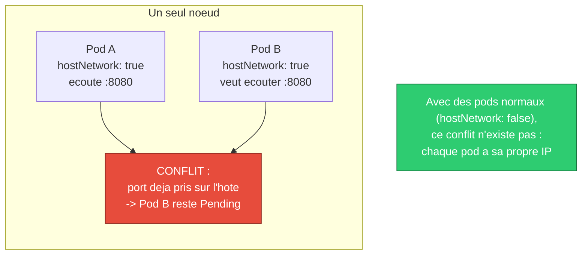

C'est exactement pour ca que hostNetwork va presque toujours avec un **DaemonSet** (un seul pod par noeud, jamais deux) plutot qu'un Deployment a plusieurs replicas, et c'est ce qui expliquait le second `cilium-operator` bloque `Pending` dans ce projet.

Le point a retenir en une phrase : **`hostNetwork` decide quelle IP le pod utilise ; le `type` du Service decide comment on entre dans le cluster. Ce sont deux reglages orthogonaux, et c'est le premier qui a cause l'incident ufw de ce document, pas le second.**

Pourquoi ca compte ici : l'**agent Cilium** (le DaemonSet) tourne en hostNetwork parce que son role est justement de **programmer le reseau de l'hote** (charger l'eBPF sur les vraies interfaces, gerer routage et regles). Il ne peut pas faire ca enferme dans un namespace isole, et il doit pouvoir demarrer avant meme que le reseau des pods existe (probleme de poule et d'oeuf evite).

Deux consequences directes qu'on retrouvera plus bas :

- au demarrage, l'agent joint l'API par l'**IP reelle du noeud** (`k8sServiceHost`), pas par une ClusterIP ;
- le Service `hubble-peer` pointe vers l'agent sur `192.168.31.106:4244` (port sur le noeud, car hostNetwork). Le trafic de Hubble vers l'agent traverse donc lui aussi la chaine INPUT de l'hote, donc `ufw`. D'ou l'ouverture de **tout** le CIDR pod vers l'hote, pas seulement du port `6443`.

Cas d'usage classiques du hostNetwork au-dela de Cilium : les agents CNI, `kube-proxy`, ou les exporters qui doivent mesurer la machine (node-exporter).

---

## 2. La stack du projet

Le cluster tourne sur un seul mini-PC qui sert aussi de serveur personnel (Vaultwarden, Immich, etc.). Ce detail, anodin en apparence, est la cause profonde de l'incident : **le pare-feu de l'hote (`ufw`) et le reseau du cluster partagent la meme machine**.

### Qui fait quoi

| Composant | Responsabilite | Ou il s'execute |
|---|---|---|
| **k3s** | API server, scheduler, kubelet | processus hote |
| **Cilium** (agent) | CNI : IP des pods, routage, eBPF | pod hostNetwork sur le noeud |
| **Cilium** (operator) | gestion du pool d'IP, CRDs | pod normal |
| **CoreDNS** | resolution DNS interne (`*.svc`) | pod normal |
| **Hubble** | observabilite des flux Cilium | pods relay + UI |
| **ufw** | pare-feu de l'hote | netfilter du noyau |

### Le plan d'adressage (a garder sous les yeux)

Trois plages d'IP coexistent, et toute la suite du document y fait reference. Les confondre, c'est ne rien comprendre au diagnostic.

| Plage | Role | Exemple |
|---|---|---|
| `10.42.0.0/16` | **pod CIDR** : IP reelles des pods | `10.42.0.120` (CoreDNS) |
| `10.43.0.0/16` | **service CIDR** : ClusterIP virtuelles | `10.43.0.1` (API), `10.43.0.10` (DNS) |
| `192.168.31.0/24` | **reseau LAN** : IP reelles des machines | `192.168.31.106` (le noeud), `192.168.31.1` (routeur) |

Le point a interioriser : une ClusterIP en `10.43.x` est **fictive**, elle se fait traduire (DNAT) vers une IP reelle, et cette IP reelle est tres souvent celle du **noeud lui-meme** en `192.168.31.106`.

### La topologie qui explique tout

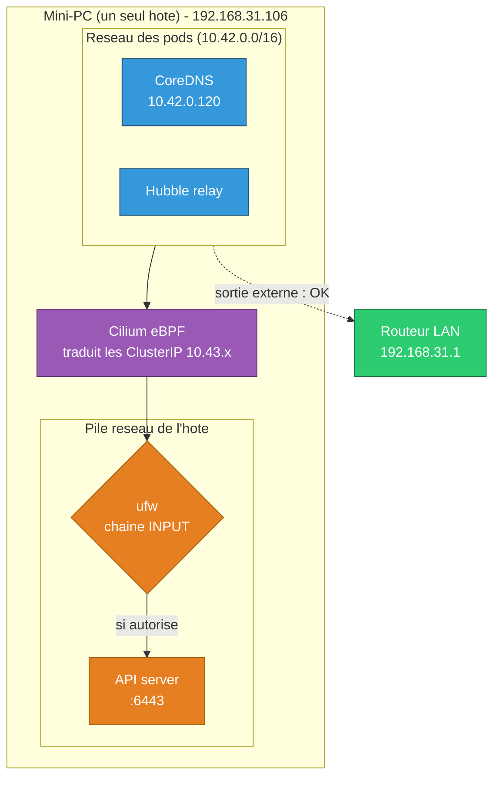

Ce schema porte la these du document : pour joindre l'API, un pod ne "sort" pas de la machine, il **remonte vers la pile reseau du meme hote**, et se heurte donc a `ufw`. A l'inverse, le trafic vers le routeur (`192.168.31.1`) sort reellement et passe sans probleme. C'est exactement l'asymetrie qu'on observera au diagnostic.

---

## 3. Le symptome

Apres l'installation de Cilium, le noeud passe bien `Ready`, l'agent Cilium tourne, `cilium status` affiche `OK`. Et pourtant :

```
coredns-...        0/1   Running   (Ready=False depuis des heures)
hubble-relay-...   0/1   CrashLoopBackOff
metrics-server-... 0/1   CrashLoopBackOff
```

Le log de CoreDNS tourne en boucle sur :

```
[INFO] plugin/ready: Still waiting on: "kubernetes"
... failed to list *v1.Service: Get "https://10.43.0.1:443/...": dial tcp 10.43.0.1:443: i/o timeout
```

Traduction : **CoreDNS n'arrive pas a joindre l'API Kubernetes** via sa ClusterIP `10.43.0.1`. Et comme CoreDNS est en panne, plus aucune resolution DNS interne ne marche, donc Hubble (qui cherche `hubble-peer....svc`) tombe aussi. Effet domino.

Le piege pedagogique ici : `cilium status` disait `OK`. **L'outil de la couche reseau se croit en bonne sante**, mais la connectivite reelle est cassee. D'ou la regle : toujours tester le chemin reel, pas seulement l'auto-diagnostic du composant.

---

## 4. Le diagnostic, couche par couche

La methode : ne pas deviner, descendre une couche a la fois et tester chaque saut. On entre dans l'espace reseau (network namespace) du pod CoreDNS avec `nsenter` pour tester depuis sa perspective exacte.

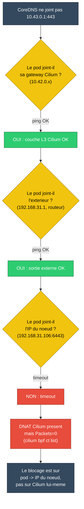

Les faits recueillis :

| Test depuis le netns du pod | Resultat |
|---|---|
| `ping 10.42.0.128` (gateway Cilium) | OK |
| `ping 192.168.31.1` (routeur LAN) | OK |
| `nc 10.43.0.1 443` (ClusterIP API) | timeout |
| `nc 192.168.31.106 6443` (IP reelle du noeud) | timeout |

La derniere ligne est la cle. Le pod sort vers le **routeur** (`.1`) sans probleme, mais ne joint pas le **noeud lui-meme** (`.106`). Le probleme n'est donc ni Cilium ni le DNS : c'est specifiquement le trafic **pod vers l'hote** qui est jete.

Et `cilium bpf ct list` (la table de suivi de connexions eBPF de Cilium) montrait :

```
TCP OUT 10.42.0.120:47118 -> 192.168.31.106:6443 ... Packets=0 Bytes=0
```

Cilium a bien cree l'entree (il a fait son DNAT), mais **zero paquet n'est jamais parti**. Le paquet est tue apres Cilium, plus bas dans la pile.

---

## 5. La mecanique fine : le voyage d'un paquet

C'est ici que tout se joue. Suivons un paquet de CoreDNS vers l'API.

Quand un pod envoie vers une ClusterIP, la traduction le redirige vers l'IP du **noeud local**. Or une IP locale ne se route pas vers l'exterieur : elle "remonte" vers la pile reseau de l'hote par la chaine **INPUT** de netfilter. Et c'est exactement la que `ufw` applique sa politique.

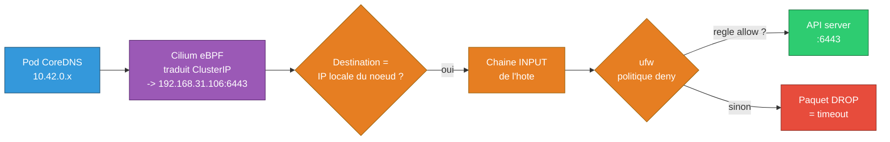

Le point contre-intuitif, et la vraie lecon de cet incident :

> Le trafic d'un pod vers un **Service ClusterIP** ne finit pas forcement dans la chaine `FORWARD` (trafic qui traverse la machine). Comme la cible reelle est l'**IP locale du noeud**, il finit dans la chaine `INPUT` (trafic destine a la machine elle-meme). Un `ufw` en deny, qui ne gere d'habitude que les services exposes, bloque alors **le plan de controle interne du cluster** sans qu'on y pense.

C'est pour ca que `ufw` etait invisible dans le diagnostic au depart : on pense "pare-feu = ce qui filtre l'exterieur", alors qu'ici il filtrait du trafic 100 % interne au cluster.

### Pourquoi ca "marchait" avant avec Flannel ?

Question legitime. La reponse honnete : le cluster n'a jamais reellement fonctionne avec ce combo dans ce projet (les pods systeme etaient deja `Ready=False`). Mais sur le principe, des configurations Flannel + kube-proxy peuvent masquer le probleme via du SNAT/masquerade qui fait apparaitre le trafic comme venant de l'hote lui-meme (souvent autorise en `INPUT`). Le passage a Cilium en *direct routing* a expose le trafic tel quel, et donc revele le `deny` de ufw.

---

## 6. La preuve par le test

On ne corrige pas sur une intuition. On a ajoute une seule regle ufw autorisant le CIDR des pods a joindre l'hote, et on a **re-teste le meme `nc`** depuis le netns du pod :

```bash
# avant
nc -zv -w 3 192.168.31.106 6443   ->  timed out

sudo ufw allow from 10.42.0.0/16

# apres
nc -zv -w 3 192.168.31.106 6443   ->  succeeded
nc -zv -w 3 10.43.0.1 443         ->  succeeded
```

Bascule immediate, et CoreDNS est passe `Ready` dans la foulee. **C'est la preuve directe que ufw etait le bloqueur decisif.**

---

## 7. Les decisions prises (et la nuance importante)

Deux changements ont ete appliques. Il faut bien distinguer leur **role**.

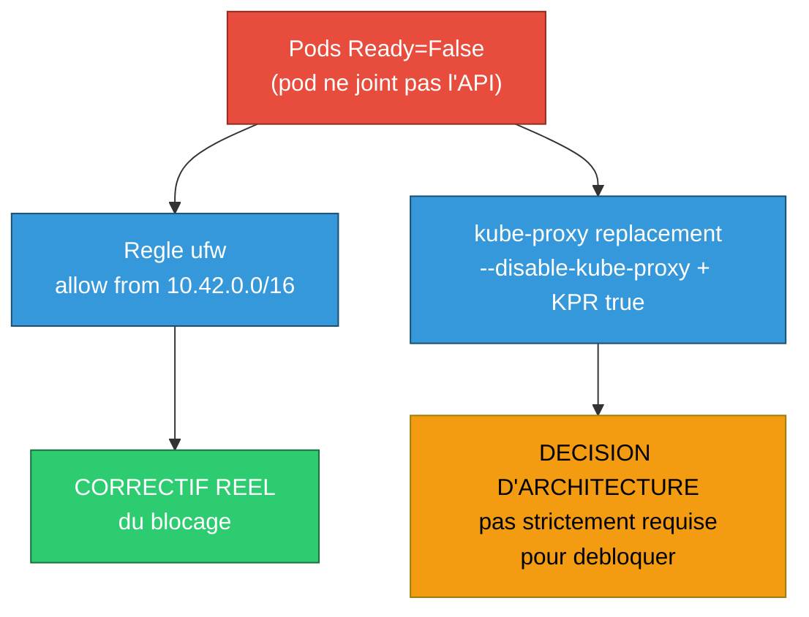

### 7.1 La regle ufw = le vrai correctif

```
ufw allow from 10.42.0.0/16
```

On autorise tout le CIDR des pods a joindre l'hote. C'est volontairement large : les pods doivent joindre plusieurs services de l'hote (API sur `:6443`, agent Cilium sur `:4244` via `hubble-peer`, etc.). Plutot que d'ouvrir port par port, on fait confiance au CIDR des pods. **L'isolation reelle entre charges reste assuree par les NetworkPolicies Cilium**, qui sont le bon endroit pour ca, pas ufw.

### 7.2 Le kube-proxy replacement = un choix, pas une rustine

En toute honnetete : `--disable-kube-proxy` + `kubeProxyReplacement: true` n'etaient **probablement pas necessaires** pour corriger le bug. Meme en gardant kube-proxy, le paquet finissait sur l'IP locale du noeud, donc sur la chaine INPUT, donc bloque par ufw. Lever ufw aurait suffi.

Alors pourquoi le garder quand meme ? Pour trois bonnes raisons :

- **Coherence d'architecture** : le projet veut Cilium comme plan de donnees. Autant lui confier reellement le routage des Services.
- **Eviter un semi-remplacement bancal** : avant, on etait en `kube-proxy-replacement: false` mais Cilium interceptait quand meme certains flux en eBPF (les entrees `Packets=0` le prouvaient). Deux mecanismes qui se marchent dessus, c'est fragile. Mieux vaut un seul responsable clair.
- **Performance et transfert de competence** : routage eBPF plutot qu'iptables, et c'est la meme logique qu'on reutilisera plus tard sur EKS.

Comme il n'y a plus de kube-proxy pour exposer l'API via sa ClusterIP au demarrage, l'agent Cilium doit savoir joindre l'API directement. D'ou les deux parametres obligatoires dans ce mode :

```yaml
kubeProxyReplacement: true
k8sServiceHost: 192.168.31.106   # IP reelle du noeud
k8sServicePort: 6443
```

C'est un **probleme d'amorcage** classique : pour router les Services il faut parler a l'API, mais l'API est elle-meme un Service. On casse la boucle en donnant l'adresse reelle en dur.

### 7.3 Le nombre de replicas de l'operator

Detail mais instructif : l'operator Cilium a 2 replicas par defaut, qui se disputent les memes hostPorts. Sur un cluster mono-noeud, le second reste `Pending` pour toujours, et le `helm --wait` echoue en timeout car le Deployment n'est jamais "completement pret". Correction : `operator.replicas: 1` en local.

---

## 8. La configuration finale

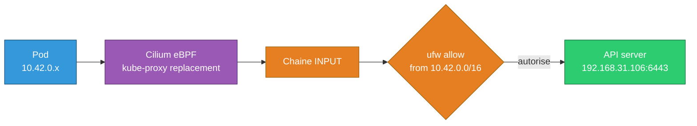

Cote k3s (`roles/k3s-install`) :

```
--flannel-backend=none      # pas de CNI par defaut
--disable-network-policy    # NetworkPolicy gere par Cilium
--disable-kube-proxy        # routage des Services delegue a Cilium
```

Cote Cilium (`roles/cilium-setup`) :

```yaml
kubeProxyReplacement: true
k8sServiceHost: <IP du noeud>
k8sServicePort: 6443
operator:
  replicas: 1
ipam:
  mode: cluster-pool
  # pool 10.42.0.0/16, /24 par noeud
hubble:
  relay: { enabled: true }
  ui:    { enabled: true }
```

Cote hote (ajoute par `cilium-setup`) :

```
ufw allow from 10.42.0.0/16
```

---

## 9. Rendre tout ca idempotent (le reflexe Ansible)

L'objectif du projet n'est pas "ca marche une fois" mais "ca se reconstruit a l'identique". Deux pieges d'idempotence ont ete traites.

### 9.1 Un flag de service ne se met pas a jour tout seul

`k3s-install` ne se reinstallait que si la **version** changeait. Ajouter `--disable-kube-proxy` aux arguments ne declenchait donc rien : le service continuait de tourner avec l'ancienne config. Correctif : le role lit l'unite `k3s.service` reelle et compare les flags actifs aux flags voulus. S'il manque un flag, il reinstalle.

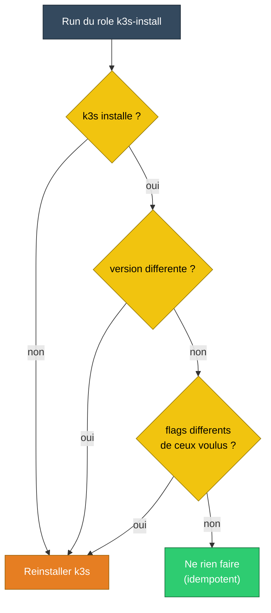

La lecon generale : **un role idempotent doit reagir a l'intention declaree (les flags voulus), pas seulement a un proxy comme la version.**

### 9.2 La course au demarrage de CoreDNS

Au boot, k3s planifie CoreDNS **avant** que Cilium et la regle ufw soient en place. CoreDNS demarre donc dans un reseau non pret et reste bloque. Le role `cilium-setup` verifie a la fin si CoreDNS est `Ready` ; sinon il fait un `rollout restart` pour le recreer sur un reseau desormais fonctionnel. Et il ne le fait **que** s'il n'est pas deja pret, donc un second passage ne change rien.

Resultat : deux executions consecutives du playbook donnent `changed=0, failed=0`. C'est la definition pratique de l'idempotence.

---

## 10. Ce qu'il faut retenir

- Un **CNI** donne les IP et le routage aux pods ; sans lui, le noeud est `NotReady`.
- Une **ClusterIP** est virtuelle : il faut un traducteur (kube-proxy ou Cilium eBPF) qui fait le DNAT vers une vraie adresse.
- Le trafic pod vers ClusterIP peut finir sur l'**IP locale du noeud**, donc dans la chaine **INPUT** de l'hote, donc soumis au **pare-feu de l'hote**.
- Un `ufw` en deny peut casser le **plan de controle interne** d'un cluster sans toucher a rien d'expose : c'est un angle mort classique.
- **Tester le chemin reel** (`nsenter` + `nc`/`ping` depuis le netns du pod) plutot que de croire l'auto-diagnostic d'un composant (`cilium status: OK`).
- **Distinguer le correctif du bug** (la regle ufw) de la **decision d'architecture** prise au passage (le kube-proxy replacement). Les deux sont legitimes, mais ce ne sont pas la meme chose.
- **Idempotence** : un role doit reagir a l'intention (flags voulus, etat cible), pas seulement a un indicateur partiel.

### 10.1 Ce qu'on garde dans Molecule pour `cilium-setup`

Molecule ne doit pas pretendre "prouver Cilium" au sens datapath eBPF complet. Dans ce projet, on l'utilise pour verifier le **role Ansible** avec le meilleur ratio entre cout de maintenance, valeur pedagogique et confiance du resultat.

| Controle retenu dans Molecule | Complexite | Valeur ajoutee | Fiabilite / confiance |
|---|---|---|---|
| Le role converge sans erreur | Faible | Haute | Haute |
| Le role est idempotent | Faible | Haute | Haute |
| Le release Helm `cilium` existe | Faible | Haute | Haute |
| Les valeurs Helm critiques sont bien appliquees (`kubeProxyReplacement`, `k8sServiceHost`, IPAM, Hubble, `operator.replicas`) | Faible a moyenne | Haute | Haute |
| Les objets Kubernetes attendus existent (`ds/cilium`, `deploy/cilium-operator`, `hubble-relay`, `hubble-ui`) | Faible a moyenne | Moyenne a haute | Haute |
| Les prerequis k3s attendus sont poses (`--disable-kube-proxy`, pas de Flannel) | Faible | Haute | Haute |

Le reste, c'est-a-dire le **datapath reel**, la **connectivite effective** et les interactions fines avec le **noyau**, `hostNetwork` et le **pare-feu hote**, reste valide sur l'hote cible avec `cilium status --wait`, `cilium connectivity test` et un rerun idempotent du playbook.

---

## Annexe : la boite a outils de diagnostic reseau

Commandes reutilisables, du plus haut niveau au plus bas.

| But | Commande |
|---|---|
| Etat des pods et conditions | `kubectl get pods -n kube-system -o wide` |
| Sante auto-declaree de Cilium | `kubectl exec -n kube-system ds/cilium -- cilium status` |
| Mode kube-proxy replacement actif | `... cilium status \| grep KubeProxyReplacement` |
| Table de suivi de connexions eBPF | `... cilium bpf ct list global \| grep <IP>` |
| Liste des endpoints Cilium | `... cilium endpoint list` |
| PID d'un conteneur (pour nsenter) | `crictl inspect <id> \| jq .info.pid` |
| Tester depuis le netns d'un pod | `sudo nsenter -t <pid> -n -- nc -zv -w 3 <ip> <port>` |
| Voir la route dans le pod | `sudo nsenter -t <pid> -n -- ip route` |
| Regles NAT des Services | `sudo iptables -t nat -L KUBE-SERVICES -n` |
| Politique FORWARD/INPUT de l'hote | `sudo iptables -L FORWARD -n` / `... -L INPUT -n` |
| Etat du pare-feu hote | `sudo ufw status` |

Regle d'or : ne jamais sauter une couche. On descend un saut a la fois, on teste, on interprete, puis on descend encore. C'est plus lent que de deviner, mais c'est la seule methode qui donne une **certitude** plutot qu'une intuition.
