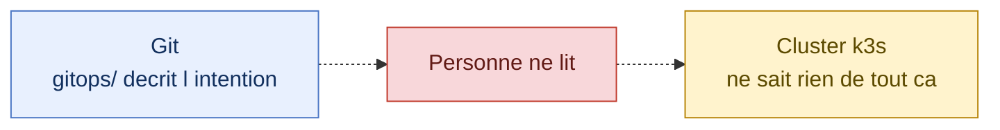
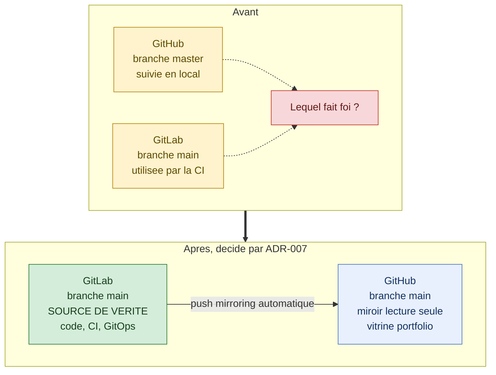
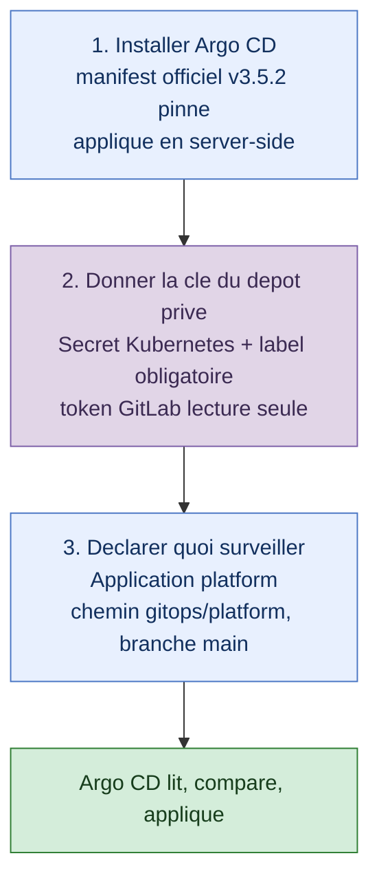
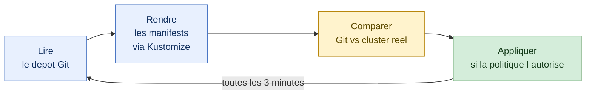
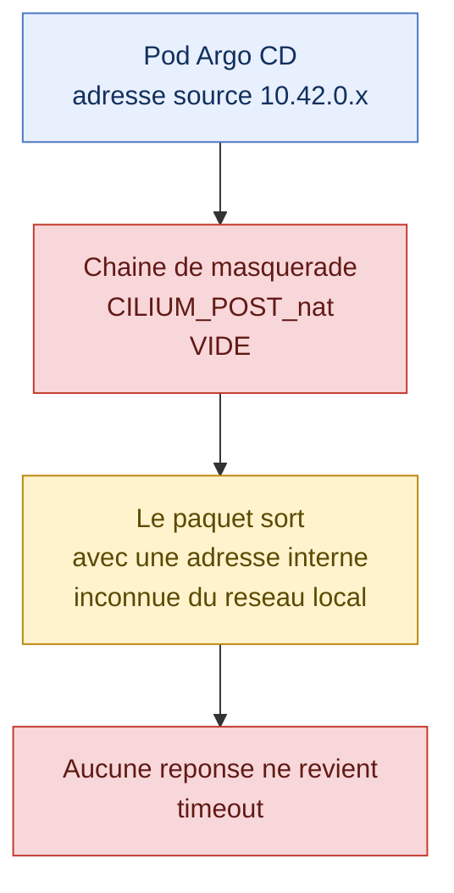
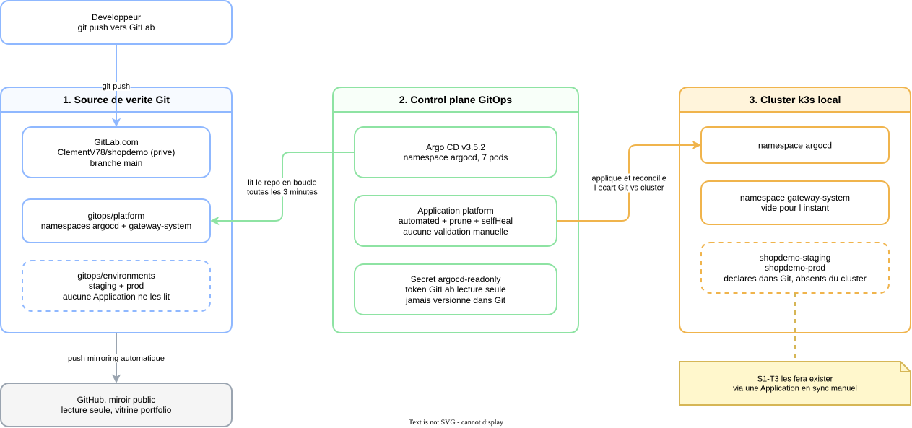
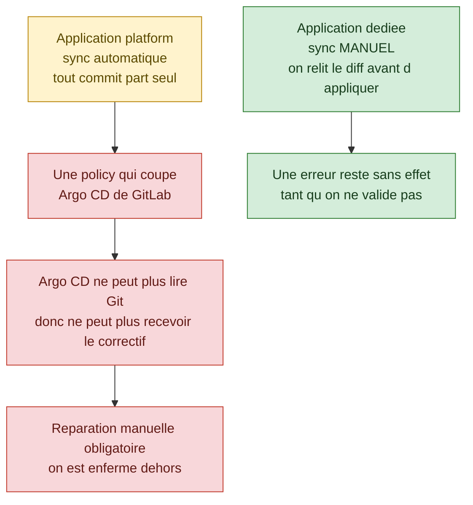

# Recit S1-T2 : comment Argo CD est arrive dans le lab

Ce document raconte, dans l'ordre, ce qui s'est passe pendant `S1-T2`. Il est ecrit pour etre relu a froid, sans avoir suivi la session : chaque schema est suivi d'une explication en phrases, et les details techniques sont volontairement remis dans leur contexte plutot que listes.

Pour la version courte et factuelle, voir [`sprints/sprint-1-gitops-local.md`](../../sprints/sprint-1-gitops-local.md). Pour le diagnostic complet de l'incident reseau, voir [`s1-t2-cilium-egress-blocker.md`](s1-t2-cilium-egress-blocker.md).

## Sommaire

- [Le point de depart](#le-point-de-depart)
- [1. Savoir qui commande](#1-savoir-qui-commande)
- [2. Installer le controleur](#2-installer-le-controleur)
- [3. La boucle qui tourne toute seule](#3-la-boucle-qui-tourne-toute-seule)
- [4. Le mur](#4-le-mur)
- [5. La photo actuelle](#5-la-photo-actuelle)
- [6. La suite](#6-la-suite)
- [A retenir](#a-retenir)

## Le point de depart

A la fin de `S1-T1`, le depot contenait deja un dossier `gitops/` bien range : des namespaces declares, une separation entre plateforme, applications et environnements, des rendus Kustomize valides localement. Mais personne ne lisait ces fichiers.

C'est la situation qu'il faut bien comprendre avant tout le reste : `S1-T1` avait ecrit la recette, mais il n'y avait aucun cuisinier dans la cuisine. Les fichiers YAML pouvaient dire "je veux un namespace `argocd`", le cluster n'en savait rien et ne le creait pas. Tant que ce chainon manque, GitOps n'existe pas vraiment, il n'y a que des intentions bien rangees.

L'objectif de `S1-T2` etait donc precis et volontairement petit : installer le composant qui lit Git et agit sur le cluster, puis prouver une seule fois que la chaine complete fonctionne. Pas de plateforme complete, pas de `ApplicationSet`, pas de policies. Juste : la boucle tourne, et on sait l'expliquer.

## 1. Savoir qui commande

Avant meme de toucher a Argo CD, une question bloquante est apparue. Argo CD doit lire *un* depot Git. Or le projet en avait deux, et personne n'avait tranche lequel faisait autorite.

Le probleme n'etait pas theorique. Si Argo CD lit GitHub pendant que la CI ecrit sur GitLab, les deux depots divergent silencieusement et on finit par deployer un etat different de celui qu'on croit avoir valide. Il fallait donc une regle explicite, ecrite quelque part, plutot qu'une habitude implicite.

La decision prise est `ADR-007` : GitLab.com devient la source de verite unique pour le code, la CI et le depot GitOps lu par Argo CD, et GitHub devient un miroir en lecture seule alimente automatiquement. GitLab a ete choisi parce que `ADR-001` y avait deja mis la CI et l'authentification OIDC vers AWS : garder tout au meme endroit evite d'avoir deux verites a synchroniser a la main.

Dans la foulee, trois choses ont ete alignees sur cette decision. La branche par defaut a ete renommee `master` en `main` partout, pour que les trois copies portent le meme nom. Le suivi de la branche locale a ete bascule vers GitLab, pour qu'un simple `git push` aille vers la source de verite et non vers le miroir. Et le miroir GitLab vers GitHub a ete configure, avec l'option qui ne miroite que les branches protegees, donc uniquement `main`.

Deux details ont coince au passage, et ils meritent d'etre notes parce qu'ils reviendront. D'abord, la branche `main` etant protegee cote GitLab, le token utilise pour pousser doit avoir le role `Maintainer` : le token existant etait en `Developer`, ce qui suffisait pour lire et pour la CI, mais pas pour ecrire sur une branche protegee. Ensuite, sur ce poste, la variable `GIT_ASKPASS` pointe vers le script d'invite de VSCode, qui attend une fenetre graphique : quand elle ne s'ouvre pas, `git push` reste bloque indefiniment sans rien afficher. Le contournement est de forcer la saisie dans le terminal avec `GIT_ASKPASS= git push`.

## 2. Installer le controleur

Une fois la source de verite fixee, l'installation elle-meme tient en trois gestes.

La premiere etape installe Argo CD lui-meme. Le manifest officiel a ete telecharge depuis un tag versionne precis, `v3.5.2`, et non depuis l'alias `stable`. La difference compte : `stable` peut pointer vers autre chose demain, ce qui rendrait l'installation non reproductible et donc invalidable. Le fichier est versionne dans le depot, ce qui permet de savoir exactement ce qui tourne.

C'est aussi ici qu'un premier piege est apparu. Un `kubectl apply` classique echoue sur ce manifest, parce que l'un des CRD d'Argo CD est trop volumineux pour l'annotation dans laquelle `kubectl` stocke la configuration precedente. Il faut passer en apply cote serveur, ou c'est l'API Kubernetes qui calcule la difference, champ par champ, sans avoir besoin de recopier tout le manifest dans une annotation limitee a 256 Ko.

La deuxieme etape donne a Argo CD de quoi lire un depot prive. Le credential vit dans un `Secret` cree directement dans le cluster, jamais dans Git, avec un token GitLab volontairement minimal : role `Reporter`, portee `read_repository` uniquement. Le token plus puissant deja utilise par la CI aurait fonctionne, mais il aurait donne a Argo CD le droit d'ecrire dans le depot et de gerer des runners, ce dont il n'a aucun besoin. Deuxieme piege ici : Argo CD n'utilise un `Secret` comme identifiant de depot que s'il porte le label `argocd.argoproj.io/secret-type=repository`. Sans ce label, le secret existe mais il est ignore, en silence.

La troisieme etape declare enfin ce qu'il faut surveiller. Une ressource `Application` dit a Argo CD : regarde ce depot, cette branche, ce dossier, et fais en sorte que le cluster y ressemble.

## 3. La boucle qui tourne toute seule

C'est le coeur du modele GitOps, et c'est ce qui change par rapport a un `kubectl apply` lance a la main.

Argo CD ne se contente pas d'appliquer une fois puis d'oublier. Il refait ce tour de piste en permanence. La consequence pratique est que le cluster ne peut plus deriver silencieusement de ce qui est ecrit dans Git : si quelqu'un modifie une ressource a la main, l'ecart est detecte au tour suivant.

La politique choisie pour l'`Application` `platform` va au bout de cette logique. `selfHeal` annule automatiquement toute modification manuelle, et `prune` supprime du cluster ce qui disparait de Git. Autrement dit, Git n'est pas seulement la reference, c'est le seul endroit ou ecrire. C'est puissant, et c'est aussi exactement ce qui rend l'etape suivante du sprint delicate, on y reviendra.

## 4. Le mur

Une fois l'`Application` creee, la synchronisation aurait du reussir. Elle est restee bloquee sur un statut `Unknown`, avec un message qui accusait la resolution DNS.

Le message d'erreur pointait vers le DNS, mais le vrai probleme etait ailleurs et beaucoup plus large : aucun pod du cluster ne pouvait joindre quoi que ce soit hors du cluster. Ni GitLab, ni une adresse IP publique, ni meme la passerelle du reseau local. La panne n'avait donc rien a voir avec Argo CD ni avec GitOps, elle etait sous les deux.

La cause se trouvait dans Cilium, la couche reseau installee au Sprint 0. Pour qu'un pod puisse parler a l'exterieur, son adresse interne doit etre remplacee par celle de la machine hote, sinon les reponses ne savent pas par ou revenir. C'est le role du masquerade. Or la chaine de regles qui aurait du faire ce travail etait vide, tandis que les bonnes regles dormaient dans une ancienne chaine que plus rien n'utilisait. Cilium avait commence a basculer d'un jeu de regles a l'autre et n'avait jamais termine, bloque en boucle depuis 44 heures sur une etape de nettoyage impossible.

Deux tentatives de reparation ont echoue avant de trouver la bonne. Redemarrer le pod Cilium n'a rien change, ce qui a appris une chose utile : l'etat casse ne vivait pas dans le conteneur mais dans les regles reseau de la machine hote, qui survivent au redemarrage d'un pod. Recreer a la main la regle manquante n'a pas fonctionne non plus, le noyau ne la reconnaissant pas comme identique a celle attendue.

La reparation qui a marche est passee par le chemin reproductible du projet : redemarrage complet de la machine, puis relance du playbook Ansible `cilium-setup.yml`. Cilium a alors reconstruit ses regles proprement, tout seul. Un contournement manuel avait bien ete pose pendant le diagnostic, uniquement pour prouver la cause, et il a ete volontairement abandonne plutot que conserve. C'est un point important pour la suite du projet : la configuration cible doit rester celle que l'outil sait reproduire, pas un correctif tape a la main que personne ne saura refaire.

## 5. La photo actuelle

Voici ou en est le lab a la fin de `S1-T2`.

  

> Source editable : [`diagrams/s1-t2-vue-densemble.drawio`](../../diagrams/s1-t2-vue-densemble.drawio).

La lecture se fait de gauche a droite. A gauche, la source de verite : le depot GitLab prive, sur la branche `main`, avec a l'interieur le dossier `gitops/platform` qui est le seul reellement surveille aujourd'hui. En dessous, GitHub recoit une copie automatique, mais personne ne travaille dessus, c'est une vitrine.

Au centre, le control plane GitOps : Argo CD tourne dans le namespace `argocd`, il lit le depot grace a un token en lecture seule stocke uniquement dans le cluster, et l'`Application` `platform` decrit ce qu'il doit maintenir. A droite, le resultat concret dans le cluster : les namespaces `argocd` et `gateway-system` existent parce que le chemin GitOps les declare.

Deux zones sont dessinees en pointilles, et c'est volontaire. Le dossier `gitops/environments`, qui contient les namespaces `shopdemo-staging` et `shopdemo-prod`, est du YAML dormant : il est bien dans Git, mais aucune `Application` ne le lit, donc ces deux namespaces n'existent pas encore dans le cluster. C'est ce qui explique la prochaine etape.

## 6. La suite

`S1-T3` doit poser les premieres regles reseau, les NetworkPolicies. Le point d'attention principal n'est pas technique, il est structurel.

Le risque est le suivant. L'`Application` `platform` applique automatiquement tout ce qui arrive dans son chemin, sans validation humaine. Si une regle reseau coupait par erreur l'acces d'Argo CD a GitLab, Argo CD ne pourrait plus lire le depot, donc plus recevoir le correctif : on casserait precisement le mecanisme cense nous reparer, et il faudrait ressortir `kubectl` a la main.

La parade retenue evite completement le probleme. Les premieres policies seront posees sur les namespaces applicatifs, qui n'existent pas encore et ne contiennent aucun workload, via une nouvelle `Application` en synchronisation manuelle. Le namespace `argocd` reste hors perimetre, parce que c'est le seul endroit ou une erreur coute cher. Et comme aucun workload applicatif n'a besoin de joindre GitLab, la question de l'autorisation par nom de domaine ne se pose meme pas a cette etape.

## A retenir

Cinq idees valent la peine d'etre gardees de cette etape.

Une intention ecrite dans Git ne vaut rien sans un composant qui la lit et agit : c'est toute la difference entre `S1-T1` et `S1-T2`.

Avoir deux depots sans dire lequel fait foi est un probleme d'architecture, pas un detail d'organisation, et ca se tranche par une decision ecrite.

Un message d'erreur peut designer la mauvaise couche : un echec DNS dans Argo CD etait en realite une panne de masquerade reseau deux etages plus bas.

Quand un outil gere une configuration, on repare en repassant par cet outil, pas en corrigeant a la main dans son dos.

Enfin, l'automatisation totale d'une boucle GitOps est une force jusqu'au jour ou l'on modifie ce dont cette boucle depend pour vivre, et c'est exactement la qu'une porte de validation manuelle reprend du sens.
