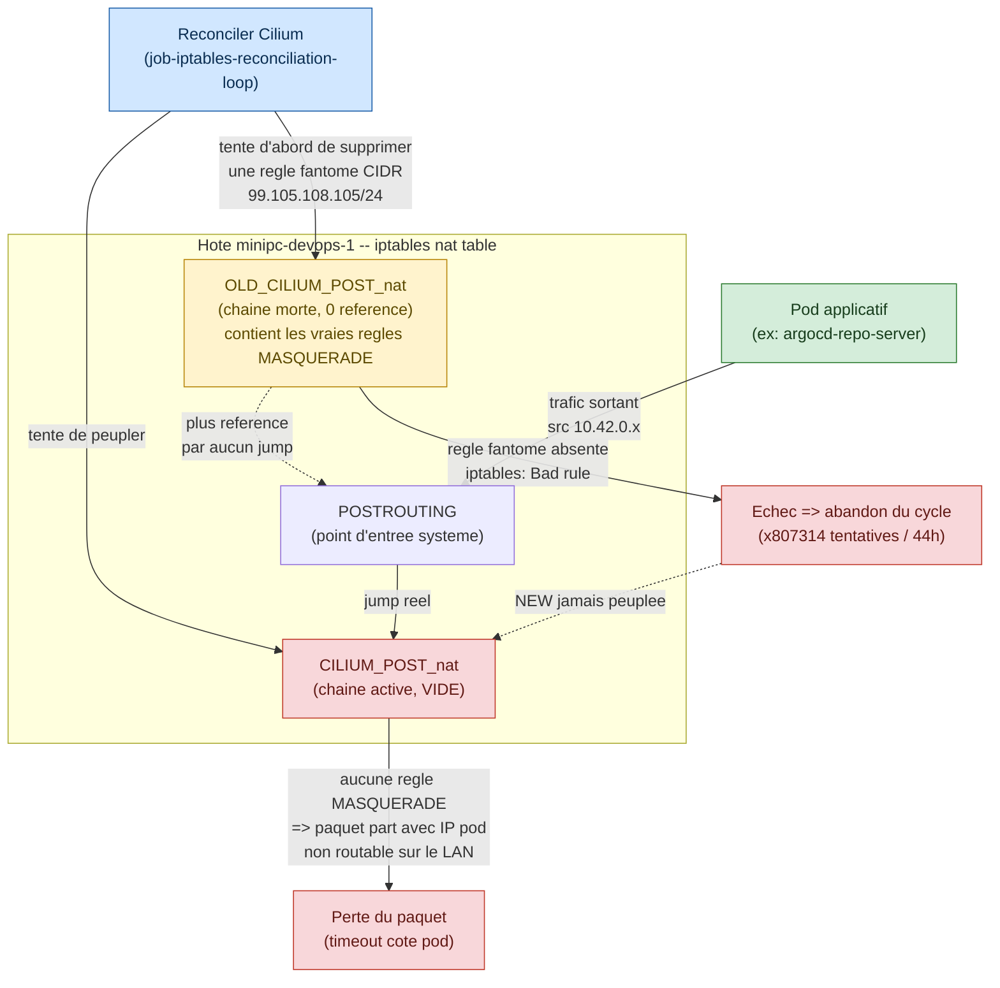

# Preuve S1-T2 - Blocage egress reseau Cilium

Date : 2026-09-07

## Perimetre

Cette preuve couvre le diagnostic du blocage rencontre pendant `S1-T2`
(installation Argo CD). L'installation Argo CD elle-meme est validee ; c'est
la synchronisation de la premiere `Application` qui a revele une panne reseau
plateforme independante de GitOps, probablement issue du reset k3s/Cilium du
2026-09-05
([`../sprint-0/k3s-cilium-reset-plan.md`](../sprint-0/k3s-cilium-reset-plan.md)).

## Symptome observe

Aucun pod du cluster ne peut atteindre une adresse en dehors du cluster :

```bash
kubectl exec net-test -n default -- ping -c 3 -W 2 192.168.31.1
# 100% packet loss

kubectl exec net-test -n default -- nslookup gitlab.com
# connection timed out; no servers could be reached
```

L'`Application` Argo CD `platform` reste `Sync Status: Unknown` avec la
condition :

```text
ComparisonError: Failed to load target state: failed to generate manifest for
source 1 of 1: rpc error: code = Unknown desc = failed to list refs: Get
"https://gitlab.com/ClementV78/shopdemo.git/info/refs?service=git-upload-pack":
dial tcp: lookup gitlab.com on 10.43.0.10:53: server misbehaving
```

## Diagnostic

Boucle hypothese / commande / observation menee en session :

| Hypothese | Commande | Observation |
|---|---|---|
| Probleme specifique a Argo CD / ses NetworkPolicies | `kubectl run dns-test ... nslookup gitlab.com` dans `default` | Meme echec hors namespace `argocd` : probleme cluster-wide |
| CoreDNS en panne | `kubectl logs -n kube-system -l k8s-app=kube-dns` | CoreDNS tourne, mais `read udp ...->192.168.31.1:53: i/o timeout` : l'upstream n'est pas joignable depuis les pods |
| Panne cote hote/reseau LAN | `resolvectl status`, `nslookup gitlab.com 192.168.31.1` depuis l'hote | L'hote resout normalement ; le probleme est specifique au reseau pod |
| Regression Cilium (masquerade/egress) | `cilium status --verbose \| grep -i degraded` | `job-iptables-reconciliation-loop [DEGRADED] iptables rules full reconciliation failed (x807314)` |
| Redemarrage suffit | `kubectl delete pod -n kube-system -l k8s-app=cilium` puis retest | Sans effet : le module reste `DEGRADED` (x114 dans les secondes suivantes), l'etat casse vit dans les regles iptables de l'hote, pas dans le pod |
| Bascule iptables incomplete | `sudo iptables -t nat -S POSTROUTING` / `-S OLD_CILIUM_POST_nat` / `-S CILIUM_POST_nat` | `POSTROUTING` pointe vers `CILIUM_POST_nat` (vide, 0 regle) ; les vraies regles de masquerade dorment dans `OLD_CILIUM_POST_nat` (0 reference, mort) |

## Cause racine

Cilium (v1.19.5) maintient un jeu de regles iptables "nouveau"
(`CILIUM_*`) et "ancien" (`OLD_CILIUM_*`) pour basculer atomiquement entre
deux etats. Ici, la bascule des points d'entree (`PREROUTING`, `POSTROUTING`,
`INPUT`, `OUTPUT`, `FORWARD`) vers les nouvelles chaines a partiellement
reussi, mais la chaine `CILIUM_POST_nat` (celle desormais active pour le
masquerade NAT) est restee vide. Le job de reconciliation qui devrait la
peupler echoue avant d'y arriver, bloque sur une etape anterieure : il tente
de supprimer, dans `OLD_CILIUM_POST_nat`, une regle avec un CIDR incoherent
(`! -d 99.105.108.105/24`, qui ne correspond a aucune configuration reseau
reelle du projet) qui n'existe pas dans la chaine reelle
(`! -d 10.42.0.0/24`). La suppression echoue systematiquement
(`iptables: Bad rule`), et Cilium abandonne tout le cycle de reconciliation a
chaque tentative (repetee toutes les ~10 secondes depuis 44h au moment du
diagnostic).

Hypothese sur l'origine : residu d'un etat de reconciliation Cilium
interrompu en plein bascule pendant ou juste apres le reset k3s/Cilium du
2026-09-05, laissant en memoire un CIDR calcule de maniere incoherente.



## Correctifs tentes (sans succes complet en session)

1. Redemarrage du pod agent Cilium (DaemonSet, un seul noeud) : sans effet,
   confirme que l'etat casse vit dans les regles iptables persistantes de
   l'hote, pas dans la memoire du pod.
2. Recreation manuelle de la regle fantome exacte dans `OLD_CILIUM_POST_nat`
   pour permettre au `DELETE` de Cilium de reussir et le laisser terminer sa
   bascule :
   ```bash
   sudo iptables -t nat -A OLD_CILIUM_POST_nat -s 10.42.0.0/24 \
     ! -d 99.105.108.105/24 ! -o cilium_+ \
     -m comment --comment "cilium masquerade non-cluster" -j MASQUERADE
   ```
   Insertion reussie, mais les cycles de reconciliation suivants echouent
   encore avec le meme message. Hypothese : divergence de representation
   interne iptables/nftables entre la regle recreee manuellement et celle que
   Cilium cherche a supprimer (ordre des extensions de match, traduction
   nftables), qui fait que le noyau ne les considere pas identiques malgre un
   texte `-S` identique.

## Resolution

Resolution validee le 2026-09-07.

Un ajout manuel temporaire de MASQUERADE dans la chaine active
`CILIUM_POST_nat` a d'abord confirme la cause effective : des que le trafic
pod `10.42.0.0/24` etait masque par l'IP de l'hote, un pod de test pouvait de
nouveau resoudre et joindre `https://gitlab.com`.

Ce workaround n'a pas ete conserve comme etat cible. Apres redemarrage complet
du noeud local `minipc-devops-1`, le playbook reproductible a ete relance :

```bash
cd /home/xclem/projetsperso/shop-demo/ansible
ansible-playbook playbooks/cilium-setup.yml
```

Resultat synthetique :

```text
localhost : ok=15 changed=0 unreachable=0 failed=0 skipped=2
Cilium: OK
Operator: OK
Envoy DaemonSet: OK
Hubble Relay: OK
Cluster Pods: 14/14 managed by Cilium
```

La chaine active `CILIUM_POST_nat` a ete reconstruite par Cilium lui-meme :

```text
-A CILIUM_POST_nat -s 10.42.0.0/24 ! -d 10.42.0.0/24 ! -o cilium_+ \
  -m comment --comment "cilium masquerade non-cluster" -j MASQUERADE
```

La regle temporaire ajoutee pendant le diagnostic n'etait plus presente :

```bash
sudo iptables -t nat -S CILIUM_POST_nat | grep temporary || echo "NO_TEMP_RULE"
# NO_TEMP_RULE
```

Validation egress pod :

```bash
kubectl run net-test -n default --image=busybox:1.36 --restart=Never -- sleep 3600
kubectl wait --for=condition=Ready pod/net-test -n default --timeout=60s
kubectl exec net-test -n default -- nslookup gitlab.com
kubectl exec net-test -n default -- wget -qO /dev/null https://gitlab.com && echo "HTTPS_OK"
kubectl delete pod net-test -n default
```

Resultat :

```text
gitlab.com resolves through CoreDNS (10.43.0.10)
HTTPS_OK
```

## Non-impact sur l'installation Argo CD

Ce blocage etait independant de la configuration Argo CD :

- Argo CD `v3.5.2` installe via manifest officiel pinne, 7 pods `Running`.
- Secret de credential Git prive cree dans le cluster (jamais commite), token
  GitLab dedie lecture seule (`argocd-readonly`, role `Reporter`, scope
  `read_repository`).
- `Application` `platform` creee, ciblant `gitops/platform` sur
  `https://gitlab.com/ClementV78/shopdemo.git` branche `main`.

Apres resolution de l'egress Cilium, un refresh hard Argo CD a relance la
comparaison Git :

```bash
kubectl annotate application platform -n argocd \
  argocd.argoproj.io/refresh=hard \
  --overwrite
kubectl get applications -n argocd
```

Resultat :

```text
NAME       SYNC STATUS   HEALTH STATUS
platform   Synced        Healthy
```

Revision synchronisee :

```text
57763f42f5eb4e6333d42bfbe5c6ba392dd0accc
```

Conclusion : `S1-T2` est valide de bout en bout. Argo CD lit GitLab, rend le
chemin Kustomize `gitops/platform`, et synchronise les namespaces attendus.
