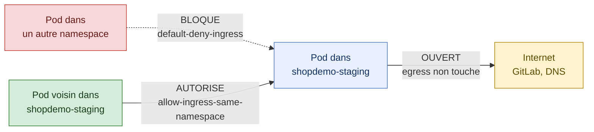

# Preuve S1-T3 - Namespaces applicatifs et isolation en entree

Date : 2026-09-07

## Perimetre

Cette preuve couvre `S1-T3` : faire exister les namespaces applicatifs par le chemin GitOps, puis poser une premiere isolation reseau en entree, sans toucher a l'egress repare pendant `S1-T2`.

Deux choix de cadrage encadrent ce lot. Les policies sont volontairement limitees a l'ingress, l'egress restant entierement ouvert. Et le namespace `argocd` reste hors perimetre, parce qu'une erreur de policy y couperait Argo CD de son depot Git, donc de sa capacite a recevoir le correctif.

## Le probleme de depart

Les namespaces `shopdemo-staging` et `shopdemo-prod` etaient declares dans Git depuis `S1-T1`, mais aucune `Application` Argo CD ne lisait `gitops/environments/`. C'etait du YAML dormant : present dans le depot, absent du cluster.

```bash
kubectl get ns shopdemo-staging shopdemo-prod
# Error from server (NotFound): namespaces "shopdemo-staging" not found
# Error from server (NotFound): namespaces "shopdemo-prod" not found
```

## La porte manuelle

Deux `Application` ont ete creees, sur `gitops/environments/staging` et `gitops/environments/prod`, volontairement **sans bloc `automated`**. Contrairement a l'`Application` `platform`, rien ne part tout seul : Argo CD detecte l'ecart et attend une action humaine.

C'est la parade au risque d'auto-lockout : si une regle reseau erronee coupait Argo CD de GitLab, Argo CD ne pourrait plus lire le depot pour recevoir le correctif. Avec une synchronisation manuelle, une erreur reste sans effet tant qu'on ne la valide pas.

Ce comportement a ete verifie explicitement. Apres avoir pousse les policies sur GitLab, avant toute synchronisation :

```bash
kubectl get applications -n argocd
# staging   OutOfSync   Healthy
# prod      OutOfSync   Healthy

kubectl get networkpolicies -n shopdemo-staging
# No resources found in shopdemo-staging namespace.
```

Argo CD **voit** l'ecart mais ne l'applique pas. La porte tient.

## Le modele d'isolation pose



Deux `NetworkPolicy` standard par environnement suffisent a ce modele. La premiere, `default-deny-ingress`, selectionne tous les pods du namespace avec `policyTypes: [Ingress]` et aucune regle, ce qui refuse toute entree. La seconde, `allow-ingress-same-namespace`, rouvre le trafic venant des pods du meme namespace. Les autorisations de plusieurs `NetworkPolicy` s'additionnent, donc le resultat net est : tout est refuse en entree sauf ce qui vient du meme namespace.

L'egress n'apparait dans aucune des deux policies. C'est deliberé : ne pas declarer `policyTypes: Egress` laisse la sortie totalement intacte, donc le chemin pod vers GitLab repare pendant `S1-T2` n'est pas remis en cause.

## Commandes executees

```bash
# validations locales, sans effet sur le cluster
yamllint gitops
kubectl kustomize gitops/environments/staging
kubectl kustomize gitops/environments/staging | kubeconform -strict -ignore-missing-schemas -summary
kubectl kustomize gitops/environments/prod | kubeconform -strict -ignore-missing-schemas -summary
kubectl kustomize gitops/environments/staging | kubectl apply --dry-run=server -f -
kubectl kustomize gitops/environments/prod | kubectl apply --dry-run=server -f -

# bootstrap des Applications, geste unique en dehors de GitOps
kubectl apply -f gitops/argocd/application-staging.yaml -f gitops/argocd/application-prod.yaml

# synchronisation manuelle, sans CLI argocd installee
kubectl patch application staging -n argocd --type merge \
  -p '{"operation":{"initiatedBy":{"username":"clement"},"sync":{"revision":"main"}}}'
kubectl patch application prod -n argocd --type merge \
  -p '{"operation":{"initiatedBy":{"username":"clement"},"sync":{"revision":"main"}}}'

# workload et sondes de test, ephemeres
kubectl run web --image=nginx:1.27-alpine -n shopdemo-staging --labels=app=web --port=80
kubectl expose pod web -n shopdemo-staging --port=80 --name=web
kubectl run probe-out --image=busybox:1.36 -n default --restart=Never --command -- sleep 600
kubectl run probe-in --image=busybox:1.36 -n shopdemo-staging --restart=Never --command -- sleep 600
```

## Resultat : mesure avant et apres

Le meme jeu de tests a ete execute deux fois, une fois avec les namespaces nus et une fois apres application des policies. C'est la comparaison qui fait la preuve, pas la mesure finale seule.

| Test | Avant policies | Apres policies | Ce que ca prouve |
|---|---|---|---|
| `probe-out` (namespace `default`) vers `web.shopdemo-staging` | JOIGNABLE | **BLOQUE** | `default-deny-ingress` refuse bien le trafic venant d'un autre namespace |
| `probe-in` (meme namespace) vers `web.shopdemo-staging` | JOIGNABLE | JOIGNABLE | `allow-ingress-same-namespace` laisse passer le trafic interne |
| Resolution DNS de `gitlab.com` depuis `shopdemo-staging` | OK | OK | CoreDNS reste joignable, aucun effet de bord sur le DNS |
| `https://gitlab.com` depuis `shopdemo-staging` | OK | OK | l'egress n'est pas touche, `S1-T2` n'est pas casse |

Etat des `Application` apres le lot, verifie apres nettoyage des ressources de test :

```text
NAME       SYNC     HEALTH
platform   Synced   Healthy
prod       Synced   Healthy
staging    Synced   Healthy
```

## Ce que cette preuve ne couvre pas

Le namespace `argocd` conserve uniquement les sept `NetworkPolicy` livrees par le manifest d'installation d'Argo CD. Aucune policy de ce lot ne s'y applique, c'est une dette assumee et documentee.

Le namespace `gateway-system` reste sans policy, parce qu'il est encore vide : NGINX Gateway Fabric n'est pas installe.

Les namespaces applicatifs ne contiennent aucun workload permanent a ce stade. Quand `S1-T4` ajoutera les manifests applicatifs, il faudra ajouter des autorisations d'entree ciblees, typiquement depuis la gateway vers les services. Une connexion refusee a ce moment-la sera le fonctionnement normal de `default-deny-ingress`, pas une regression.

Enfin, l'egress n'est volontairement pas restreint. Le jour ou il le sera, la question de l'autorisation par nom de domaine se posera, et c'est le cas d'usage prevu pour `CiliumNetworkPolicy` decrit dans [`../../adr/ADR-008-standard-networkpolicy-by-default.md`](../../adr/ADR-008-standard-networkpolicy-by-default.md).
