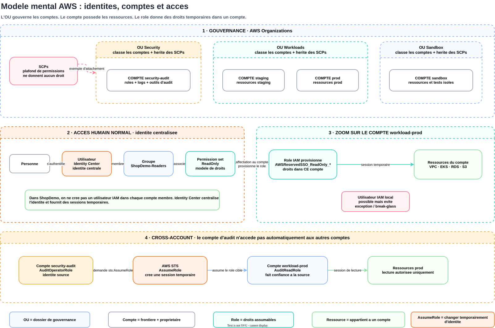

# Manuel d'installation de la plateforme ShopDemo

[Statut du manuel](#statut-du-manuel) · [Principes](#principes) · [Modele mental des acces AWS](#modele-mental-des-acces-aws) · [Prerequis](#prerequis) · [1. Installer le lab local](#1-installer-le-lab-local) · [2. Preparer l'acces AWS](#2-preparer-lacces-aws) · [3. Reprendre le bootstrap Terraform](#3-reprendre-le-bootstrap-terraform) · [4. Activer IAM Identity Center](#4-activer-iam-identity-center) · [5. Deployer la configuration Identity Center](#5-deployer-la-configuration-identity-center) · [6. Creer et tester l'utilisateur](#6-creer-et-tester-lutilisateur) · [Etapes futures](#etapes-futures)

## Statut du manuel

Ce document est le parcours operateur de reference pour installer ShopDemo. Il evolue avec les sprints et distingue ce qui est disponible, ce qui exige une action manuelle et ce qui reste planifie. Aujourd'hui, le lab local, la base GitOps, la Landing Zone AWS, IAM Identity Center et la baseline AWS permanente sont disponibles. Les preuves fonctionnelles de la baseline restent a produire. EKS, OIDC GitLab et les workloads applicatifs ne sont pas encore installables de bout en bout.

Le tout premier amorcage du bucket S3 de state a ete realise en S2-T2 avec un state local, puis migre vers S3. Le depot courant est configure pour reprendre ce backend existant. Une reinstallation dans une organisation AWS totalement vierge exige encore une procedure d'amorcage dediee a extraire et valider avant S2-T8 ; ne pas contourner cette limite en creant un bucket ou un state concurrent sans procedure de migration.

## Principes

- Le proprietaire execute les commandes AWS et Terraform importantes afin de comprendre les effets du plan.
- Le state `bootstrap` est permanent ; il ne doit jamais etre detruit avec le workload ephemere.
- Les profils AWS sont toujours nommes. Aucun compte n'est selectionne implicitement par un profil par defaut.
- `backend.hcl`, `terraform.tfvars`, les plans et les states restent hors de Git.
- Une action manuelle d'amorcage doit etre suivie par une configuration declarative ; elle ne doit pas devenir une seconde source de verite.

## Modele mental des acces AWS

<p align="center"></p>

| Objet | Modele mental | Effet concret |
|---|---|---|
| Utilisateur Identity Center | Une personne identifiee au niveau central | S'authentifie une fois et obtient des sessions temporaires dans les comptes autorises |
| Groupe | Un ensemble de personnes ayant le meme besoin | Relie plusieurs utilisateurs aux memes permission sets |
| Permission set | Un modele central de droits | Identity Center provisionne un role IAM correspondant dans chaque compte affecte |
| Role IAM | Un costume de permissions dans un compte | Une identite l'assume pour obtenir une session temporaire dans ce compte |
| Compte AWS | Une frontiere de propriete et d'isolation | Possede ses roles, VPC, clusters, bases, buckets et autres ressources |
| OU | Un dossier de gouvernance pour des comptes | Transmet notamment les SCPs ; ne possede aucune ressource et ne donne aucun acces entre comptes |
| `sts:AssumeRole` | Un changement temporaire d'identite | Permet a une identite source d'utiliser un role cible si les deux cotes l'autorisent |

Dans le modele cible ShopDemo, les utilisateurs humains sont centralises dans IAM Identity Center. On ne cree donc pas un utilisateur IAM dans chaque compte membre. Un utilisateur IAM local reste techniquement possible, mais il est reserve a une exception documentee comme le chemin d'urgence temporaire du management account.

Un compte d'audit ne voit pas automatiquement les autres comptes parce qu'ils appartiennent a la meme Organization. L'acces cross-account exige un role dans le compte cible, une trust policy qui accepte l'identite source et une permission `sts:AssumeRole` cote source. Les SCPs des deux comptes continuent de limiter les actions possibles.

## Prerequis

- Ubuntu 24.04 pour le lab local de reference ;
- Git, Ansible, Docker, Terraform `1.15.x`, AWS CLI v2 et TFLint ;
- un compte AWS management avec MFA et une Organization en mode `ALL` ;
- un profil AWS CLI nomme pour le management account ;
- les quatre comptes membres ShopDemo deja crees pour reprendre l'installation actuelle.

Les versions et controles detailles vivent dans [terraform/README.md](../terraform/README.md) et dans le [suivi du Sprint 2](sprints/sprint-2-landing-zone.md).

## 1. Installer le lab local

Le Quick Start de la racine installe les fondations locales dans cet ordre : k3s, Cilium et MiniStack. Argo CD et la structure GitOps sont ensuite exploites avec les procedures dediees.

```bash
git clone https://gitlab.com/ClementV78/shopdemo.git
cd shop-demo/ansible
ansible-galaxy collection install -r requirements.yml
ansible-playbook playbooks/k3s-install.yml --ask-become-pass
ansible-playbook playbooks/cilium-setup.yml --ask-become-pass
ansible-playbook playbooks/ministack-setup.yml --ask-become-pass
```

Consulter ensuite le [guide d'exploitation GitOps](exploitation-gitops.md). Les tokens du tunnel Cloudflare et du runner GitLab restent des secrets externes et ne sont jamais saisis dans le depot.

## 2. Preparer l'acces AWS

Utiliser un profil nomme, par exemple `shopdemo-mgmt`, et verifier explicitement l'identite avant toute commande Terraform :

```bash
aws sts get-caller-identity --profile shopdemo-mgmt
```

La reponse doit designer le management account ShopDemo. Ne pas copier l'identifiant dans une documentation ou une sortie versionnee.

Creer les fichiers locaux depuis les exemples :

```bash
cd terraform/bootstrap
cp terraform.tfvars.example terraform.tfvars
cp backend.hcl.example backend.hcl
```

Renseigner localement le profil, l'identifiant du management account, le bucket de state existant et les emails des comptes. Le backend et le provider resolvent leurs credentials separement : le profil doit donc etre present dans `terraform.tfvars` et `backend.hcl`.

## 3. Reprendre le bootstrap Terraform

Initialiser le backend permanent existant :

```bash
terraform init -backend-config=backend.hcl -lockfile=readonly
terraform validate
terraform plan -input=false
```

Avant tout apply, verifier le compte et la region, puis rechercher toute suppression, tout remplacement, toute extension IAM inattendue et toute exposition publique. Un plan binaire peut contenir des donnees sensibles ; il reste local et ignore par Git.

## 4. Activer IAM Identity Center

Cette action est un bootstrap manuel unique. Elle ne doit pas etre repetee dans les comptes membres.

1. Se connecter au management account avec l'identite administrative protegee par MFA.
2. Selectionner la region Europe, Irlande, `eu-west-1`.
3. Ouvrir **IAM Identity Center**.
4. Choisir **Enable** puis l'activation avec **AWS Organizations** afin de creer une instance d'organisation.
5. Ne creer manuellement aucun groupe, permission set ou rattachement de compte.

Cette etape n'est pas geree par Terraform : l'API AWS `CreateInstance` ne permet pas de creer une instance d'organisation depuis le management account. Le module utilise ensuite `data.aws_ssoadmin_instances` pour decouvrir cette instance. L'activation n'ajoute pas de cout direct.

L'activation ajoute aussi l'acces de confiance Organizations `sso.amazonaws.com`. Cet acces est declare dans `module.organization` et ne doit jamais etre retire d'un plan : sans lui, l'instance devient inaccessible. Lors de la premiere tentative S2-T5, un plan cree avant cette declaration a retire l'acces de confiance puis les creations ont echoue ; aucun groupe ni permission set n'a ete cree. La correction consiste a declarer cet acces dans Terraform, pas a ignorer la derive.

<p align="center"></p>

Le schema se lit de gauche a droite : une identite centrale choisit un niveau de droits dans un compte qui contient les ressources. Le chemin d'urgence IAM du management account reste volontairement separe.

## 5. Deployer la configuration Identity Center

Terraform devient la source de verite apres l'activation. Il cree trois groupes, trois permission sets, trois attachements de policies et dix affectations de comptes.

```bash
cd terraform/bootstrap
terraform plan -input=false -out=tfplan
```

Resultat attendu au premier deploiement Identity Center :

```text
Plan: 19 to add, 0 to change, 0 to destroy.
```

En fonctionnement normal, le plan ne doit modifier ni l'Organization, ni les comptes, ni les SCPs, ni le bucket de state. Apres l'incident S2-T5 decrit ci-dessus, le plan de reprise doit exceptionnellement ajouter `sso.amazonaws.com` a `aws_service_access_principals` sur l'Organization, puis creer les dix-neuf ressources Identity Center. Toute autre modification est inattendue. Appliquer uniquement le plan relu :

```bash
terraform apply tfplan
```

La matrice de reference et son schema vivent dans le [guide du module aws-sso](../terraform/modules/aws-sso/README.md).

## 6. Creer et tester l'utilisateur

La creation de l'utilisateur du proprietaire reste manuelle dans ce lab afin de ne pas stocker son nom et son adresse dans le code ou le state Terraform. En entreprise, un fournisseur d'identite synchroniserait normalement les utilisateurs et groupes via SCIM.

1. Dans IAM Identity Center, creer l'utilisateur et envoyer son invitation.
2. Activer le compte, le mot de passe et la MFA depuis le parcours utilisateur.
3. Ajouter l'utilisateur aux groupes `ShopDemo-Developers` et `ShopDemo-Readers`.
4. Ne pas l'ajouter a `ShopDemo-Admins` pour le test courant.
5. Ouvrir le portail AWS et verifier `DevAccess` dans `sandbox`.
6. Ouvrir `ReadOnly` dans `workload-prod` et confirmer qu'une modification est refusee.

Validation realisee le 2026-09-27 : avec `DevAccess` dans sandbox, un parametre SSM Standard a ete cree puis supprime dans `eu-west-1`. Avec `ReadOnly` dans workload-prod, la creation du meme parametre a ete refusee. Cette preuve rapportee par le proprietaire confirme que les deux permission sets produisent des droits effectivement differents sans laisser de ressource de test.

Le modele a retenir est :

```text
utilisateur + permission set + compte AWS = session temporaire
```

L'utilisateur IAM du management account avec MFA reste temporairement le chemin d'urgence si Identity Center est indisponible. Il ne sert pas a l'usage quotidien et sa cle statique ne sera retiree qu'apres validation d'Identity Center et du role OIDC GitLab de S2-T7.

## Etapes futures

| Etape | Statut | Manuel ou automatise |
|---|---|---|
| Lab local k3s, Cilium, MiniStack | Disponible | Ansible |
| Base GitOps et Argo CD | Disponible | Manifests et reconciliation GitOps |
| Organization, comptes et SCPs sandbox | Deployee | Terraform, avec preuves AWS manuelles ciblees |
| IAM Identity Center | Termine | Activation initiale manuelle, configuration Terraform, activation utilisateur et test fonctionnel |
| Baseline CloudTrail, Config et budgets | En cours | Socle permanent deploye par Terraform, preuves fonctionnelles restantes |
| Authentification GitLab OIDC | Planifiee, S2-T7 | Terraform et validation CI |
| VPC, EKS, RDS et workloads AWS | Planifies, Sprint 3 | Terraform, Ansible et GitOps |

Le [suivi courant](CURRENT.md) indique toujours la prochaine action concrete et les validations deja acquises.
