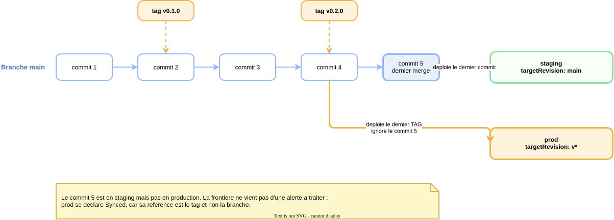

# Comment la promotion vers la production fonctionne

Ce document explique concretement comment `S1-T6` a ete mis en place : quels fichiers ont ete ecrits, quel mecanisme les fait fonctionner, et quelles commandes on tape reellement pour promouvoir une version.

Pour la decision et ses alternatives, voir [`adr/ADR-009-promotion-par-chemin-plutot-que-par-branche.md`](adr/ADR-009-promotion-par-chemin-plutot-que-par-branche.md). Pour les mesures qui prouvent que ca marche, voir [`evidence/sprint-1/s1-t6-promotion-prod-par-tags.md`](evidence/sprint-1/s1-t6-promotion-prod-par-tags.md).

## Sommaire

- [Le probleme a resoudre](#le-probleme-a-resoudre)
- [Le mecanisme en une ligne](#le-mecanisme-en-une-ligne)
- [Les trois fichiers ecrits](#les-trois-fichiers-ecrits)
- [La subtilite des deux revisions](#la-subtilite-des-deux-revisions)
- [Promouvoir en pratique](#promouvoir-en-pratique)
- [Revenir en arriere](#revenir-en-arriere)
- [Ce qui reste fragile](#ce-qui-reste-fragile)

## Le probleme a resoudre

Staging et prod lisent le meme depot, avec la meme structure de repertoires. Si les deux suivent la branche `main`, alors tout merge part simultanement dans les deux environnements, et la notion de production perd son sens : plus rien ne separe ce qui est en cours de validation de ce qui est cense etre stable.

Il fallait donc que prod suive **autre chose** que la branche, sans pour autant creer une branche `prod` permanente, ecartee par `ADR-009` parce que deux branches longue duree finissent toujours par diverger.

## Le mecanisme en une ligne

Argo CD accepte des contraintes semver dans le champ `targetRevision`, et il ne les evalue **que sur les tags**, jamais sur les branches. Ecrire `targetRevision: 'v*'` revient donc a dire : deploie le tag le plus recent qui commence par `v`, et ignore completement l'avancee des branches.

<p align="center">
  
</p>

> Source editable : [`diagrams/s1-t6-promotion-tags.drawio`](diagrams/s1-t6-promotion-tags.drawio).

Le schema se lit ainsi. La branche `main` avance commit apres commit, et staging suit systematiquement le dernier. Les tags, eux, ne sont poses que sur certains commits choisis, et prod ne regarde que ceux-la.

Au moment represente, le commit 5 est deja en staging alors que prod tourne encore sur le commit 4, celui du tag `v0.2.0`. Le detail important est que **prod ne se declare pas en erreur** pour autant : du point de vue d'Argo CD, prod est parfaitement synchronise avec sa reference, qui est le tag. La frontiere n'est pas un ecart a corriger, c'est une absence de lien.

## Les trois fichiers ecrits

**Un overlay prod pour l'application.** Sans lui le generateur ne trouverait rien, puisqu'il cherche des repertoires. Il ne contient presque rien : le namespace cible et le label d'environnement.

```yaml
# gitops/apps/smoke/overlays/prod/kustomization.yaml
namespace: shopdemo-prod
resources:
  - ../../base
labels:
  - pairs:
      shopdemo.io/environment: prod
    includeSelectors: false
    includeTemplates: true
```

**Un ApplicationSet prod**, qui porte la contrainte semver a deux endroits. C'est la seule difference reelle avec celui de staging, qui a `main` aux memes places.

```yaml
# gitops/argocd/applicationset-prod.yaml, extrait
generators:
  - git:
      revision: 'v*'                # ou chercher les applications
      directories:
        - path: gitops/apps/*/overlays/prod
template:
  spec:
    source:
      targetRevision: 'v*'          # quoi deployer une fois trouvees
      path: '{{.path.path}}'
    destination:
      namespace: shopdemo-prod
    syncPolicy:
      automated: {prune: true, selfHeal: true}
```

**Rien d'autre.** Le socle de l'environnement prod, son namespace et ses `NetworkPolicy`, existait deja depuis `S1-T3`.

## La subtilite des deux revisions

C'est le point qui surprend, et il faut l'avoir en tete pour lire le fichier sans se tromper.

Un `ApplicationSet` manipule **deux revisions distinctes**, qui ne servent pas a la meme chose.

La revision du **generateur** dit quelle version du depot scanner pour **decouvrir** quelles applications existent.

La revision du **template** dit ce que chaque `Application` generee va **deployer**.

Cote prod, les deux valent `v*`, et ce n'est pas un detail :

```yaml
generators:
  - git:
      revision: 'v*'                  # ou chercher les repertoires
      directories:
        - path: gitops/apps/*/overlays/prod
template:
  spec:
    source:
      targetRevision: 'v*'            # quoi deployer une fois trouve
```

Si le generateur scannait `main`, un service tout juste merge apparaitrait immediatement comme `Application` cote prod, en cherchant son repertoire dans le dernier tag, ou il n'existe pas encore. On obtiendrait une `Application` en erreur permanente jusqu'a la promotion suivante. Une alerte rouge qui n'est pas un vrai probleme est exactement ce qui apprend a ignorer les alertes.

En alignant les deux revisions sur les tags, une application n'apparait cote prod qu'une fois reellement promue.

## Promouvoir en pratique

Une promotion est une commande, pas une manipulation d'interface.

```bash
git tag -a v0.3.0 -m "Promotion : description de ce qui part en production"
git push gitlab v0.3.0
```

C'est tout. Argo CD detecte le nouveau tag au cycle de reconciliation suivant, resout la contrainte `v*` vers ce tag, et deploie.

Compter jusqu'a trois minutes, ce qui correspond a l'intervalle de reconciliation par defaut. Pendant ce delai rien ne se passe visiblement, ce qui donne l'impression d'un echec alors que le systeme attend simplement son prochain cycle.

Verifier ou en est la promotion :

```bash
kubectl get application prod-smoke -n argocd \
  -o jsonpath='{.status.sync.status}{" sur "}{.status.sync.revision}{"\n"}'
git rev-parse v0.3.0^{commit}
```

Les deux commits doivent correspondre.

## Revenir en arriere

C'est la propriete la plus utile du modele, et elle ne coute rien a mettre en place puisqu'elle decoule du mecanisme.

La contrainte `v*` selectionne le tag semver le plus **eleve**, pas le plus recent chronologiquement. Un retour arriere ne consiste donc pas a supprimer un tag, mais a en poser un nouveau, plus haut, sur un commit anterieur :

```bash
git tag -a v0.3.1 -m "Retour au comportement de v0.2.0" <commit-de-v0.2.0>
git push gitlab v0.3.1
```

L'historique reste lisible, on voit qu'il y a eu un incident et un retour, plutot qu'un tag efface qui ne laisse aucune trace.

Supprimer le tag defaillant fonctionnerait aussi, Argo CD retombant alors sur le tag precedent, mais c'est deconseille : reecrire un tag deja distribue est le meme genre de probleme que reecrire un commit deja pousse.

## Ce qui reste fragile

**Aucun webhook.** La decouverte d'un tag repose entierement sur l'intervalle de reconciliation, car aucun webhook ne relie GitLab a Argo CD, dont le service est en `ClusterIP` et donc injoignable de l'exterieur. Un webhook rendrait la promotion quasi immediate.

**La suppression est destructive.** `preserveResourcesOnDeletion` vaut `false`, donc si une `Application` generee disparait, ses ressources sont supprimees. Une erreur dans le motif du generateur supprimerait des workloads de production. Risque assume, documente dans la preuve, defendable uniquement parce que cette production est un environnement de demonstration.

**On promeut des manifests, pas des images.** Le modele cible de [`sprint-planning.md`](sprint-planning.md) promeut un digest d'image produit par la CI. Cette CI n'existe pas encore, donc la promotion porte aujourd'hui sur la configuration seule.
