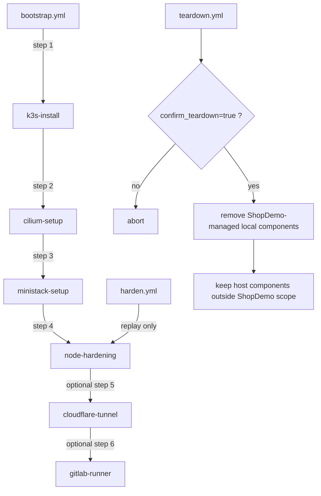

# Sprint 0 - Ansible et fondations bootstrap

## Objectif

Rendre le serveur Ubuntu local reproductible avec Ansible et poser la frontiere
Terraform/Ansible reutilisee pour le runner EC2 et RDS.

Conception cible :
[`docs/sprint-planning.md - Sprint 0`](../sprint-planning.md#sprint-0--ansible--provisioning-local--fondations-bootstrap).

## Tableau de bord

| ID | Tache | Etat | Depend de |
|---|---|---|---|
| S0-T1 | Initialiser le socle du depot | Termine | - |
| S0-T2 | Verifier l'environnement de travail | Termine | S0-T1 |
| S0-T3 | Creer le squelette Ansible | Termine | S0-T1 |
| S0-T4 | Implementer `k3s-install` | Termine | S0-T2, S0-T3 |
| S0-T5 | Tester `k3s-install` avec Molecule | Termine | S0-T4 |
| S0-T6 | Implementer `cilium-setup` | Termine | S0-T5 |
| S0-T7 | Implementer `ministack-setup` | Termine | S0-T3 |
| S0-T8 | Implementer `cloudflare-tunnel` | Termine | S0-T3 |
| S0-T9 | Implementer `gitlab-runner` | Termine | S0-T3 |
| S0-T10 | Implementer `node-hardening` | Termine | S0-T3 |
| S0-T11 | Composer `bootstrap.yml` et `teardown.yml` | Termine | S0-T6 a S0-T10 |
| S0-T12 | Preparer les playbooks AWS futurs | Termine | S0-T3 |
| S0-T13 | Valider et documenter le Sprint 0 | Termine | S0-T5 a S0-T12 |

## S0-E1 - Fondations du projet

### S0-T1 - Initialiser le socle du depot

Etat : `Termine`

- [x] Initialiser le depot Git.
- [x] Ajouter un `README.md` racine.
- [x] Ajouter un `.gitignore` adapte a Ansible, Terraform et aux outils locaux.
- [x] Ajouter le dispositif de suivi Markdown.

#### Criteres d'acceptation

- [x] `git status` fonctionne depuis la racine.
- [x] Les fichiers temporaires, secrets et states Terraform sont ignores.
- [x] Les documents de suivi sont relies entre eux.

#### Notes de progression

- Implemente : premier historique Git cree par groupement logique (gitignore,
  gouvernance agents, architecture, suivi de projet, notes d'apprentissage,
  squelette Ansible, README racine), soit 14 commits.
- Implemente : `README.md` racine avec schema Mermaid du flux applicatif,
  table des competences demontrees, Quick start executable et badges de
  progression par sprint.
- Verifie : aucun secret ni fichier sensible commite, double controle par
  grep manuel des patterns classiques (cles AWS, PEM, tokens) puis par
  `gitleaks detect --source .` sur l'historique complet (13 commits scannes,
  `no leaks found`).
- Cree : depot distant public `github.com/ClementV78/shop-demo` via
  `gh repo create`.
- Corrige : push initial rejete par GitHub (`GH007`, protection anti-fuite
  d'email) car les commits portaient l'adresse email reelle de l'auteur ;
  historique reecrit localement avec l'adresse noreply GitHub
  (`{id}+{login}@users.noreply.github.com`) avant le push reussi.
- Risque accepte : `git filter-branch` laisse des refs de sauvegarde locales
  (`refs/original/...`) ; sans impact sur le remote, nettoyage non urgent.

### S0-T2 - Verifier l'environnement de travail

Etat : `Termine`
Depend de : `S0-T1`

- [x] Identifier l'OS cible et son mode d'acces.
- [x] Verifier Python, Ansible, Docker, Git et l'AWS CLI.
- [x] Verifier la virtualisation et les contraintes systemd pour Molecule.
- [x] Documenter les versions retenues et les ecarts.

#### Criteres d'acceptation

- [x] Les prerequis disponibles et manquants sont listes.
- [x] La methode d'installation est reproductible.
- [x] Aucun outil global inutile n'est impose.

#### Notes de progression

- Verifie : Ubuntu 24.04.4 LTS, noyau 6.17, `systemd` comme PID 1, aucune
  virtualisation detectee.
- Verifie : `git`, `python3`, `pip3`, `docker`, `aws` et `ansible-core`
  fonctionnent sur le poste.
- Ecart corrige : le paquet `pipx install ansible` n'exposait pas les binaires
  attendus ; `ansible-core` a ete installe via `pipx` a la place.
- Point d'attention : le poste heberge deja plusieurs conteneurs Docker. Cela
  n'empeche pas le Sprint 0, mais impose de surveiller les collisions de ports
  pendant les tests locaux.

### S0-T3 - Creer le squelette Ansible

Etat : `Termine`
Depend de : `S0-T1`

- [x] Creer `ansible.cfg`.
- [x] Creer `requirements.yml`.
- [x] Creer `inventory/local.yml`.
- [x] Creer `inventory/aws_ec2.yml`.
- [x] Creer `group_vars/all.yml` sans secret.
- [x] Creer les repertoires `roles/`, `playbooks/` et `molecule/`.

#### Criteres d'acceptation

- [x] `ansible-config dump` utilise la configuration du projet.
- [x] `ansible-inventory --graph` affiche l'inventaire local.
- [x] `ansible-galaxy install -r requirements.yml` est reproductible.
- [x] Aucun secret n'est versionne.

#### Notes de progression

- Verifie : l'arborescence [`ansible/`](../../ansible) existe deja avec
  `inventory/`, `group_vars/`, `roles/`, `playbooks/` et `molecule/`.
- Documente : la cible et les relations entre ces elements dans
  [`docs/ansible-structure.md`](../ansible-structure.md).
- Verifie : `ansible-config dump --only-changed` charge bien
  [`ansible/ansible.cfg`](../../ansible/ansible.cfg).
- Corrige : `stdout_callback = yaml` etait incompatible avec l'installation
  locale minimale ; retour a `stdout_callback = default`.
- Verifie : `ansible-inventory --graph` affiche le groupe `local` et l'hote
  `localhost`.
- Verifie : la collection `amazon.aws` est installable depuis
  [`ansible/requirements.yml`](../../ansible/requirements.yml).
- Verifie : le premier role
  [`ansible/roles/k3s-install/`](../../ansible/roles/k3s-install) et le
  playbook [`ansible/playbooks/k3s-install.yml`](../../ansible/playbooks/k3s-install.yml)
  existent.
- Verifie : le playbook de validation passe en `--check`.
- Verifie : aucun secret n'est stocke dans le squelette Ansible versionne.
- Documente : les concepts appris du Sprint 0 dans
  [`docs/concepts-sprint-0.md`](../concepts-sprint-0.md).

## S0-E2 - Kubernetes local

### S0-T4 - Implementer le role `k3s-install`

Etat : `Termine`  
Depend de : `S0-T2`, `S0-T3`

- [x] Definir les variables et versions par defaut.
- [x] Installer k3s sans Flannel.
- [x] Desactiver le controleur NetworkPolicy natif.
- [x] Gerer le service systemd.
- [x] Configurer le kubeconfig avec des permissions minimales.
- [x] Ajouter les handlers necessaires.

#### Criteres d'acceptation

- [x] Le service k3s est actif.
- [x] Flannel n'est pas installe.
- [x] Le controleur NetworkPolicy natif est desactive.
- [x] Le kubeconfig permet d'interroger le cluster.
- [x] Aucun secret n'apparait dans les logs Ansible.

#### Notes de progression

- Initialise : variables par defaut dans
  [`ansible/roles/k3s-install/defaults/main.yml`](../../ansible/roles/k3s-install/defaults/main.yml).
- Initialise : validations d'hypotheses locales dans
  [`ansible/roles/k3s-install/tasks/main.yml`](../../ansible/roles/k3s-install/tasks/main.yml).
- Initialise : handler `restart k3s` dans
  [`ansible/roles/k3s-install/handlers/main.yml`](../../ansible/roles/k3s-install/handlers/main.yml).
- Initialise : playbook de validation
  [`ansible/playbooks/k3s-install.yml`](../../ansible/playbooks/k3s-install.yml).
- Verifie : l'ancien cluster `k3s` local a ete desinstalle proprement via le
  script de desinstallation.
- Verifie : le service `k3s` n'existe plus apres nettoyage.
- Verifie : le kubeconfig utilisateur pointait vers un ancien cluster local et
  n'est plus utilisable tant que `k3s` n'est pas reinstalle.
- Implemente : installation `k3s` via Ansible avec `become: true`.
- Implemente : synchronisation du kubeconfig utilisateur local depuis
  `/etc/rancher/k3s/k3s.yaml`.
- Verifie : `systemctl status k3s` est `active`.
- Verifie : `kubectl --kubeconfig ~/.kube/config get nodes -o wide`
  fonctionne.
- Verifie : un second passage de `ansible-playbook playbooks/k3s-install.yml`
  produit `changed=0`.
- Verifie : `--flannel-backend=none` et `--disable-network-policy` presents dans
  l'unite systemd (`systemctl cat k3s`).
- Verifie : kubeconfig utilisateur en `0600 user:user` — aucun autre compte
  n'a acces.
- Verifie : aucun secret dans les logs Ansible (`grep -iE "password|token|secret"`
  ne retourne rien).
- Point d'attention : le noeud est `NotReady`, coherent — Cilium n'est pas encore
  installe. Etat attendu entre S0-T4 et S0-T6.

#### Risque connu

Les pods peuvent rester en attente avant l'installation de Cilium. Cet etat est
attendu entre `S0-T4` et `S0-T6`.

### S0-T5 - Tester `k3s-install` avec Molecule

Etat : `Termine`  
Depend de : `S0-T4`

- [x] Creer le scenario Molecule.
- [x] Ajouter les tests de convergence.
- [x] Ajouter les verifications k3s et absence de Flannel.
- [x] Executer le test d'idempotence.
- [x] Documenter les limites d'un test systemd en conteneur.

#### Criteres d'acceptation

- [x] Le syntax check reussit.
- [x] `molecule test` reussit.
- [x] Le second passage ne produit aucun changement.
- [x] Les limites du driver de test sont explicites.

#### Notes de progression

- Implemente : scenario
  [`ansible/roles/k3s-install/molecule/default/molecule.yml`](../../ansible/roles/k3s-install/molecule/default/molecule.yml)
  avec driver Docker, `systemd` en conteneur et sequence `syntax ->
  converge -> idempotence -> verify`.
- Implemente : playbook
  [`converge.yml`](../../ansible/roles/k3s-install/molecule/default/converge.yml)
  qui cree un utilisateur `molecule` dedie pour isoler le kubeconfig de test du
  compte local principal.
- Implemente : playbook
  [`verify.yml`](../../ansible/roles/k3s-install/molecule/default/verify.yml)
  qui controle le service `k3s`, les flags `--flannel-backend=none` et
  `--disable-network-policy`, le kubeconfig utilisateur, le symlink `kubectl`
  et la reponse de `kubectl get nodes`.
- Verifie : `docker`, `molecule` et le plugin Docker sont disponibles
  localement.
- Verifie : `molecule syntax`, `molecule converge`, `molecule idempotence`,
  `molecule verify` et `molecule test` reussissent pour le role.
- Verifie : le scenario Docker doit ajouter `--snapshotter=native` dans
  `k3s_install_extra_args` pour contourner la limite `overlayfs` du conteneur
  de test ; cette adaptation reste confinee a Molecule et ne change pas la
  cible du role sur le poste local.
- Risque accepte : un noeud `NotReady` reste acceptable dans ce scenario tant
  que `Cilium` n'est pas encore installe. Le scenario valide le role Ansible,
  pas la disponibilite reseau finale du cluster.

### S0-T6 - Implementer le role `cilium-setup`

Etat : `Termine`  
Depend de : `S0-T5`

- [x] Installer Cilium par Helm en replacement mode.
- [x] Configurer l'IPAM cluster-pool.
- [x] Activer Hubble (relay + UI).
- [x] Ajouter les tests Molecule pertinents.
- [x] Rejouer les validations runtime sur l'hote reel.

#### Criteres d'acceptation

- [x] Le scenario Molecule converge, reste idempotent, et verifie le release
  Helm ainsi que les valeurs critiques du role.
- [x] Sur l'hote reel, `cilium status --wait` confirme un etat sain.
- [x] Sur l'hote reel, les noeuds Kubernetes sont `Ready` et Hubble est actif.
- [x] Sur l'hote reel, `cilium connectivity test` est rejoue ; son echec
  residuel `pod-to-service` est documente comme faux negatif probable de
  validation Hubble / `connectivity test`, non bloquant pour ce lab local
  mono-noeud.
- [x] Sur l'hote reel, le rerun du playbook reste idempotent.

#### Notes de progression

- Implemente : role `ansible/roles/cilium-setup/` (`defaults/main.yml`,
  `tasks/main.yml`) et playbook `ansible/playbooks/cilium-setup.yml`,
  installation via `kubernetes.core.helm` (collection ajoutee a
  `requirements.yml`).
- Implemente : scenario Molecule
  `ansible/roles/cilium-setup/molecule/default/` avec une frontiere de preuve
  explicite :
  - Molecule prouve l'automatisation Ansible (`converge -> idempotence ->
    verify`) et controle le release Helm, les valeurs cles et les objets
    Kubernetes attendus.
  - Les validations de reference du datapath Cilium restent sur l'hote reel
    via `cilium status --wait`, `cilium connectivity test`, Hubble et le
    rerun idempotent du playbook.
- Decide : chart Cilium pinnee en `1.19.5` (derniere stable au moment du
  sprint), IPAM `cluster-pool` sur `10.42.0.0/16` (le defaut interne de k3s,
  pas de reinstallation necessaire), Hubble relay + UI actives.
- Bloque : premiere execution en `CrashLoopBackOff` sur l'agent Cilium.
  Diagnostic mene en chaine : `cilium-operator` restait `Pending`
  (`untolerated taint node.kubernetes.io/disk-pressure`) -> les CRDs Cilium
  n'etaient jamais enregistrees -> l'agent plantait en attendant ces CRDs.
- Cause racine : partition `/` a 94% d'usage, sous le seuil kubelet
  `imagefs.available<15%`. Le poste hebergeait deja d'autres services et
  charges locaux hors perimetre ShopDemo ; aucune de ces donnees n'a ete
  touchee.
- Nettoyage applique sans toucher aux services actifs : conteneurs Docker
  `Exited` supprimes, `docker image prune -a` (images sans conteneur actif
  uniquement, ~1,7 Go), cache `apt`, backends CUDA Ollama inutilises
  supprimes (~3,2 Go, aucun GPU NVIDIA present, service Ollama
  inactif/disabled).
- Point d'attention non resolu : la `data-root` Docker reelle se trouve sur la
  partition systeme alors qu'un autre disque local, beaucoup plus capacitaire,
  est deja monte a cote et quasi vide. Migration de la `data-root` Docker
  reportee par le proprietaire
  (coupure de service le temps du transfert) : a planifier hors urgence.
- Decouverte : un repertoire local de ~5,9 Go ressemble a un duplicata de
  `/var/lib/snapd/` non reference par le `snapd` actif, mais ses fichiers
  ont des dates de modification recentes (avril 2026) ; laisse intact tant
  que son origine n'est pas confirmee par le proprietaire.
- Note technique : `--eviction-pressure-transition-period` (5 min par
  defaut chez kubelet) retarde la levee de `DiskPressure` meme apres un
  nettoyage suffisant ; ne pas conclure trop vite a un nettoyage insuffisant
  sur la base d'une verification immediate.
- Verifie sur l'hote reel : `cilium status --verbose` est sain, Hubble Relay
  est `OK`, le noeud reste `Ready` et les composants `cilium`,
  `cilium-envoy`, `cilium-operator`, `coredns`, `hubble-relay` et
  `hubble-ui` sont prets.
- Verifie sur l'hote reel : `kubectl exec deploy/client -- curl -sv
  http://echo-same-node:8080/` et le meme test depuis `client2` retournent
  `HTTP/1.1 200 OK`.
- Verifie sur l'hote reel : `hubble observe` montre les flows attendus pour
  `pod -> service` (`pre-xlate-fwd`, puis `SYN/SYN-ACK/ACK/FIN` vers le pod
  backend) et pour `pod -> world`.
- Risque accepte : `cilium connectivity test --test no-policies` garde un
  echec residuel sur `no-policies/pod-to-service`. Le trafic reel est
  pourtant valide par `curl` et Hubble ; l'echec est donc traite comme un
  faux negatif probable de validation Hubble / `connectivity test` sur ce
  cluster local mono-noeud, pas comme une panne datapath.
- Etat du suivi : `S0-T6` est `Termine`. La connectivite reelle, Hubble et
  l'idempotence sont verifies ; le faux negatif residuel de
  `cilium connectivity test` est accepte comme risque documente, non
  bloquant pour la suite du sprint.

## S0-E3 - Services du serveur local

### S0-T7 - Implementer `ministack-setup`

Etat : `Termine`  
Depend de : `S0-T3`

- [x] Verifier Docker comme prerequis.
- [x] Deployer MiniStack.
- [x] Creer le profil AWS CLI local.
- [x] Ajouter un test de disponibilite du port 4566.

#### Criteres d'acceptation

- [x] MiniStack demarre automatiquement.
- [x] L'AWS CLI peut interroger l'endpoint local.
- [x] Le role est idempotent.

#### Notes de progression

- Verifie : une synthese de decouverte MiniStack a ete redigee dans
  [`docs/decouverte-ministack.md`](../decouverte-ministack.md) avant
  implementation pour cadrer le modele mental, les limites produit et
  l'usage attendu dans le projet.
- Implemente : role
  [`ansible/roles/ministack-setup/`](../../ansible/roles/ministack-setup)
  et playbook
  [`ansible/playbooks/ministack-setup.yml`](../../ansible/playbooks/ministack-setup.yml)
  avec Docker comme prerequis explicite, image MiniStack pinnee
  `ministackorg/ministack:1.3.70`, endpoint local `localhost:4566` et profil
  AWS CLI `ministack`.
- Implemente : scenario Molecule dedie sous
  [`ansible/roles/ministack-setup/molecule/default/`](../../ansible/roles/ministack-setup/molecule/default)
  pour verifier la convergence du role, l'ecriture du profil AWS CLI, la
  sante `/_ministack/health` et un smoke test `sts get-caller-identity`.
- Verifie : les syntax checks Ansible reussissent pour
  `playbooks/ministack-setup.yml`, `molecule/default/converge.yml` et
  `molecule/default/verify.yml`.
- Verifie sur l'hote reel : premier passage
  `ansible-playbook playbooks/ministack-setup.yml --ask-become-pass`
  reussi (`changed=4`, `failed=0`), conteneur MiniStack demarre, endpoint
  `/_ministack/health` en `200`.
- Verifie sur l'hote reel : `aws --profile ministack --endpoint-url
  http://127.0.0.1:4566 sts get-caller-identity` retourne une identite locale
  synthetique coherente :
  `Account=000000000000`, `Arn=arn:aws:iam::000000000000:root`.
- Verifie sur l'hote reel : second passage du playbook idempotent
  (`changed=0`, `failed=0`).
- Documente : une vue d'architecture locale MiniStack a ete ajoutee dans
  [`ARCHITECTURE.md`](../../ARCHITECTURE.md) avec sa source editable
  [`docs/diagrams/ministack-local-infra.drawio`](../diagrams/ministack-local-infra.drawio).
- Documente : une seconde vue, orientee **cartographie des services AWS
  emules** plutot que flux local, a ete ajoutee dans
  [`ARCHITECTURE.md`](../../ARCHITECTURE.md) avec sa source editable
  [`docs/diagrams/ministack-emulated-services.drawio`](../diagrams/ministack-emulated-services.drawio).
- Documente : `ARCHITECTURE.md` a ete ensuite refactorise en **page maitre
  plus concise**, avec table des matieres cliquable et sous-pages sous
  [`docs/architecture/`](../architecture/README.md), afin de separer vue
  d'ensemble et details pedagogiques.
- Risque accepte : le scenario Molecule a ete prepare et syntax-checke, mais
  n'a pas encore ete execute sur le poste local dans cette passe. La preuve de
  reference retenue pour cloturer `S0-T7` est la validation runtime sur l'hote
  reel + l'idempotence du role.

### S0-T8 - Implementer `cloudflare-tunnel`

Etat : `Termine`  
Depend de : `S0-T3`

- [x] Cadrer l'integration ShopDemo dans un hote ou `cloudflared` est deja installe et utilise.
- [x] Configurer le connecteur local dedie, en laissant les routes metier pour plus tard.
- [x] Proteger le token avec Ansible Vault ou une injection externe.
- [x] Gerer le service systemd.

#### Criteres d'acceptation

- [x] Aucun port entrant public n'est requis.
- [x] Aucun token n'est present dans Git ou les logs.
- [x] Le role est idempotent.

#### Notes de progression

- Verifie : `cloudflared` etait deja installe sur l'hote avant `S0-T8`
  (`/usr/bin/cloudflared`, accessible aussi via `/usr/local/bin/cloudflared`).
- Verifie : d'autres tunnels Cloudflare, non lies a ShopDemo, tournaient deja
  sur cet hote avant tout travail sur `S0-T8`. Le role du sprint ne devait
  donc pas prendre le controle global de `cloudflared`.
- Decide : la sous-etape initiale "Installer `cloudflared`" est annulee pour
  `S0-T8`. Reinstaller ou prendre en charge globalement `cloudflared` via un
  role Ansible d'installation serait intrusif et risquerait de casser des
  tunnels personnels deja en service sur cet hote.
- Corrige : une unite systemd generique `cloudflared.service` preexistante a
  ete renommee localement afin de lever l'ambiguite operationnelle. L'ancienne
  unite a ete retiree.
- Corrige : `cloudflared-update.service` cible maintenant les unites systemd
  encore gerees localement au lieu de l'ancien nom generique supprime.
- Decide : les autres tunnels preexistants, y compris ceux exploites hors
  `systemd`, restent hors perimetre de `S0-T8`.
- Implemente : nouveau playbook
  [`ansible/playbooks/cloudflare-tunnel.yml`](../../ansible/playbooks/cloudflare-tunnel.yml)
  et role [`ansible/roles/cloudflare-tunnel/`](../../ansible/roles/cloudflare-tunnel)
  pour la **surcouche ShopDemo** uniquement. Le role ne reinstalle pas
  `cloudflared` et ne prend pas en charge les tunnels personnels existants.
- Implemente : le role rend un fichier d'environnement
  `/etc/cloudflared/shopdemo.env` (token externe) et une unite dediee
  `cloudflared-shopdemo.service`, avec un port de metrics propre
  `127.0.0.1:20245`.
- Decide : pour ce lab, le compromis de secret retenu est :
  - persistance runtime dans `/etc/cloudflared/shopdemo.env` ;
  - export shell `SHOPDEMO_TUNNEL_TOKEN` uniquement temporaire pour rejouer
    Ansible ;
  - recharge a la demande via
    `export SHOPDEMO_TUNNEL_TOKEN="$(sudo awk -F= '/^TUNNEL_TOKEN=/{print $2}' /etc/cloudflared/shopdemo.env)"`.
- Implemente : variables de routes futures `argocd`, `grafana`
  documentees dans les defaults du role comme **routes planifiees** cote
  Cloudflare, sans pretendre que les origins locales existent deja.
- Implemente : scenario Molecule minimal sous
  [`ansible/roles/cloudflare-tunnel/molecule/default/`](../../ansible/roles/cloudflare-tunnel/molecule/default)
  pour verifier le rendu du fichier d'environnement, de l'unite `systemd` et
  les permissions associees sans takeover du vrai `systemd` de l'hote.
- Verifie : `ansible-playbook --syntax-check playbooks/cloudflare-tunnel.yml`
  reussit depuis le repertoire [`ansible/`](../../ansible).
- Verifie : `molecule test` reussit pour
  [`ansible/roles/cloudflare-tunnel/`](../../ansible/roles/cloudflare-tunnel)
  avec un binaire `cloudflared` de test et une gestion `systemd` desactivee
  dans le conteneur Molecule ; l'objectif est de prouver le rendu, les
  permissions et l'idempotence du role, pas une connexion reelle a Cloudflare.
- Documente : l'architecture locale a ete completee avec le schema
  [`docs/diagrams/cloudflare-tunnels-local.drawio`](../diagrams/cloudflare-tunnels-local.drawio)
  et son export SVG, centres sur le pattern ShopDemo et non sur l'inventaire
  detaille des usages personnels de l'hote.
- Risque accepte : les tokens restent inline pour certains tunnels existants
  hors perimetre ShopDemo. Ce point est documente comme hygiene restante, mais
  n'est pas traite dans cette phase de prerequis.
- Etat reel : l'integration specifique ShopDemo est maintenant implemente sur
  le plan Ansible et documentaire, avec tunnel Cloudflare `shopdemo` cree,
  token externe charge hors Git, service `cloudflared-shopdemo.service`
  actif sur l'hote et statut `Healthy` confirme cote Cloudflare.
- Verifie : rerun manuel du playbook avec vrai token, sans changement
  (`changed=0`), ce qui confirme l'idempotence utile sur l'hote reel.
- Verifie : le tunnel `shopdemo` est `Healthy` dans le dashboard Cloudflare ;
  la remontee du connecteur est donc validee.

#### Suite hors cloture de `S0-T8`

- [ ] Quand les services existeront reellement, raccorder les routes
  Cloudflare aux vraies origins locales (`argocd`, `grafana`).
- [ ] Rejouer au besoin le playbook avec un token temporairement recharge :

  ```bash
  export SHOPDEMO_TUNNEL_TOKEN="$(sudo awk -F= '/^TUNNEL_TOKEN=/{print $2}' /etc/cloudflared/shopdemo.env)"
  cd ansible
  ansible-playbook playbooks/cloudflare-tunnel.yml \
    -e cloudflare_tunnel_shopdemo_token="$SHOPDEMO_TUNNEL_TOKEN"
  ```

### S0-T9 - Implementer `gitlab-runner`

Etat : `Termine`  
Depend de : `S0-T3`

- [x] Installer GitLab Runner.
- [x] Configurer le Docker executor.
- [x] Externaliser le token d'enregistrement ou d'authentification runner.
- [x] Preparer la reutilisation sur l'EC2 bootstrap.

Hypotheses de cadrage :

- `GitLab.com` est la cible CI par defaut du projet.
- Le role reste parametrable pour une autre URL GitLab sans fork.
- La logique commune doit rester reutilisable entre serveur local et EC2
  bootstrap.

Decision structurante :
[`docs/adr/ADR-001-gitlab-com-for-ci.md`](../adr/ADR-001-gitlab-com-for-ci.md).

#### Criteres d'acceptation

- [x] Le runner peut etre configure pour `GitLab.com` sans secret versionne.
- [x] Le service GitLab Runner est actif et le role reste idempotent.
- [x] Une preuve de validation realiste est definie : enregistrement du runner
  puis job de smoke test GitLab une fois le token fourni.
- [x] Le role est idempotent.

#### Notes de progression

- Implemente : role [`ansible/roles/gitlab-runner/`](../../ansible/roles/gitlab-runner)
  avec `defaults/main.yml`, `tasks/main.yml` et `handlers/main.yml`.
- Implemente : playbook
  [`ansible/playbooks/gitlab-runner.yml`](../../ansible/playbooks/gitlab-runner.yml).
- Implemente : installation du package via le depot officiel
  `packages.gitlab.com` pour Ubuntu, avec keyring APT dedie sous
  `/etc/apt/keyrings/runner_gitlab-runner-archive-keyring.gpg`.
- Implemente : separation installation / enregistrement via
  `gitlab_runner_manage_registration`, afin de pouvoir valider le role sans
  token puis activer l'enregistrement plus tard avec un secret externe.
- Implemente : prise en charge du workflow recommande (`--token`) et du legacy
  (`--registration-token`) via `gitlab_runner_token_type`, tout en gardant
  `authentication` comme valeur par defaut.
- Verifie : `ansible-playbook --syntax-check playbooks/gitlab-runner.yml`
  reussit depuis le repertoire `ansible/`.
- Verifie : `ansible-playbook --check playbooks/gitlab-runner.yml -e
  gitlab_runner_manage_registration=false -e
  gitlab_runner_runtime_validation_enabled=false` reussit sur `localhost`.
- Verifie : installation reelle du package `gitlab-runner` et service actif
  sur l'hote local.
- Verifie : enregistrement vers `GitLab.com` avec un token runner moderne
  `glrt-...`, apres adaptation du role au workflow GitLab actuel.
- Verifie : pipeline GitLab `#2656759588` au statut `Passed` sur la branche
  `test/gitlab-runner-smoke`, avec job de smoke execute par le runner
  `shopdemo-localhost-docker`.

### S0-T10 - Implementer `node-hardening`

Etat : `Termine`  
Depend de : `S0-T3`

- [x] Re-scoper la tache pour un hardening local minimaliste, non intrusif.
- [x] Implementer un role `node-hardening` limite a `unattended-upgrades`, permissions sensibles et verification `journald`.
- [x] Valider le playbook en `--check`.
- [x] Verifier l'idempotence par un second `--check` ou une application reelle suivie d'un rerun.
- [x] Decider si l'application reelle sur l'hote local est acceptable.
- [x] Documenter explicitement que le hardening fort est reporte aux cibles cloud.

#### Criteres d'acceptation

- [x] Le hardening minimal ne touche ni `ufw`, ni SSH, ni `sysctl`, ni PAM.
- [x] Le durcissement ne casse pas k3s, Docker ou l'acces d'administration.
- [x] Le compromis local vs cloud est documente.
- [x] Le role est idempotent.

## S0-E4 - Orchestration et frontiere Terraform/Ansible

### S0-T11 - Composer les playbooks locaux

Etat : `Termine`  
Depend de : `S0-T6`, `S0-T7`, `S0-T8`, `S0-T9`, `S0-T10`

- [x] Creer `playbooks/bootstrap.yml`.
- [x] Definir un ordre explicite entre les roles.
- [x] Creer `playbooks/harden.yml`.
- [x] Creer `playbooks/teardown.yml` avec des garde-fous.

#### Criteres d'acceptation

- [x] Le bootstrap complet est reproductible.
- [x] Le second passage est idempotent.
- [x] Le teardown exige une confirmation explicite.
- [x] Les actions destructives sont documentees.

#### Design retenu avant implementation

Objectif : formaliser un chemin de bootstrap local reproductible sans coupler
inutilement les roles deja valides ni rendre le teardown dangereux sur l'hote
personnel.

Perimetre retenu :

- `bootstrap.yml` orchestre uniquement les roles du lab local.
- `harden.yml` rejoue uniquement `node-hardening`.
- `teardown.yml` retire uniquement les composants ShopDemo du lab local.
- Les futurs playbooks AWS (`runner-setup.yml`, `rds-setup.yml`) restent hors
  perimetre `S0-T11`.

Vue d'ensemble :



Ordre cible pour `bootstrap.yml` :

| Ordre | Role | Type | Raison |
|---|---|---|---|
| 1 | `k3s-install` | Obligatoire | Base Kubernetes locale requise par `cilium-setup` |
| 2 | `cilium-setup` | Obligatoire | Complete le reseau du cluster apres `k3s` |
| 3 | `ministack-setup` | Obligatoire | Outillage local AWS-like sans dependre de secrets externes |
| 4 | `node-hardening` | Obligatoire | Durcissement local minimal et non intrusif en fin de socle |
| 5 | `cloudflare-tunnel` | Optionnel | Depend d'un token externe, ne doit pas bloquer le bootstrap de base |
| 6 | `gitlab-runner` | Optionnel | Depend d'un token externe et d'une inscription GitLab |

Classification des roles :

| Role | Statut dans `bootstrap.yml` | Contrainte particuliere |
|---|---|---|
| `k3s-install` | Active par defaut | Requiert `become` |
| `cilium-setup` | Active par defaut | Depend d'un cluster `k3s` operationnel |
| `ministack-setup` | Active par defaut | Requiert Docker disponible |
| `node-hardening` | Active par defaut | Doit rester non intrusif pour l'hote local |
| `cloudflare-tunnel` | Desactive par defaut | Exige un secret externe (`TUNNEL_TOKEN`) |
| `gitlab-runner` | Desactive par defaut | Exige un token GitLab et une inscription explicite |

Garde-fous de conception :

- `bootstrap.yml` doit rester idempotent et explicite sur les roles actives ou
  ignores.
- Les roles optionnels doivent etre controles par des variables booleennes
  dediees plutot que par des preconditions implicites.
- `harden.yml` reste separe pour permettre un rerun cible de
  `node-hardening` sans rejouer tout le lab.
- `teardown.yml` doit exiger une confirmation explicite via une variable du
  type `confirm_teardown=true`.
- `teardown.yml` ne doit supprimer ni modifier des composants hors perimetre
  ShopDemo deja presents sur l'hote.
- `cloudflare-tunnel` dedie ShopDemo peut etre retire par defaut, mais
  `MiniStack` et `k3s` demandent une variable explicite de suppression.
- `gitlab-runner`, `~/.kube/config` et `/usr/local/bin/kubectl` restent hors
  teardown automatique.
- Les actions destructives doivent etre annoncees et documentees avant toute
  execution reelle.

Points a verifier pendant l'implementation :

- Comment exposer proprement les variables d'activation des roles optionnels.
- Quel niveau de teardown est acceptable pour `k3s`, MiniStack, tunnel et
  runner sans toucher au reste de l'hote.
- Quels roles peuvent etre verifies en `--check` et lesquels demandent une
  validation reelle ou partielle.

#### Notes de progression

- Implemente : [`ansible/playbooks/bootstrap.yml`](../../ansible/playbooks/bootstrap.yml)
  orchestre `k3s-install`, `cilium-setup`, `ministack-setup` et
  `node-hardening`, puis laisse `cloudflare-tunnel` et `gitlab-runner`
  desactives par defaut via variables booleennes.
- Implemente : [`ansible/playbooks/harden.yml`](../../ansible/playbooks/harden.yml)
  rejoue uniquement `node-hardening`.
- Implemente : [`ansible/playbooks/teardown.yml`](../../ansible/playbooks/teardown.yml)
  impose `teardown_confirm=true`, retire par defaut uniquement l'integration
  `cloudflared-shopdemo`, puis laisse `MiniStack` et `k3s` derriere des
  variables explicites.
- Implemente : [`ansible/group_vars/all.yml`](../../ansible/group_vars/all.yml)
  porte les bascules `bootstrap_enable_*` et `teardown_remove_*` avec des
  valeurs par defaut prudentes.
- Verifie : `ansible-playbook --syntax-check playbooks/bootstrap.yml` OK
  depuis [`ansible/`](../../ansible).
- Verifie : `ansible-playbook --syntax-check playbooks/harden.yml` OK.
- Verifie : `ansible-playbook --syntax-check playbooks/teardown.yml` OK.
- Verifie : `ansible-playbook --check playbooks/bootstrap.yml` OK avec
  desactivation explicite des validations runtime dans les roles
  `cilium-setup`, `ministack-setup`, `cloudflare-tunnel` et `gitlab-runner`.
- Verifie : `ansible-playbook --check playbooks/harden.yml` OK.
- Verifie : `ansible-playbook --check playbooks/teardown.yml -e teardown_confirm=true`
  OK.
- Decision de validation : `S0-T11` est consideree terminee avec des preuves
  en `--syntax-check` et `--check`, sans exiger a ce stade un run reel complet
  du teardown sur l'hote personnel.
- Risque residuel : `teardown.yml` n'a pas encore ete execute en reel ; le
  retrait local du runner GitLab reste hors teardown automatique et le
  perimetre `k3s`/`MiniStack` demande encore une decision explicite
  d'execution reelle sur l'hote.

### S0-T12 - Preparer les playbooks AWS futurs

Etat : `Termine`
Depend de : `S0-T3`

- [x] Creer `runner-setup.yml`.
- [x] Creer `rds-setup.yml`.
- [x] Definir les variables et interfaces sans appeler AWS.

#### Criteres d'acceptation

- [x] Terraform reste responsable du provisioning.
- [x] Ansible reste responsable de la configuration.
- [x] Les secrets sont lus depuis une source externe.
- [x] Aucun appel AWS payant n'est necessaire pour la validation initiale.

#### Notes de progression

- Implemente : [`ansible/playbooks/runner-setup.yml`](../../ansible/playbooks/runner-setup.yml)
  configure le futur runner EC2 bootstrap en reutilisant le role
  `gitlab-runner`, mais uniquement si `runner_setup_apply=true`.
  Par defaut, il affiche son plan et ne fait aucune installation ni
  inscription GitLab.
- Implemente : [`ansible/playbooks/rds-setup.yml`](../../ansible/playbooks/rds-setup.yml)
  prepare la creation des databases `catalogue`, `panier`, `commande` et
  `stock`, ainsi que leurs users applicatifs `svc_*`. Les connexions
  PostgreSQL sont desactivees par defaut via `rds_setup_apply=false`.
- Supprime de la cible : l'ancien playbook de configuration de forge Git
  self-hosted avait ete prepare dans `S0-T12`, mais il est retire apres
  `ADR-002`, car cette brique n'est plus un livrable MVP.
- Ajoute : la collection `community.postgresql` est declaree dans
  [`ansible/requirements.yml`](../../ansible/requirements.yml) pour supporter
  les modules PostgreSQL du playbook RDS.
- Corrige : le role [`ansible/roles/gitlab-runner/`](../../ansible/roles/gitlab-runner)
  deplace la conversion de la cle de depot APT vers un handler et corrige les
  points remontes par `ansible-lint`.
- Documente : la frontiere Terraform/Ansible et les interfaces des trois
  playbooks sont decrites dans
  [`docs/ansible-structure.md`](../ansible-structure.md), avec le schema
  [`docs/diagrams/terraform-ansible-boundary.drawio`](../diagrams/terraform-ansible-boundary.drawio)
  et son export SVG.
- Verifie :
  - `ansible-galaxy collection install -r requirements.yml` installe
    `community.postgresql:4.2.0` ;
  - `ansible-playbook --syntax-check playbooks/runner-setup.yml` OK ;
  - `ansible-playbook --syntax-check playbooks/rds-setup.yml` OK ;
  - `ansible-playbook --check playbooks/runner-setup.yml -e runner_setup_hosts=localhost`
    OK, sans changement et sans charger le role GitLab Runner ;
  - `ansible-playbook --check playbooks/rds-setup.yml` OK, sans connexion
    PostgreSQL ;
  - `ansible-lint playbooks/runner-setup.yml playbooks/rds-setup.yml`
    OK, profil `production` ;
  - `yamllint` OK sur les playbooks S0-T12 et le role `gitlab-runner` touche ;
  - le fichier Draw.io passe `validate.py` et `xmllint`, puis l'export SVG
    reussit via `xvfb-run drawio`.
- Risque residuel : les chemins `*_apply=true` ne sont pas valides contre une
  vraie EC2 ou un vrai RDS. Cette validation est reportee aux sprints ou
  Terraform creera effectivement ces ressources.

## S0-E5 - Validation et cloture

### S0-T13 - Valider et documenter le Sprint 0

Etat : `Termine`
Depend de : `S0-T5` a `S0-T12`

- [x] Executer les syntax checks.
- [x] Executer les tests Molecule complets.
- [x] Verifier l'idempotence du bootstrap.
- [x] Documenter installation, utilisation, rollback et nettoyage.
- [x] Renseigner les preuves importantes.
- [x] Preparer le fichier de suivi du Sprint 1.

#### Criteres d'acceptation

- [x] Tous les roles applicables passent leurs validations.
- [x] Les validations non executees sont justifiees.
- [x] Les risques residuels sont documentes.
- [x] La table de suivi de `README.md` et `CURRENT.md` refletent l'etat reel.

#### Notes de progression

- Verifie : tous les playbooks sous [`ansible/playbooks/`](../../ansible/playbooks)
  passent `ansible-playbook --syntax-check`.
- Verifie : `ansible-lint playbooks/*.yml roles/*/tasks/main.yml
  roles/*/handlers/main.yml roles/*/defaults/main.yml` passe avec le profil
  `production`.
- Verifie : `yamllint` passe sur le perimetre touche par `S0-T12` et les
  corrections de cloture (`runner-setup`, `rds-setup`,
  `teardown`, `gitlab-runner`, `k3s-install`, `ministack-setup`,
  `cilium-setup/molecule/default/converge.yml`, `requirements.yml`).
- Verifie : les schemas Draw.io ajoutes ou modifies pour le sprint
  (`ansible-overview-drawio`, `k3s-install-role-flow-drawio`,
  `terraform-ansible-boundary`) passent `validate.py` et `xmllint`, avec export
  SVG disponible.
- Verifie : les playbooks futurs `runner-setup.yml` et `rds-setup.yml`
  passent `--check` sans appel externe et avec `changed=0`.
- Verifie : `teardown.yml --check -e teardown_confirm=true` passe sans
  execution reelle. Le dry-run predit des suppressions pour le tunnel
  `cloudflared-shopdemo`, ce qui est attendu dans un teardown simule.
- Verifie partiellement : `bootstrap.yml --check` passe avec les validations
  runtime des roles desactivees. Le dry-run predit des changements de
  configuration (`get-k3s.sh` et unattended-upgrades), donc ce n'est pas une
  preuve d'idempotence reelle.
- Verifie : `harden.yml --check` passe. Le dry-run predit deux changements sur
  la configuration APT/unattended-upgrades ; a confirmer par un rerun reel
  lorsque l'etat disque local sera sain.
- Verifie : `molecule test` reussit completement pour
  [`ansible/roles/k3s-install`](../../ansible/roles/k3s-install) :
  convergence OK, idempotence `changed=0`, verify OK.
- Verifie : apres liberation d'espace disque sur `/`, `molecule test` reussit
  completement pour
  [`ansible/roles/cilium-setup`](../../ansible/roles/cilium-setup) :
  convergence OK, idempotence `changed=0`, verify OK.
- Diagnostique pendant la cloture : le lab local gardait une ancienne IP
  `192.168.31.200` dans l'etat embarque k3s, notamment dans les master leases.
  Comme le cluster local est reproductible, l'etat Kubernetes a ete reconstruit
  proprement au lieu d'editer la base k3s a la main. Le plan et le resultat
  sont archives dans
  [`docs/evidence/sprint-0/k3s-cilium-reset-plan.md`](../evidence/sprint-0/k3s-cilium-reset-plan.md).
- Corrige pendant la cloture : les playbooks cibles `k3s-install.yml` et
  `cilium-setup.yml` chargent maintenant `../group_vars/all.yml`, afin que les
  variables communes soient disponibles hors `bootstrap.yml`.
- Corrige pendant la cloture : `cilium-setup` configure explicitement
  `devices` avec `ansible_facts['default_ipv4']['interface']`. Sur le mini-PC,
  cela donne `br0`, ce qui evite le CrashLoop Cilium
  `unable to determine direct routing device`.
- Corrige pendant la cloture : `cilium-setup` applique Helm sans attente
  globale, puis pilote les attentes runtime avec `kubectl rollout status` sur
  Cilium, Hubble relay et Hubble UI. Cela evite qu'un ancien pod Cilium en
  CrashLoop bloque l'upgrade avant redemarrage du DaemonSet.
- Verifie sur l'hote reel apres reset : `ansible-playbook
  playbooks/k3s-install.yml` passe avec `changed=0`, puis `ansible-playbook
  playbooks/cilium-setup.yml` passe avec `changed=0`.
- Verifie sur l'hote reel apres reset : le noeud `minipc-devops-1` est
  `Ready` sur `192.168.31.106`, Cilium annonce `OK`, kube-proxy replacement est
  actif sur `br0`, et les pods systeme sont `Running` ou `Completed`.
- Verifie : `molecule test` reussit completement pour
  [`ansible/roles/ministack-setup`](../../ansible/roles/ministack-setup) :
  convergence OK, healthcheck MiniStack `200`, smoke STS `rc=0`, idempotence
  `changed=0`, verify OK.
- Verifie : `molecule test` reussit completement pour
  [`ansible/roles/cloudflare-tunnel`](../../ansible/roles/cloudflare-tunnel) :
  convergence OK, idempotence `changed=0`, verify OK.
- Le blocage disque est leve : `/` dispose de nouveau d'un espace suffisant
  pour les validations Molecule longues.
- Corrige pendant la cloture : le scenario Molecule `cilium-setup` execute le
  script Helm via `bash` et declare `bash` comme prerequis, ce qui evite les
  erreurs sur `/tmp` non executable et sur les syntaxes Bash du script.
- Corrige pendant la cloture : le role `cilium-setup` remplace
  `ansible_default_ipv4.address` par `ansible_facts['default_ipv4']['address']`
  pour eviter la deprecation Ansible `INJECT_FACTS_AS_VARS`.
- Corrige pendant la cloture : le scenario Molecule `cilium-setup` remplace les
  commandes `systemctl` du verify par `service_facts` et `slurp`, ce qui garde
  les checks en lecture seule et compatibles `ansible-lint`.
- Corrige pendant la cloture : le role `ministack-setup` verifie Docker via
  `community.docker.docker_host_info` au lieu du binaire `docker`, afin de
  fonctionner dans le scenario Molecule avec socket Docker monte.
- Corrige pendant la cloture : le role `ministack-setup` introduit
  `ministack_endpoint_host`, avec la valeur locale par defaut `127.0.0.1` et
  une decouverte `auto` limitee a Molecule pour joindre le conteneur MiniStack
  par son IP Docker interne.
- Corrige pendant la cloture : le scenario Molecule `ministack-setup` installe
  l'AWS CLI via `pip`, car le paquet Ubuntu `awscli` n'est pas disponible dans
  l'image Molecule utilisee.
- Corrige pendant la cloture : les handlers et commandes touches par
  `ansible-lint` sont alignes (`Restart k3s`, `argv`, `changed_when`
  explicite).
- Prepare : le fichier de suivi
  [`docs/sprints/sprint-1-gitops-local.md`](sprint-1-gitops-local.md) est cree
  en etat `Planifie`.
- Ajoute pendant la cloture : deux documents de comprehension transverses,
  [`docs/comprendre-le-projet.md`](../comprendre-le-projet.md) et
  [`docs/glossaire.md`](../glossaire.md), pour donner une entree plus lisible
  que les journaux de sprint et faciliter la presentation orale du projet.
  `comprendre-le-projet.md` integre trois schemas Draw.io dedies : modele
  mental, local vs AWS, et delivery/runtime.
- Complete pendant la cloture :
  [`docs/concepts-sprint-0.md`](../concepts-sprint-0.md) est restructure en
  synthese pedagogique du Sprint 0 et integre trois schemas Draw.io dedies aux
  concepts Ansible, roles/handlers/idempotence, et k3s/Cilium.
- Verifie : apres correction de la cle APT du depot GitHub CLI sur l'hote, le
  premier rerun reel de `bootstrap.yml` passe avec `changed=2`, uniquement sur
  les fichiers de configuration `node-hardening` attendus.
- Verifie : le deuxieme rerun reel de `bootstrap.yml` passe avec `ok=59`,
  `changed=0`, `failed=0` et `skipped=43`. Cette preuve clot l'idempotence
  globale du lab local pour le chemin obligatoire.

Validations Molecule relancees apres liberation d'espace :

```bash
cd ansible
cd roles/cilium-setup && molecule test
cd ../ministack-setup && molecule test
cd ../cloudflare-tunnel && molecule test
```

## Preuves

| Controle | Etat | Preuve |
|---|---|---|
| Structure de suivi | Verifie | Documents sous `docs/` |
| Syntaxe Ansible | Verifie | Tous les playbooks `ansible/playbooks/*.yml` passent `--syntax-check` |
| Ansible lint | Verifie | `ansible-lint` profil `production` OK sur playbooks, tasks, handlers et defaults |
| YAML lint | Verifie partiellement | OK sur le perimetre touche ; le lint global du repertoire garde des lignes longues historiques hors cloture |
| Schemas Draw.io | Verifie | `validate.py`, `xmllint` et exports SVG OK pour les schemas ajoutes ou modifies |
| Tests Molecule | Verifie | `k3s-install`, `cilium-setup`, `ministack-setup` et `cloudflare-tunnel` passent `molecule test` |
| Idempotence bootstrap | Verifie | Deux reruns reels de `ansible-playbook playbooks/bootstrap.yml` ; premier passage `changed=2` attendu sur `node-hardening`, deuxieme passage `changed=0`, `failed=0` |
| Connectivite k3s/Cilium | Verifie | Reset local puis rerun reels `k3s-install.yml` et `cilium-setup.yml` avec `changed=0`; noeud `Ready`, Cilium `OK`, pods systeme `Running` ou `Completed` |

## Decisions et ecarts

- Aucun ecart avec `ARCHITECTURE.md` identifie sur le perimetre Ansible.
- Risque residuel accepte : les roles optionnels `cloudflare-tunnel` et
  `gitlab-runner` restent desactives par defaut dans `bootstrap.yml` car ils
  dependent de secrets externes non versionnes. Ils ont leurs validations
  ciblees documentees dans ce sprint.
