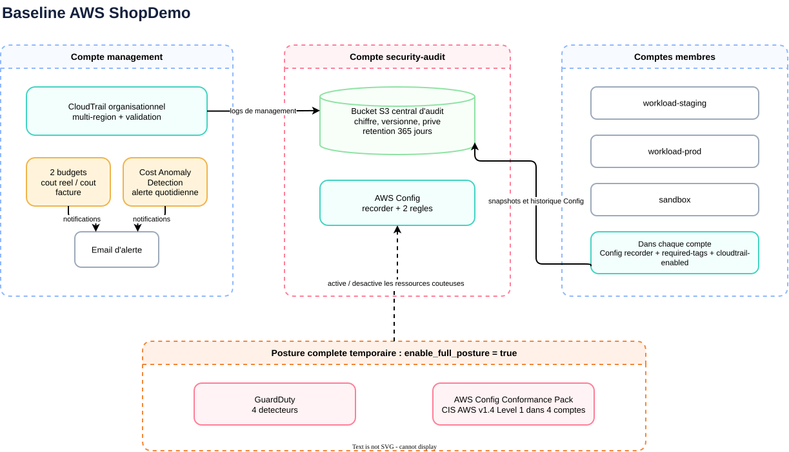

# Baseline AWS multi-compte

[Role](#role) · [Architecture](#architecture) · [Socle-permanent](#socle-permanent) · [Posture-complete](#posture-complete) · [Entrees](#entrees) · [Deploiement](#deploiement) · [Validation](#validation) · [Limites](#limites)

## Role

Ce module pose les controles transverses de la Landing Zone ShopDemo. Il utilise le provider par defaut pour le compte management et quatre alias pour les comptes membres. Le bucket d'audit vit dans `security-audit`, tandis que le trail organisationnel, les budgets et Cost Anomaly Detection sont pilotes depuis le management account.

<p align="center"></p>

## Architecture

Le module parent cree les ressources centralisees, puis appelle un sous-module interne une fois par compte membre. Ce sous-module recoit explicitement le provider du compte cible. Cette structure evite qu'une ressource Config ou GuardDuty soit creee par erreur dans le management account.

Le bucket S3 central refuse HTTP, bloque tout acces public, active le chiffrement SSE-S3, la gestion de version et une retention de 365 jours. Sa policy autorise uniquement CloudTrail et AWS Config avec des chemins distincts et des conditions sur les comptes ou le trail attendus. CloudTrail dispose de deux chemins d'ecriture, un pour le management account et un pour l'Organization, comme l'exige la validation de `CreateTrail`.

## Socle permanent

Avec `enable_full_posture = false`, valeur par defaut, le module cree :

- un CloudTrail organisationnel multi-region qui journalise les evenements de management et valide l'integrite des fichiers ;
- un recorder AWS Config par compte membre, livre dans le bucket central ;
- les regles Config `REQUIRED_TAGS` et `CLOUD_TRAIL_ENABLED` dans chaque compte membre ;
- deux budgets mensuels : `cout-reel` exclut credits et remises, `cout-facture` les inclut et utilise un seuil bas pour detecter leur epuisement ;
- un moniteur Cost Anomaly Detection par compte lie et une notification quotidienne au-dessus du seuil absolu configure.

SSE-S3 est retenu pour ce laboratoire afin d'eviter une cle KMS et sa policy cross-account. Le compromis est documente et acceptable ici, car les journaux ne contiennent aucune donnee metier reelle sensible.

## Posture complete

Avec `enable_full_posture = true`, chaque compte membre recoit en plus un detecteur GuardDuty avec la protection S3 et le conformance pack AWS `Operational-Best-Practices-for-CIS-AWS-v1.4-Level1`.

Ce conformance pack est un modele AWS de correspondance avec le benchmark CIS Level 1. Il aide a evaluer la posture, mais ne constitue ni une certification ni une preuve de conformite complete. Certaines regles sont des controles de processus manuels.

Le retour a `false` planifie la destruction des trois ressources optionnelles par compte : detecteur GuardDuty, feature S3 et conformance pack. Les recorders Config, les deux regles minimales, CloudTrail, les budgets et le bucket restent en place.

## Entrees

| Variable | Defaut | Role |
|---|---:|---|
| `project` | requis | Prefixe de nommage |
| `owner` | requis | Valeur attendue du tag `Owner` |
| `organization_id` | requis | Autorise le chemin CloudTrail de l'Organization |
| `management_account_id` | requis | Unicite du bucket et condition anti-confused-deputy |
| `account_ids` | requis | IDs des quatre comptes membres |
| `alert_email` | requis | Destinataire Budgets et Cost Anomaly Detection, stocke dans le state |
| `monthly_budget_amount` | `25` | Seuil mensuel du budget hors credits, en USD |
| `billed_budget_amount` | `1` | Seuil bas du budget apres credits, en USD |
| `cost_anomaly_threshold` | `5` | Impact absolu minimal d'une anomalie, en USD |
| `enable_full_posture` | `false` | Active les controles temporaires plus couteux |

## Deploiement

Ajouter localement `alert_email` dans `terraform/bootstrap/terraform.tfvars`, puis planifier tout le root. `-target` n'est pas utilise : il contournerait une partie du graphe de dependances et pourrait masquer une modification connexe.

```bash
cd terraform/bootstrap
terraform plan -input=false -out=tfplan
terraform show -no-color tfplan
```

Pour une session de posture complete, remplacer temporairement la variable dans `terraform.tfvars` ou la passer explicitement :

```bash
terraform plan -input=false -var='enable_full_posture=true' -out=tfplan-full-posture
terraform show -no-color tfplan-full-posture
```

Apres la session, revenir a `false` et examiner le plan de retrait. Il doit detruire douze ressources optionnelles, trois dans chacun des quatre comptes, sans toucher aux ressources permanentes.

```bash
terraform plan -input=false -var='enable_full_posture=false' -out=tfplan-disable-full-posture
terraform show -no-color tfplan-disable-full-posture
```

## Validation

Les tests natifs utilisent cinq providers AWS mockes et valident les deux branches sans appeler AWS :

```bash
terraform -chdir=terraform/modules/aws-baseline test
```

Le test permanent verifie le trail organisationnel, les deux budgets et l'absence des ressources optionnelles. Le test complet verifie la creation logique de trois ressources optionnelles par compte.

## Limites

- GuardDuty est active dans les quatre comptes membres, mais ses findings ne sont pas encore agreges par administration deleguee dans `security-audit`.
- AWS Config n'est deploye que dans `eu-west-1`. Le trail reste multi-region, mais la conformite Config des autres regions n'est pas evaluee.
- Le compte management n'a pas de recorder Config dans ce sprint.
- Le bucket porte `prevent_destroy`. Sa suppression exige une decision explicite, le retrait de cette protection et un traitement des objets versionnes.

Sources : [trail organisationnel AWS](https://docs.aws.amazon.com/awscloudtrail/latest/userguide/creating-trail-organization.html), [canal de livraison AWS Config](https://docs.aws.amazon.com/config/latest/developerguide/manage-delivery-channel.html), [conformance packs AWS Config](https://docs.aws.amazon.com/config/latest/developerguide/conformance-packs.html), [modele CIS Level 1 AWS fige au commit utilise](https://github.com/awslabs/aws-config-rules/blob/78d0e6c450c0dfcd7667a163869ccb456109e6a8/aws-config-conformance-packs/Operational-Best-Practices-for-CIS-AWS-v1.4-Level1.yaml), [types de cout AWS Budgets](https://docs.aws.amazon.com/aws-cost-management/latest/APIReference/API_budgets_CostTypes.html).
