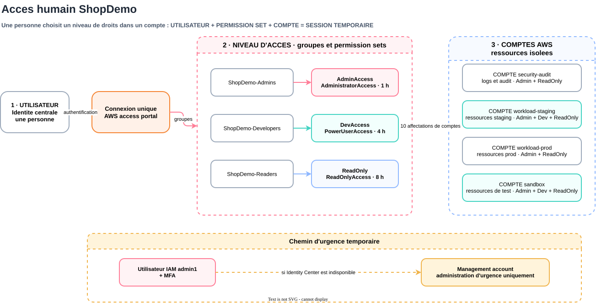

# AWS IAM Identity Center

[Role](#role) · [Matrice-dacces](#matrice-dacces) · [Lecture-du-code](#lecture-du-code) · [Frontiere-dautomatisation](#frontiere-dautomatisation) · [Activation-et-deploiement](#activation-et-deploiement) · [Utilisateur-et-validation](#utilisateur-et-validation) · [Break-glass](#break-glass)

## Role

Ce module configure l'acces humain federe aux quatre comptes membres ShopDemo. Il decouvre l'instance d'organisation IAM Identity Center active dans la region du provider, cree trois groupes, trois permission sets et leurs affectations aux comptes. Il ne cree aucun utilisateur afin de ne pas stocker d'adresse personnelle dans le code ou le state Terraform.

<p align="center"></p>

## Matrice d'acces

| Groupe | Permission set | Policy AWS geree | Session | Comptes |
|---|---|---|---|---|
| `ShopDemo-Admins` | `AdminAccess` | `AdministratorAccess` | 1 heure | Les quatre comptes membres |
| `ShopDemo-Developers` | `DevAccess` | `PowerUserAccess` | 4 heures | `sandbox`, `workload-staging` |
| `ShopDemo-Readers` | `ReadOnly` | `ReadOnlyAccess` | 8 heures | Les quatre comptes membres |

Le groupe administrateur reste vide pendant l'exploitation normale. `PowerUserAccess` permet de travailler sur les services AWS sans donner une administration IAM generale. `ReadOnlyAccess` sert a l'observation et a la validation. Les durees de session diminuent quand le niveau de privilege augmente.

## Lecture du code

`data.aws_ssoadmin_instances.this` recupere l'instance et l'Identity Store de la region courante. Les maps `groups` et `permission_sets` definissent les trois niveaux d'acces. `assignment_matrix` exprime la politique lisible par compte, puis `assignments` la transforme en dix cles Terraform stables telles que `developer:sandbox`.

`aws_identitystore_group.this` cree les groupes. `aws_ssoadmin_permission_set.this` definit le nom et la duree de session. `aws_ssoadmin_managed_policy_attachment.this` attache une policy AWS geree a chaque permission set. Enfin, `aws_ssoadmin_account_assignment.this` relie un groupe, un permission set et un compte AWS. Cette derniere ressource depend explicitement des policies pour ne pas provisionner un role incomplet dans les comptes cibles.

Le root bootstrap passe les IDs produits par `module.organization`. Cette reference cree la dependance necessaire pour les affectations de comptes, sans placer un `depends_on` sur le module SSO complet. Une dependance globale reporterait la lecture de l'instance Identity Center des qu'une autre propriete de l'Organization change et produirait de faux remplacements avec `instance_arn` et `identity_store_id` inconnus pendant le plan. `nonsensitive(...)` retire uniquement le marquage Terraform : les IDs de comptes ne sont pas des secrets, mais la sortie du module Organization est marquee sensible pour eviter leur affichage accidentel.

## Frontiere d'automatisation

| Etape | Mode | Pourquoi |
|---|---|---|
| Activer l'instance d'organisation dans `eu-west-1` | Manuel, une seule fois | L'API `CreateInstance` ne cree pas une instance d'organisation depuis le management account ; le provider Terraform expose l'instance existante avec `data.aws_ssoadmin_instances` |
| Creer les groupes, permission sets, policies et affectations | Terraform | Configuration durable, reproductible et revue dans le plan |
| Creer l'utilisateur du proprietaire | Manuel pour ce lab | Evite de stocker le nom et l'adresse personnelle dans le code et le state |
| Activer l'invitation, le mot de passe et la MFA | Action de l'utilisateur | Etapes interactives liees a la possession de l'identite et du dispositif MFA |
| Provisionner les identites en entreprise | SCIM depuis un fournisseur d'identite | Cible future possible avec Entra ID, Okta ou Google Workspace ; hors perimetre ShopDemo |

Cette frontiere est volontaire : l'activation console amorce le service, puis Terraform devient la source de verite de la matrice d'acces. Aucun groupe, permission set ou rattachement de compte ne doit ensuite etre cree manuellement.

## Activation et deploiement

Prerequis manuel unique : activer une instance d'organisation IAM Identity Center dans `eu-west-1` depuis le management account. Une instance limitee a un seul compte ne convient pas au multi-compte ShopDemo. Apres activation, ne pas creer manuellement les groupes, permission sets ou affectations que Terraform gere.

Depuis `terraform/bootstrap`, le premier plan doit proposer dix-neuf ajouts : trois groupes, trois permission sets, trois attachements de policies et dix affectations. Aucun compte, OU, SCP ou bucket ne doit etre modifie ou detruit.

```bash
terraform plan -input=false -out=tfplan
terraform apply tfplan
```

## Utilisateur et validation

Apres l'apply, creer l'utilisateur dans le portail IAM Identity Center, puis l'ajouter a `ShopDemo-Developers` et `ShopDemo-Readers`. Le portail doit presenter deux acces sur `sandbox` et `workload-staging`, puis uniquement `ReadOnly` sur `workload-prod` et `security-audit`.

Le portail a ete valide avec la matrice attendue : quatre comptes, `DevAccess` limite a sandbox et staging, `ReadOnly` sur les quatre comptes et aucun `AdminAccess` pour l'utilisateur courant. Le 2026-09-27, `DevAccess` a permis de creer puis supprimer un parametre SSM Standard dans sandbox, tandis que `ReadOnly` a refuse la creation du meme parametre dans workload-prod. Cette preuve fonctionnelle rapportee par le proprietaire valide les droits differencies sans laisser de ressource de test. Aucun ajout au groupe `ShopDemo-Admins` n'est necessaire.

## Break-glass

Identity Center n'est pas lui-meme un mecanisme de break-glass en cas d'indisponibilite du service. Tant que la procedure d'urgence definitive n'est pas livree, l'utilisateur IAM du management account avec MFA reste le chemin d'urgence. Il ne doit servir ni aux usages quotidiens ni aux workloads, et sa cle statique ne sera retiree qu'apres validation d'Identity Center et du role GitLab OIDC de S2-T7.

Sources : [instances d'organisation IAM Identity Center](https://docs.aws.amazon.com/singlesignon/latest/userguide/identity-center-instances.html), [limite de l'API `CreateInstance`](https://docs.aws.amazon.com/singlesignon/latest/APIReference/API_CreateInstance.html), [data source Terraform de decouverte](https://registry.terraform.io/providers/hashicorp/aws/latest/docs/data-sources/ssoadmin_instances), [permission sets](https://docs.aws.amazon.com/singlesignon/latest/userguide/permissionsetsconcept.html), [configuration avec le repertoire par defaut](https://docs.aws.amazon.com/singlesignon/latest/userguide/quick-start-default-idc.html).
